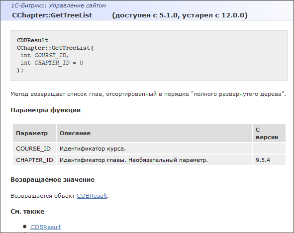

# Основные сведения

#### Версии сущностей

**Bitrix Framework** постоянно развивается. Появляются новые функции, некоторые устаревают, в функциях появляются новые параметры. Однако достаточно большое число проектов не обновляются. Для облегчения программистского труда в документации проставлено с какой и по какую версию продукта класс, метод, параметр, событие существовали (существуют).

Версии проставляются в двух местах: в названии и в таблицах. Если метод действующий, то в заголовке будет стоять только номер версии с которой он появился в продукте. Если метод устарел, то там же будет указан диапазон версий, где он был действующий.

В таблицах указывается версия, с которой сущность появилась в продукте, только в том случае, если её появление не совпадает с моментом появления самого класса, метода и так далее. На иллюстрации ниже: параметр COURSE_ID появился вместе с методом (то есть с 5.1.0), а параметр CHAPTER_ID только с версии 9.5.4.

Если с развитием продукта параметр (обычно это относится к параметрам) изменялся, то будет соответствующее примечание в его описании. (Например: до версии х.х.х параметр назывался *****).

**Пример**

**Примечания**: - Отметка **Устарел** у метода, параметра, ключа означает, что его не рекомендуется использовать так как расширений и исправлений не будет. - Простановка версий выполнена не полностью, работы в этом направлении ведутся в данный момент.
