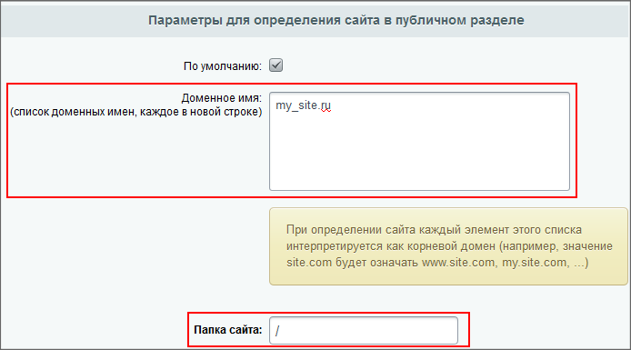

# Как система различает сайты

**Навигация**
- [← Оглавление курса](index.md)
- [← Предыдущий: 288 — Настройки языков](lesson_288.md)
- [Следующий: 286 — Многосайтовость на одном домене →](lesson_286.md)

Официальная страница урока: https://dev.1c-bitrix.ru/learning/course/index.php?COURSE_ID=103&LESSON_ID=1675

### Как система различает сайты


В плане многосайтовости при [создании сайтов](https://dev.1c-bitrix.ru/learning/course/index.php?COURSE_ID=35&LESSON_ID=1991) в системе *«1С-Битрикс: Управление сайтом»* нас интересуют поля: **Доменное имя** и **Папка сайта**. Именно они определяют, какой из сайтов откроет система по запросу пользователя. Эти поля вы найдете в форме создания/редактирования на странице Настройки &gt; Настройки продукта &gt; Сайты &gt; Список сайтов.





### Доменное имя


По получении запроса от пользователя система сначала проверяет текущий домен: из настроек всех сайтов выбираются домены и сопоставляются с доменом, на котором находится пользователь. При этом сравнивается только правая часть до точки (т.е. все поддомены автоматически относятся к этому домену). Например, если в настройках указано: example.com, а пользователь открыл www.example.com, то условие будет считаться выполненным. Но если он откроет my-example.com – это уже другой домен, его надо отдельно указывать в поле **Доменное имя**.

**Примечание:**

Важно **не** указывать в списке доменов те сайты, которые не работают на данном экземпляре продукта. Указанный неправильно или несуществующий домен может замедлить работу системы. К тому же это фактически не позволит перенести данные в сайты, работающие не на общем экземпляре продукта.


Доменное имя желательно указывать без **www**. Можно перечислить в этом поле с новой строки любое число доменных имен, по которым вы хотите, чтобы отвечал сайт. Все домены третьего или более низких уровней продукт будет считать принадлежащими данному сайту и будет открывать сайт #1 как по имени www.site1.com так же, как и без **www**.


### Папка сайта


Если доменные имена не указаны или на разных сайтах указаны одинаковые домены, то определение происходит по полю **Папка сайта**. Обратите внимание, что здесь указывается папка относительно корня сайта (т.е. путь в URL), а не путь в файловой системе на сервере.


Важно иметь в виду, что значения, указанные в поле **Доменные имена** используется продуктом для распространения в указанные домены информации о пользователях по технологии [UserMultiSiteTransfer](lesson_285.md) (перенос пользователей в многосайтовой системе). Желательно указывать полный список доменов, по которым может ответить сайт.


**Пример**: В настройках для первого сайта указана папка `/`, для второго – `/ru`. При открытии страницы example.com/forum/messages/ попадаем на первый сайт, при открытии example.com/ru/forum/messages/ – на второй. При этом папка **bitrix**, содержащая ядро продукта, лежит в корне, никуда не копируется, и никакие другие настройки на сервере не делаются.


При создании сайтов по многосайтовости на одном домене:

- поле **Путь к корневой папке веб-сервера** для этого сайта должно оставаться пустым,
- в полях **Папка сайта** должны быть указаны разные папки.


При создании сайтов по многосайтовости на разных доменах:

- в поле **Путь к корневой папке веб-сервера** для этого сайта должны быть указаны разные пути.
- поле **Папка сайта** должна быть указана корневая папка «**/**» для обоих сайтов.


**Важно знать:**

Для определения текущего сайта не используется порт, т.е. нельзя настроить многосайтовость на одном домене и разных портах.


### Проблема зеркал


Существует проблема зеркал, когда заказчик для каких-то целей покупает разные домены и делегирует их на свой сайт.


Например, сначала могут быть зеркала www.****.ru и ****.ru. В будущем могут еще появиться еще зеркала ****.com и ****.рф.


Возможна ситуация, когда по IP 111.222.33.44 открывается наш сайт по-умолчанию. Или же какие-то чужие домены делегированы на наш IP, и наш сайт открывается на чужих доменах. Такое бывает с Виртуальной машиной Битрикса с основным сайтом.


Появление новых зеркал может усложнить настройку многосайтовости и анализ статистики посещений.


Самое простое решение – установить в настройках хостинга редирект на основной домен. Например, в файле

			.htaccess


**.htaccess** (от англ. hypertext access) – файл дополнительной конфигурации веб-сервера **Apache**. Позволяет задавать большое количество дополнительных параметров и разрешений для работы веб-сервера в отдельном каталоге без изменения главного конфигурационного файла **httpd.conf**.

[Подробнее](https://dev.1c-bitrix.ru/learning/course/index.php?COURSE_ID=32&LESSON_ID=3295)...

		:


```
<IfModule mod_rewrite.c>
  Options +FollowSymLinks
  RewriteEngine On

  RewriteCond %{HTTP_HOST} !^askaron\.ru(.*?)$ [NC]
  RewriteRule ^(.*)$ http://askaron.ru/$1 [R=301,L] </IfModule>
```


Редирект на основной домен ****.ru избавит нас от лишних зеркал. В том числе от www.


Если сайт старый и проиндексирован, то рано или поздно придется в Яндекс.Вебмастере и Гугл.Вебмастере указать какое зеркало главное. Если же новый, то Яндексу и Гуглу ничего объяснять не придется, когда стоит редирект.


Решение от [Артемия Зайцева](http://dev.1c-bitrix.ru/community/webdev/user/25773/)
