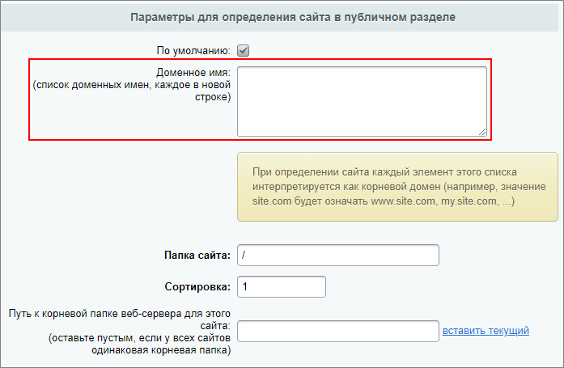

# Авторизация при поддоменности на разных установках

**Навигация**
- [← Оглавление курса](index.md)
- [← Предыдущий: 290 — Выделение разделов сайта в поддомены](lesson_290.md)
- [Следующий: 291 — Работа со структурой сайта →](lesson_291.md)

Официальная страница урока: https://dev.1c-bitrix.ru/learning/course/index.php?COURSE_ID=103&LESSON_ID=20670

При наличии сайтов вида site.ru и crm.site.ru (т.е. на **поддомене**), которые выполнены на

			разных установках

                    Например первая установка - продукт *1С-Битрикс: Управление сайтом*, а вторая - *1С-Битрикс24: CRM*.

		, могут возникнуть проблемы с авторизацией. Вызвано это дублированием переменной **PHPSESSID** в

			cookie

**Cookie** - это текстовая строка информации, которую веб-сервер передает в браузер посетителя сайта и которая сохраняется в файле на устройстве посетителя сайта. Как правило, используется для определения уникальности посетителя, времени его последнего визита, личных настроек, уникального идентификатора корзины покупок и т.д.

[Подробнее](https://dev.1c-bitrix.ru/learning/course/index.php?COURSE_ID=35&LESSON_ID=21538)...

		.

Дальнейшие действия зависят от конфигурации этих сайтов.

#### На каждой установке только один сайт

Если в рамках каждой установки существует только один сайт (т.е. не настроена многосайтовость), то проблемы авторизации решаются удалением домена в настройках сайта (Настройки &gt; Настройки продукта &gt; Сайты &gt; Список сайтов), в поле **Доменное имя** формы редактирования настроек сайта.

Если домен в поле НЕ указан, то cookie ставятся только на текущий домен. При указании же доменного имени в этом поле, cookie ставятся и на все его поддомены (т.е. на все *.site.ru).

После очистки поля **Доменное имя**, рекомендуем также выполнить

			очистку cookies в браузере

                    Если возникли проблемы с очисткой cookies в браузере и не получается авторизоваться, можно инициировать удаление лишней куки со стороны сервера:

1. Если не используется многосайтовость, а поле «Доменное имя» очищено, то надо удалить куку с точкой в начале. Для этого впишите в любую строку файла *dbconn.php* следующий код:

`setcookie("PHPSESSID", "", 777, '/', '.site.ru');`

где *site.ru* - имя вашего домена.

2. Если используется многосайтовость или не очищено поле «Доменное имя», то впишите код:

`setcookie("PHPSESSID", "", 777, '/');`

строго без имени домена.

		.

#### На одной из установок настроена многосайтовость (на одном ядре)

**Пример конфигурации**:

1. site.ru имеет на этой же установке сайты:

  - site.by
  - site.org
2. crm.site.ru - другая установка.

Указанную конфигурацию продукты *1С-Битрикс* не поддерживают.

Очистить поле **Доменное имя** в таком случае не получится, т.к. его заполнение обязательно для организации

			многосайтовости на разных доменах

                    Для работы многосайтовости на разных доменах нам потребуется произвести настройку программного продукта. Настройку веб-сервера Apache, как и в случае с многосайтовостью на одном домене, должна произвести хостинговая компания.

Будем использовать для примера конфигурацию из двух сайтов:

[Подробнее](lesson_287.md)...

		.

**Решение**: подобрать другой домен для сайта crm.site.ru, второй уровень которого не будет совпадать с сайтами первой установки.
