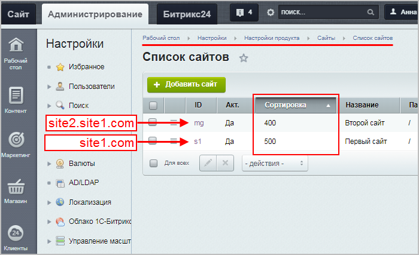

# Многосайтовость на разных доменах

**Навигация**
- [← Оглавление курса](index.md)
- [← Предыдущий: 286 — Многосайтовость на одном домене](lesson_286.md)
- [Следующий: 1677 — Псевдомногосайтовость на разных доменах →](lesson_1677.md)

Официальная страница урока: https://dev.1c-bitrix.ru/learning/course/index.php?COURSE_ID=103&LESSON_ID=287

### Введение. Видеоурок


Для работы многосайтовости на разных доменах нам потребуется произвести настройку программного продукта. Настройку веб-сервера Apache, как и в случае с многосайтовостью на одном домене, должна произвести хостинговая компания.


Будем использовать для примера конфигурацию из двух сайтов:


- www.site1.ru - корпоративный сайт компании
- www.site2.ru - интернет-магазин компании


**Многосайтовость на разных доменах** – это название **технологии** создания сайтов, при которой ядро продукта устанавливается в папку одного из сайтов, а для остальных сайтов настраиваются символьные ссылки (симлинки). Эту технологию можно реализовать и на

			разных доменах


www.site1.ru - корпоративный сайт компании

www.site2.ru - интернет-магазин компании

		 (как в примере выше), и на

			поддоменах.

                    **Вариант 1: два поддомена**

www.site1.site.ru - корпоративный сайт компании

www.site2.site.ru - интернет-магазин компании

**Вариант 2: домен с поддоменом**

www.site1.ru - корпоративный сайт компании

www.site2.site1.ru - интернет-магазин компании


 <!-- видео скрыто из-за хостинга Beget, его нельзя показывать
&lt;p&gt;&lt;iframe title="Многосайтовость на разных доменах" src="//www.youtube.com/embed/lEcfZ551fSI?feature=oembed&rel=0" allowfullscreen="" width="720" height="405" frameborder="0"&gt;
&lt;/iframe&gt;
&lt;/p&gt;

&lt;p&gt;&lt;iframe src="https://rutube.ru/play/embed/dc540606e20e353de46d5c33cd32a27e" frameborder="0" allow="clipboard-write" allowfullscreen="" width="720" height="405" frameborder="0"&gt;&lt;/iframe&gt;&lt;/p&gt; -->


### Настройка многосайтовости на разных доменах


Каждый сайт надо разместить в соответствующем каталоге, например:


- `/home/www/site1/`
- `/home/www/site2/`


#### Установка продукта и настройка символьных ссылок


Продукт устанавливается в один из сайтов. Чтобы ядро могло работать для обоих сайтов, необходимо создать символьные ссылки для сайта, в котором нет установленного ядра. Ссылки потребуются для папок `/bitrix`, `/local` и `/upload`. Эти папки являются общими для обоих сайтов, такова особенность архитектуры.


**Примечание:** Есть возможность простого копирования указанных папок из первого сайта во второй. При таком копировании получится две копии ядра, которые работают с одной базой данных. Такой вариант будет работать, но есть два отрицательных момента: технический и юридический. Техническая проблема заключается в том, что после обновления одного из ядер обновится база данных, и второй сайт перестанет работать. Юридическая проблема заключается в том, что копирование ядра противоречит лицензии на продукт.


**Примечание:** Технически возможно (но не рекомендуется) копирование указанных папок в некоторую внешнюю папку, на которую для всех сайтов настраиваются символические ссылки.


> **Символьная ссылка:** (также симлинк от англ. Symbolic link, символическая ссылка) - cпециальный файл, для которого в файловой системе не хранится никакой информации, кроме одной текстовой строки. Эта строка трактуется как путь к файлу, который должен быть открыт при попытке обратиться к данной ссылке.
>
>
>
> Практически символьные ссылки используются для более удобной организации структуры файлов на компьютере, так как позволяют одному файлу или каталогу иметь несколько имён и свободны от некоторых ограничений, присущих жёстким ссылкам (последние действуют только в пределах одного раздела и не могут ссылаться на каталоги).


Ссылки можно создать двумя способами. Первый - классический, который рекомендовался компанией с самого начала. Второй - более поздний, считается более "красивым и изящным". В нем отсутствует шаг создания отдельной папки и переноса в нее ядра системы.


### Настройка симлинков (вариант 1)


**Первый вариант** (зеленым цветом приведены примеры для установки на UNIX системы):


1. установите программный продукт *"1С-Битрикс: Управление сайтом"* сначала в каталог первого сайта `/home/www/site1/`
2. создайте каталог `/home/www/shared/`, в котором будут располагаться общие для всех сайтов файлы:
     mkdir /home/www/shared
3. перенесите весь каталог `/home/www/site1/bitrix/` в `/home/www/shared/bitrix/`:
     mv /home/www/site1/bitrix /home/www/shared/bitrix
4. перенесите весь каталог `/home/www/site1/upload/` в `/home/www/shared/upload/`:
     mv /home/www/site1/upload /home/www/shared/upload
5. перенесите весь каталог `/home/www/site1/local/` в `/home/www/shared/local/`:
     mv /home/www/site1/local /home/www/shared/local
6. создайте символическую связь для каталога `/bitrix/` в каждом из сайтов:

  1. ln -s /home/www/shared/bitrix /home/www/site1/
  2. ln -s /home/www/shared/upload /home/www/site1/
  3. ln -s /home/www/shared/local /home/www/site1/
  4. ln -s /home/www/shared/bitrix /home/www/site2/
  5. ln -s /home/www/shared/upload /home/www/site2/
  6. ln -s /home/www/shared/local /home/www/site2/
7. убедитесь, что веб-сервер (*Apache, IIS*) имеет право на запись в каталог `/home/www/shared/` (это необходимо будет для работы системы обновлений и загрузки графических файлов)
8. разместите публичную часть второго сайта в каталог `/home/www/site2/`


**Примечание**: Для создания и удаления символьных ссылок в Windows (начиная с Vista) есть команда mklink, либо воспользуйтесь дополнительными программами.


**Важно!** Файловая система FAT32 не поддерживает создание символьных ссылок.


При настройке многосайтовой конфигурации на UNIX, можно воспользоваться программным методом создания символьных ссылок:


```
<?
symlink("/virt/homes/forinsured/bitrix", "/virt/homes/forinsured/htdocs/bitrix");
symlink("/virt/homes/forinsured/upload", "/virt/homes/forinsured/htdocs/upload");
symlink("/virt/homes/forinsured/local", "/virt/homes/forinsured/htdocs/local");
?>
```


**Примечание:**

В ряде случаев, например если web сервер работает в chroot, необходимо делать относительные ссылки.


Пример:

 `/var/www/s1` - первый сайт

   `/var/www/s2` - второй сайт


   `/var/www/shared` - папка с ядром системы


Заходим в `/var/www/s1` и создаём ссылки:


```
   ln -s ../shared/bitrix bitrix
   ln -s ../shared/upload upload
   ln -s ../shared/local local
```


 Переходим в `/var/www/s2` и выполняем те же команды.


### Настройка симлинков (вариант 2)


В этом варианте символьные ссылки создаются непосредственно в папке второго сайта.


1. Установите программный продукт *«1С-Битрикс: Управление сайтом»* сначала в каталог первого сайта `/home/www/site1/`
2. Создайте в корневой папке второго сайта (`/home/www/site2/`) скрипт, например, под именем **symlink.php**:
3. Запустите скрипт и укажите путь к корневой папке первого сайта, в нашем случае `/home/www/site1/`.
4. После того как символьные ссылки созданы, наберите в адресной строке браузера `site1/bitrix/admin`. Откроется панель авторизации.
5. Введите данные администратора, которые указывали при установке продукта на первый сайт, и попадете в административную панель *«1С-Битрикс: Управление сайтом»*.


После завершения работы скрипта наличие символических ссылок на папки `/bitrix`, `/local` и `/upload` в папке второго сайта можно проверить по появлению одноименных папок.


На этапе создания могут возникнуть проблемы:


- отсутствия прав на запись в текущую папку;
- ограничение безопасности (**open_basedir**), которое не позволяет пользователям разделяемого хостинга обращаться к другим сайтам.


В случае возникновения проблем с этим скриптом следует обратиться за помощью к хостеру.


### Конфигурирование сайтов


Настройка сайтов выполняется в административном разделе системы на странице Настройки &gt; Настройки продукта &gt; Сайты &gt; Список сайтов.


В строке первого сайта (www.site1.ru), в колонке действий выбираем команду **Изменить** и указываем в них:


- **Название:** site1
- **Доменное имя:**site1.ru
- **Папка сайта:** /
- **Название сайта:** Корпоративный сайт компании "*Название компании*"
- **URL сервера:** www.site1.ru
- **Путь к корневой папке веб-сервера для этого сайта:** /home/www/site1/


Если DNS настроен таким образом, что ваш сайт отвечает на адрес http://site1.ru, то в поле **Доменное имя** желательно указывать без www. Можно перечислить в этом поле с новой строки любое число доменных имен, по которым вы хотите, чтобы отвечал сайт (или уже отвечает).


Важно иметь в виду, что значения, указанные в поле **Доменное имя**, используются продуктом для распространения в указанные домены информации о посетителях по технологии *переноса посетителей*. Поэтому крайне желательно указывать полный список доменов, по которым может ответить сайт.


Очень важно не указывать в списке доменов сайты, которые не работают на данном экземпляре продукта. Указанный неправильно или несуществующий домен может не только замедлить работу пользователей, но и фактически не позволит перенести данные в сайты, работающие не на общем *экземпляре продукта*.


Аналогично настроим параметры второго сайта (www.site2.ru/):


- **Название:** site2
- **Доменное имя:** site2.ru
- **Папка сайта:** /
- **Название сайта:** Интернет-магазин компании "*Название компании*"
- **URL сервера:** www.site2.ru
- **Путь к корневой папке веб-сервера для этого сайта:** /home/www/site2/


Обратите внимание, что для двух сайтов в параметре **Папка сайта** указано одинаковое значение: "**/**". Это связано с тем, что сайты обслуживаются разными "виртуальными серверами" (в терминологии Apache) у которых для размещения файлов использован разный каталог.


Также необходимо обратить внимание на параметр **Путь к корневой папке веб-сервера для этого сайта**. Для разных сайтов у него свое значение, взятое из параметра `DocumentRoot` настроек соответствующего "виртуального сервера" (см. ниже пример части файла **httpd.conf** настроек Apache).


**Примечание:**

Необходимо иметь в виду, что при организации многосайтовости по данному способу, вы можете использовать как виртуальные сервера одной установки *Apache*, так и просто разные установки Apache. Это справедливо для других веб-серверов: *IIS*, *EServ* и т.д.


**Важно**: при создании второго сайта необходимо скопировать с основного сайта или заново создать файлы `/.htaccess` и `/404.php`.


При включенной Проактивной защите второй сайт должен быть обязательно добавлен в список [разрешённых доменов](https://dev.1c-bitrix.ru/learning/course/index.php?COURSE_ID=35&LESSON_ID=5804).


#### Файл .access.php


Создайте файл **.access.php** c таким содержанием в корне второго сайта:


```
<? $PERM["/"]["*"]="R"; ?>
```


**Примечание:**

Для данного способа организации многосайтовости не требуется настраивать на индексной странице алгоритм выбора сайтов, как это делается при [Псевдомногосайтовости](http://dev.1c-bitrix.ru/learning/course/lesson.php?COURSE_ID=103&ID=1677), т.к. сайт будет однозначно определяться по полю **Доменное имя**.


Конфигурация готова к работе.


#### Вход в систему


- Наберите в адресной строке браузера http://site1/bitrix/admin (или http://site2/bitrix/admin). Откроется панель авторизации.
- Вводите данные администратора, которые указывали при установке продукта на первый сайт и попадете в административную панель *"1С-Битрикс: Управление сайтом"*.


Поскольку ядро одно и база одна - административная панель для обоих сайтов будет одинаковая.


Технически, система допускает создание произвольного числа сайтов, работающих по этой схеме. В каждом из вновь создаваемых сайтов необходимо настроить веб-сервер и создать символическую ссылку.


**Примечание:** **HTML кеширование** не поддерживается на второй многосайтовости. Более того, этот функционал считается устаревшим. Рекомендуется использовать технологию [Композитный сайт](http://dev.1c-bitrix.ru/learning/course/index.php?COURSE_ID=39).


### Сортировка сайтов


Есть особенность в установке значений в поле **Сортировка** сайтов в списке. Если второй сайт работает на

			поддомене


Пример:

**site1.ru** - первый сайт

**site2.site1.ru** - второй сайт (на поддомене первого сайта)

		 домена первого сайта, то он в списке сайтов должен иметь

			меньшее значение.




		 Например, сортировка у первого сайта - 500, сортировка у второго сайта (работающего на поддомене первого) - 400.


В противном случае, или при равенстве значения в поле **Сортировка**, система будет открывать первый сайт при обращении ко второму.


Для случаев, когда сайты находятся на

			разных доменах


Пример разных доменов:

**site1.ru**

**site2.ru**

		 или

			разных поддоменах,


Пример разных поддоменов:

**bus.site.ru**

**b24.site.ru**

		 сортировка может быть любой.


|  |
| --- |


- [Перенос сайтов](http://dev.1c-bitrix.ru/learning/course/index.php?COURSE_ID=135&LESSON_ID=2559) при многосайтовости на разных доменах.
