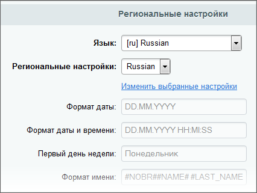

# Настройки языков

**Навигация**
- [← Оглавление курса](index.md)
- [← Предыдущий: 289 — Создание и настройка сайта](lesson_289.md)
- [Следующий: 1675 — Как система различает сайты →](lesson_1675.md)

Официальная страница урока: https://dev.1c-bitrix.ru/learning/course/index.php?COURSE_ID=103&LESSON_ID=288

В Административном разделе системы настройки языков и сайтов выполняются раздельно.

Несмотря на то, что многосайтовая конфигурация часто используется для представления языковых копий одного ресурса, настройки языков и языковых свойств сайтов выполняют разные задачи.


### Языки интерфейса


**Примечание:** Настройки языков предназначены для задания параметров языка интерфейса в Административном разделе.


Настройка осуществляется в разделе Настройки &gt; Настройки продукта &gt; Языковые параметры &gt; Языки интерфейса.


Параметры языков влияют на отображение информации в Административном разделе сайта. Так, например, формат даты, заданный в настройках языка, будет определять формат даты при показе записей в административном интерфейсе.


Параметр **Направление текста** также влияет только на отображение административного раздела.


**Примечание:** Количество языков интерфейса никак не влияет на количество сайтов в системе.


### Язык в Параметрах сайта


Для каждого сайта можно задать определенные языковые настройки. Это делается в Административном разделе на странице настроек параметров сайта (Настройки &gt; Настройки продукта &gt; Сайты &gt; Список сайтов) в разделе **Параметры**.


 Так в настройках каждого сайта можно выполнить привязку к определенному языку интерфейса, формат даты, формат даты и времени (при совместном отображении), кодировку.





Заданные языковые параметры будут использованы для показа записей в публичной части сайта. Например, формат даты будет использован при показе даты новостей, а кодировка может быть использована в коде шаблонов сайта.


За выбор языка интерфейса в кодах сайта отвечает константа:


```
<meta http-equiv="Content-Type" content="text/html; charset=<?= LANG_CHARSET;?>" />
```


**Примечание:** Выбор языка интерфейса определяет, например, язык сообщений публичных компонентов и сообщений об ошибке, которые выдаются в публичной части сайта.
