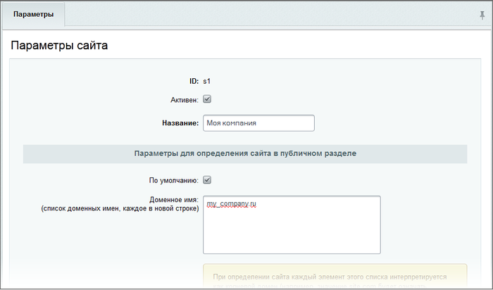
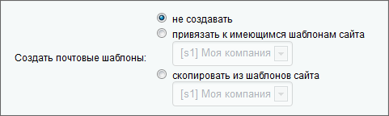

# Создание и настройка сайта

**Навигация**
- [← Оглавление курса](index.md)
- [← Предыдущий: 285 — Технология переноса посетителей между сайтами](lesson_285.md)
- [Следующий: 288 — Настройки языков →](lesson_288.md)

Официальная страница урока: https://dev.1c-bitrix.ru/learning/course/index.php?COURSE_ID=103&LESSON_ID=289

### Основные настройки

Перед настройкой системы на работу с несколькими сайтами необходимо создать новый сайт. Это осуществляется в Административном разделе на странице Настройки &gt; Настройки продукта &gt; Сайты &gt; Список сайтов. В момент добавления записи о новом сайте в таблицу необходимо указать следующие параметры:

- **идентификатор сайта** – двухсимвольная комбинация, например: **ru**, **en**, **de**, **s1,** **s2** и т.п.
- **название** – произвольное название, наряду с идентификатором используется в различных административных формах для указания привязки к тому или иному сайту.
- **доменное имя** – указываются доменные имена, которые соответствуют данному сайту.

**Примечание:**

Доменные имена задаются в отдельной строке (одно имя на строку).

Каждое доменное имя является «маской», т.е. может включать субдомены. Например, по имени site.ru могут быть выбраны www.site.ru или www1.site.ru. В данном случае site.ru частично входит в состав всех трех доменных имен.

Начиная с 11-ой версии возможно использование кириллических доменных имен.

**Важно!**

Будьте внимательны при указании доменных имен. Если на сайте используется технология cookies, то в случае некорректного указания доменных имен при просмотре пользователем страниц вашего сайта также будет выполняться обращение и к другому сайту, доменное имя которого указано по ошибке.

Если на сайте, доменное имя которого указано по ошибке, предусмотрен показ всплывающих окон, то посетителям вашего сайта также будет выполняться показ этих окон.

<!-- &lt;p&gt;Например, если для &lt;span class="link"&gt;http://demo.bitrixsoft.com/&lt;/span&gt; вместо &lt;span class="link"&gt;demo.bitrixsoft.com&lt;/span&gt; указано &lt;span class="link"&gt;demo.bit&lt;b&gt;i&lt;/b&gt;rxsoft.com&lt;/span&gt; (ошибка в написании второго i), то в код страниц &lt;span class="link"&gt;http://demo.bitrixsoft.com/&lt;/span&gt; будет добавлен код вида:&lt;/p&gt;

  &lt;pre class="syntax"&gt;&lt;IMG style=&quot;width:0px; height:0px; border: 0px&quot;  src=&quot;http://&lt;b&gt;demo.bitirxsoft.com&lt;/b&gt;/bitrix/spread.php? s=QklUUklYX1NNX0dVRVNUX0lEATk5NDgBMTE5MTU5NDU0OAEvAQECQklUUkl YX1NNX0xBU1RfVklTSVQBMTAuMTAuMjAwNiAxODoyOTowOAExMTkxNTk0NTQ4AS8BAQI%3D&amp; k=9e8de698c64709edf2e76202279ce889&quot;&gt;&lt;/IMG&gt;&lt;/pre&gt;

  &lt;p&gt;В результате посетителям &lt;span class="link"&gt;http://demo.bitrixsoft.com/&lt;/span&gt; будет выполняться показ всплывающих окон сайта с доменным именем &lt;span class="link"&gt;demo.bitirxsoft.com&lt;/span&gt;:&lt;/p&gt;

&lt;p&gt;&lt;img height="386" border="0" width="647" src="/images/multidomain/7.png" /&gt;&lt;/p&gt; -->

**Примечание:**

Чтобы избежать проблем в случае, когда доменные имена различных сайтов частично совпадают, следует использовать индекс сортировки. Тогда при выборе сайта по доменному имени произойдет сравнение индекса сортировки: будет использован сайт с меньшим значением индекса.

Если значение индекса сортировки совпадает, то проверка будет производиться по длине доменного имени.

- **Папка сайта** – задается папка, в которой расположено информационное содержимое сайта, его разделы и страницы.
  Указанное значение используется как опорный уровень для построения логической и физической структуры в модуле управления структурой.
- **Сортировка** – указывается численный параметр, определяющий порядок сайта в общем списке.
  Но не только. В ряде случаев при добавлении второго сайта могут не применяться указанные ему шаблоны. Эта проблема вызвана особым механизмом выбора сайтов. Так, при содержании в имени второго сайта (к примеру, test.site.ru) имени первого сайта (site.ru), и значения сортировки второго сайта больше, чем первого, происходит применение шаблона ко второму сайту от первого. При использовании таких имен необходимо указывать значение сортировки у второго сайта меньше, чем у первого.

### Секция Параметры

В секции **Параметры** производится задание языковых настроек сайта и, кроме того, задаются следующие значения:

- **Название сайта** – произвольное название, которое может быть использовано в почтовых шаблонах. Если значение не задается в параметрах, то будет использовано значение одноименного параметра из настроек главного модуля.

- **URL сервера** – заданный адрес сервера будет использован при формировании почтовых сообщений на основе шаблонов. Задание адреса производится без http://. В случае, если значение не задается в настройках, то будет использовано одноименное значение из настроек главного модуля.

- **E-mail адрес по умолчанию** – задается электронный адрес, который будет использован в качестве значения макроса **DEFAULT_EMAIL_FROM** при формировании почтовых сообщений для каждого сервера. В случае, если данное поле не заполнено, в шаблоне будет использован почтовый адрес, указанный в настройках главного модуля.

- **Путь к корневой папке веб-сервера для данного сайта** – указывается полный путь к папке, на которую настроена переменная `DOCUMENT_ROOT` для данного сайта. Для упрощения вставки полного пути в данное поле можно воспользоваться ссылкой «*вставить текущий*». В таком случае будет автоматически подставлен полный путь к файлам текущего сайта на сервере.

**Обратите внимание:**

Использовать данную возможность вставки текущего пути следует, только находясь непосредственно на сайте, для которого производится вставка значения.

Например, находясь в административном разделе при заходе с site1.ru/bitrix/admin будет подставлено значение пути именно для этого сайта:

- `/home/public_html/site1/`

 Чтобы установить текущее значение для site2.ru необходимо зайти в административную часть site2.ru/bitrix/admin.

 Тогда будет подставлено значение пути:

- `/home/public_html/site2/`

### Почтовые шаблоны

При создании нового сайта дополнительно предлагается опция по созданию почтовых шаблонов. Доступны следующие варианты:

- **Не создавать** – шаблоны для сайта не будут созданы;
- **Привязать к имеющимся шаблонам** – предлагается возможность привязать сайт к существующим шаблонам для одного из сайтов;
- **Скопировать из шаблонов сайта** – шаблоны будут скопированы для указанного сайта из соответствующих шаблонов для выбранного сайта.

**Обратите внимание:**

Выбор опции по созданию или привязке почтовых шаблонов доступен только при создании нового сайта.

