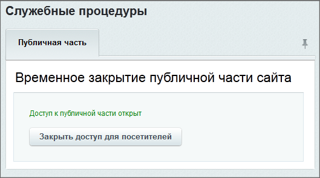

# Как закрыть только один из сайтов для посещения пользователей

**Навигация**
- [← Оглавление курса](index.md)
- [← Предыдущий: 294 — Какую статистику можно анализировать в разрезе по сайтам](lesson_294.md)
- [Следующий: 297 — Компонент для переключения сайтов →](lesson_297.md)

Официальная страница урока: https://dev.1c-bitrix.ru/learning/course/index.php?COURSE_ID=103&LESSON_ID=296

В настройках системы есть возможность закрыть сайт для публичного посещения, например, на время каких-либо технических работ. Это делается на странице настроек главного модуля (Настройки &gt; Настройки продукта &gt; Настройки модулей &gt; Главный модуль):





Однако, указанная возможность позволяет выполнить действие только для всех сайтов системы одновременно. Для того чтобы закрыть отдельный сайт в рамках многосайтовой конфигурации, необходимо разместить специальный программный код в файле:
`/bitrix/php_interface/siteid/init.php`


```
AddEventHandler("main", "OnBeforeProlog", "MyOnBeforePrologHandler", 50);
function MyOnBeforePrologHandler()
{
   global $USER;
   if(!is_object($USER)){
      $USER = new CUser();
   }
   if (!$USER->IsAdmin()){
      include($_SERVER["DOCUMENT_ROOT"]."/coming-soon/underconstruction.html");
      die();
   }
}
```


где **siteid** - идентификатор сайта, который нужно закрыть.


**Внимание!** Учтите, что при добавлении этого кода перестанут работать задания выполняемые через

			cron

                    Всецело можно сказать одно: если агенты занимают несколько десятых долей секунды, то уже стоит задуматься о переносе агентов на cron.

[Подробнее](https://dev.1c-bitrix.ru/learning/course/index.php?COURSE_ID=43&LESSON_ID=2943)...

		.


В файле **underconstruction.html** следует поместить информационное сообщение, которое будет показано посетителям вместо стандартных страниц сайта.
