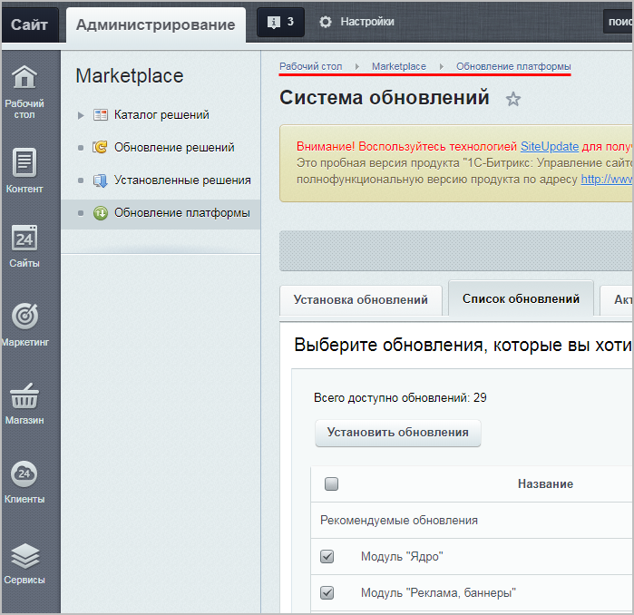
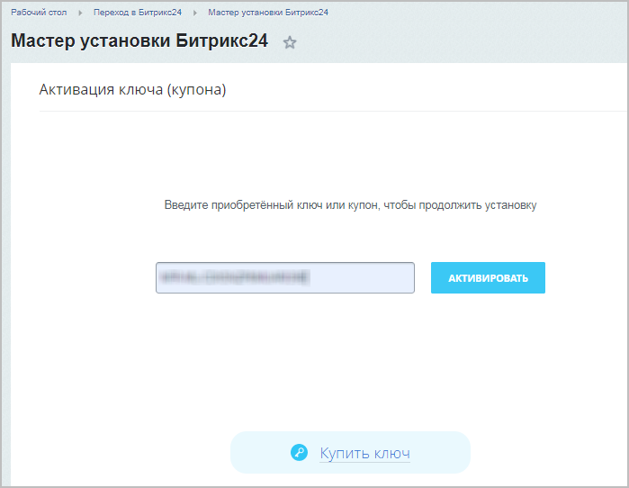
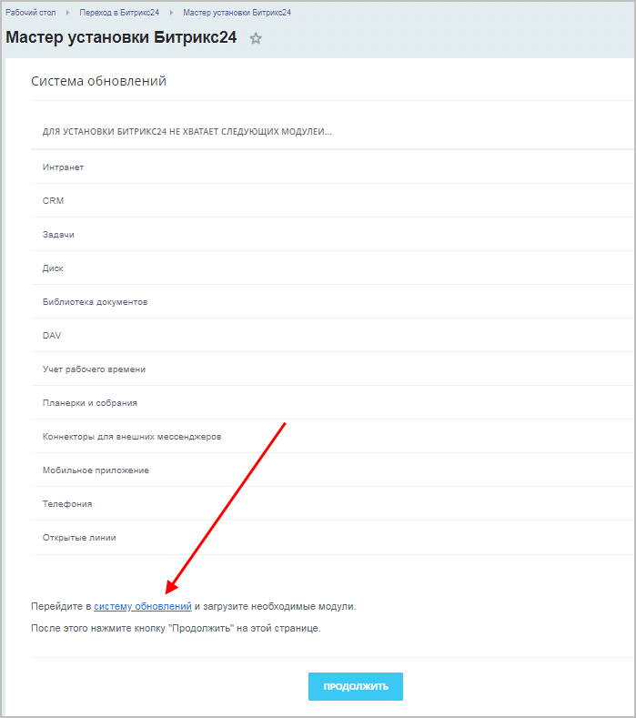
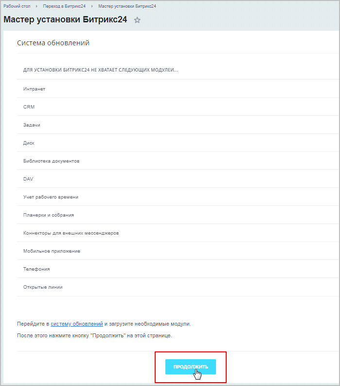
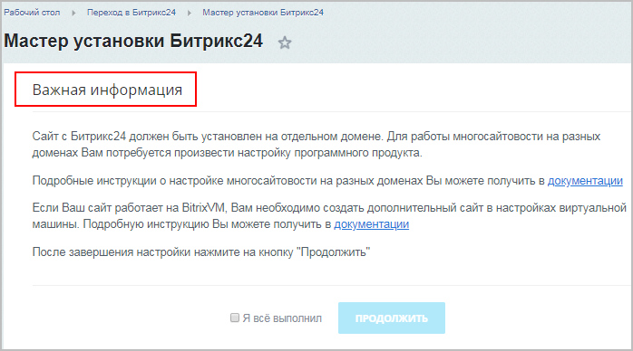
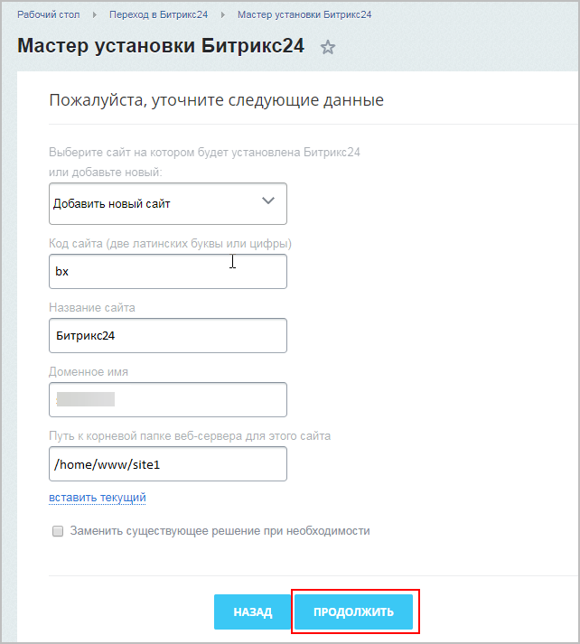
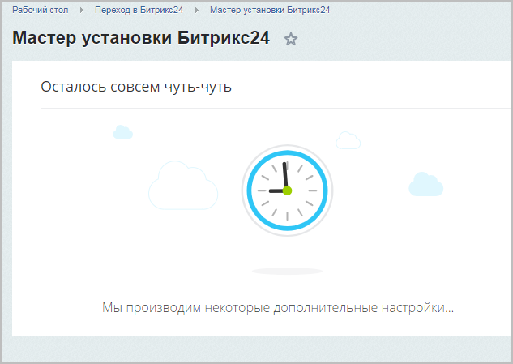
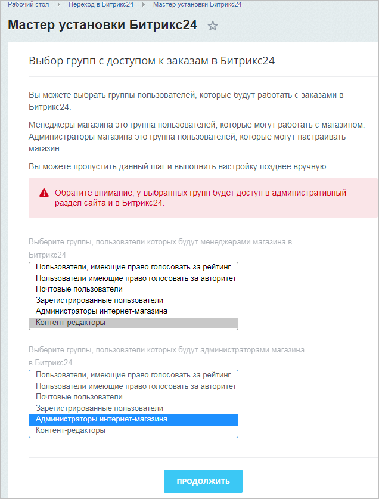
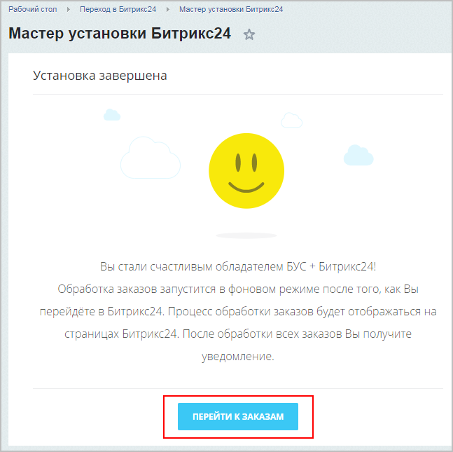

# Переход на «1С-Битрикс24: Интернет-магазин + CRM» с БУС

**Навигация**
- [← Оглавление курса](index.md)
- [← Предыдущий: 12960 — Установка «1С-Битрикс24: Интернет-магазин + CRM» из дистрибутива](lesson_12960.md)
- [Следующий: 12842 — Создание нового интернет-магазина в Битрикс24 →](lesson_12842.md)

Официальная страница урока: https://dev.1c-bitrix.ru/learning/course/index.php?COURSE_ID=135&LESSON_ID=12834

### Начальные требования и подготовка

В этом уроке рассмотрим, как

			перейти

Если вы используете лицензию «Бизнес», то можете перейти на коробочную версию «1С-Битрикс24: Интернет-магазин + CRM». После оплаты вам будет доступна не только административная панель сайта, но и модули «Битрикс24»!

[Подробнее](https://www.1c-bitrix.ru/buy/products/cms.php#tab-section-4)...

		 на *«1С-Битрикс24: Интернет-магазин + CRM»* с продукта *«1С-Битрикс: Управление сайтом»* редакции «Бизнес».

### Начальные требования:

- Лицензионный ключ
  **Лицензионный ключ** - это код из 23 символов в состав, которого входят прописные (большие) буквы латинского алфавита и цифры, в формате: XXX-XX-XXXXXXXXXXXXXXXX.
  [Подробнее](https://www.1c-bitrix.ru/support/key_info.php)...
  		 (ключ перехода)
- Организованная на сайте
  			многосайтовость на разных доменах
  Для работы многосайтовости на разных доменах нам потребуется произвести настройку программного продукта. Настройку веб-сервера Apache, как и в случае с многосайтовостью на одном домене, должна произвести хостинговая компания.
  [Подробнее в курсе "Многосайтовость"](https://dev.1c-bitrix.ru/learning/course/?COURSE_ID=103&LESSON_ID=287)...

**Важно!** При переходе на *«1С-Битрикс24: Интернет-магазин + CRM»* сохранятся те приложения из **Marketplace**, которые созданы для изменения публичной части сайта (например, приложения типа "готовый сайт"). Если вы используете для перехода

			ключ от *«1С-Битрикс24: Корпоративный портал»*,

Объединить два уже установленных продукта (*«1С-Битрикс: Управление сайтом»* и *«Битрикс24: Корпоративный портал»*) **нельзя**.

Если важнее сохранить настройки *«1С-Битрикс: Управление сайтом»* –  возьмите ключ от *«1С-Битрикс24: Корпоративный портал»*, введите его в *«1С-Битрикс: Управление сайтом»*, конвертируйте и получите *«1С-Битрикс24: Интернет-магазин + CRM»* с данными интернет-магазина и новым *Битрикс24*. Часть несконвертированных данных вам придется перенести вручную.

[Подробнее](lesson_12972.md)...

		 то для перепривязки приложений к этому ключу обратитесь в [Техподдержку](http://www.1c-bitrix.ru/support/customers/ticket.php?show_wizard=Y).

Если же модули затрагивали административную часть (вмешивались, например, в форму заказа и работали на событиях), то они будут удалены.

### Подготовка:

**Обязательно** перед началом работ по переходу на *«1С-Битрикс24: Интернет-магазин + CRM»*

			создайте резервную копию

Выполняется резервное копирование на странице **Резервное копирование**

(Настройки &gt; Инструменты &gt; Резервное копирование).

[Подробнее](https://dev.1c-bitrix.ru/learning/course/index.php?COURSE_ID=35&LESSON_ID=5330&LESSON_PATH=3906.4833.5330)...

		 сайта, чтобы при появлении возможных ошибок иметь возможность восстановить сайт.

**Примечания**:

1) убедитесь, что тариф вашего хостинга соответствует

			требованиям коробочной версии

**Место на жестком диске**

Рекомендуется выделять как минимум 10Гб на начальном этапе без учета ОС. В зависимости от количества документов места может потребоваться и больше, но 10Гб - это минимум.

**Оперативная память**

Минимум – 2 Гб, лучше больше.

[Подробнее](https://helpdesk.bitrix24.ru/open/5825131/)...

		 *Битрикс24*, а также на хостинге достаточно места (для резервной копии и для загрузки обновлений);

2) для корректной работы портала настоятельно рекомендуется использовать

			Виртуальную машину BitrixVM

**«1C-Битрикс: Виртуальная машина»** - бесплатный программный продукт, готовый к немедленному использованию виртуальный сервер, полностью настроенный, протестированный и адаптированный для оптимальной работы как с продуктами «1С-Битрикс», так и с любыми PHP-приложениями. Имеется в версии для Windows и для Unix систем.

[Подробнее о Виртуальной машине BitrixVM](https://dev.1c-bitrix.ru/learning/course/index.php?COURSE_ID=37&INDEX=Y)...

[Подробнее о настройке многосайтовости в BitrixVM для перехода на «1С-Битрикс24»](lesson_12878.md)...

		 или

			«1С-Битрикс: Веб-окружение».

«1С-Битрикс: Веб-окружение» - Linux позволяет быстро и с минимальными затратами развернуть оптимальное окружение для работы продуктов и решений «1С-Битрикс» на Linux-платформе CentOS 6/7 (i386, x86_64).

[Подробнее](https://dev.1c-bitrix.ru/learning/course/index.php?COURSE_ID=37&LESSON_ID=8811)...

|  |
| --- |

### Проведение работ

1. Для начала нужно
  			установить обновления
  
  		 (Главный модуль версии **v20.0.0**) (Рабочий стол &gt; Marketplace &gt; Обновление платформы).
2. После установки обновлений в левом меню появится раздел
  			Переход в Битрикс24.
  
  		 Перейдите в этот раздел и запустите **Мастер установки Битрикс24**:
  
3. Далее необходимо ввести
  			лицензионный ключ.
  
4. После ввода ключа станут доступны новые модули, которые нужно загрузить в системе обновлений, перейдя
  			по ссылке
  
  		 либо открыв соответствующую страницу (аналогично пункту 1: Рабочий стол &gt; Marketplace &gt; Обновление платформы).
  **Примечание**: На этом этапе при загрузке модулей может возникнуть проблема с нехваткой места на хостинге. Необходимо увеличить размеры хранилища и повторить этап.
5. Далее вернитесь к **Мастеру установки Битрикс24** (Мастер пропустит уже выполненные шаги, остановившись на моменте установки модулей). Кликните
  			Продолжить
  
  		 и
  			установите
  
  		 требуемые модули (установка может занять длительное время: 20-50 минут).
6. После успешной установки всех модулей появится окно с
  			важной информацией
  
  		: для успешной работы *«1С-Битрикс24: Интернет-магазин + CRM»* вам необходимо **самостоятельно** настроить многосайтовость на разных доменах.
  Выполните все настройки и поставьте галочку в поле **Я всё выполнил**, нажмите кнопку **Продолжить**.
7. Далее укажите данные сайта, куда необходимо установить Битрикс24, и нажмите кнопку **Продолжить**:
  
  **Примечание**: Если вы используете **Виртуальную машину VMBitrix**, то путь к корневой папке задаётся в виде
  			/home/bitrix/ext_www/[доменное_имя_сайта]
  
  [Подробнее в уроке "Виртуальная машина: многосайтовость для перехода на «1С-Битрикс24»"](lesson_12878.md)...
8. Дождитесь
  			завершения работы
  
  		 Мастера. После этого можете либо сразу указать группы пользователей (менеджеров и администраторов магазина в Битрикс24), которые будут работать в Битрикс24, либо указать их позже:
  
  Для завершения установки Битрикс24 нажмите кнопку **Продолжить**.
9. На этом в целом установка Битрикс24 завершена, однако есть ещё один важный этап: обработка заказов (перенос заказов в Битрикс24).

  Процесс занимает продолжительное время (в зависимости от числа существующих заказов и мощности сервера), поэтому запускайте обработку заказов в часы наименьшей нагрузки на сайт:
  
  Для перехода в Битрикс24 кликните по соответствующей
  			кнопке.
  

Если у вас включена

			сквозная авторизация

Сквозная авторизация включается в настройках **Главного модуля** (опция "Распространять авторизацию на все домены").

[Подробнее](https://dev.1c-bitrix.ru/user_help/settings/settings/settings.php)...

		 на сайте «1С-Битрикс: Управлением сайтом» и портале «1С-Битрикс24», то для настройки виджета

			Открытых линий

**Открытые линии Битрикс24** объединяют множество цифровых каналов: **Vkontakte**, **Telegram**, **Skype** и другие.

Обращения клиентов собираются в один чат и автоматически распределяются по ответственным менеджерам.

[Подробнее](https://dev.1c-bitrix.ru/learning/course/index.php?COURSE_ID=41&LESSON_ID=8671)...

		 ознакомьтесь предварительно

			с соответствующим уроком.

Есть одна особенность при использовании сквозной авторизации на сайте «1С-Битрикс: Управлением сайтом» и портале «1С-Битрикс24» в многосайтовой конфигурации **на одном ядре** и **на поддомене основного домена**:

**-** если клиент обращается в виджет Открытых линий *Битрикс24*, то после этого у него меняется авторизация на основном сайте – это, в свою очередь, доставит неудобства вашему клиенту.

[Подробнее](lesson_22634.md)...

**Примечание**: Поскольку для создания нескольких сайтов (интернет-магазин и CRM Битрикс24) на одном ядре используется технология

			многосайтовость на разных доменах

Для работы многосайтовости на разных доменах нам потребуется произвести настройку программного продукта. Настройку веб-сервера Apache, как и в случае с многосайтовостью на одном домене, должна произвести хостинговая компания.

[Подробнее в курсе "Многосайтовость"](https://dev.1c-bitrix.ru/learning/course/?COURSE_ID=103&LESSON_ID=287)...

		, то в дальнейшем при создании **резервной копии** и восстановлении из неё нужно учитывать ряд

			особенностей.

                    **Особенности резервного копирования при многосайтовости на разных доменах:**

1. Создавать резервные копии можно для любого сочетания существующих в системе файлов. Просто отметьте "птичками" в форме нужные сайты.
2. База данных полностью копируется в архив. Даже тех сайтов, которые не были отмечены "птичками".
3. Восстановление сайтов потребует дополнительных действий со стороны администратора.

[Подробнее](https://dev.1c-bitrix.ru/learning/course/index.php?COURSE_ID=35&LESSON_ID=5330)...

**Разработчикам**: В «1С-Битрикс24: Интернет-магазин + CRM» рекомендуется работать с сущностями интернет-магазина (заказ, оплата и т.д.) через

			реестр.

Этот способ помогает не ошибиться в названии нужного метода при работе с сущностями интернет-магазина в редакции, объединяющей интернет-магазин и CRM.

Если в таких редакциях использовать классы обычного интернет-магазина, то могут возникнуть проблемы с работой функционала, специфичного для CRM (например, с работой роботов).

[Подробнее](https://dev.1c-bitrix.ru/api_d7/bitrix/sale/registry_work.php)...

|  |
| --- |

### «1С-Битрикс24: Интернет-магазин + CRM»: вопросы и ответы

- [Общие вопросы](https://helpdesk.bitrix24.ru/open/10434184/)
- [Вопросы по лицензированию](https://helpdesk.bitrix24.ru/open/10434194/)
- [Вопросы по переходу](https://helpdesk.bitrix24.ru/open/10434212/)
- [Вопросы по функционалу](https://helpdesk.bitrix24.ru/open/10434232/)
