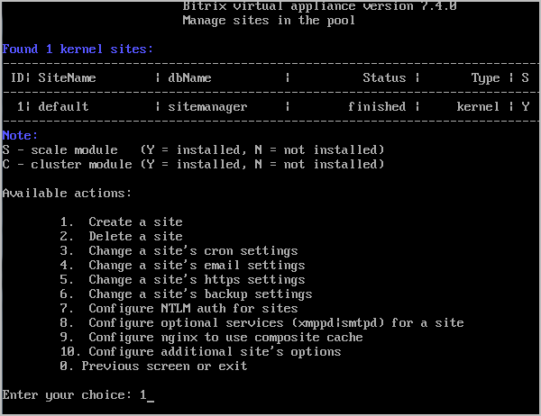
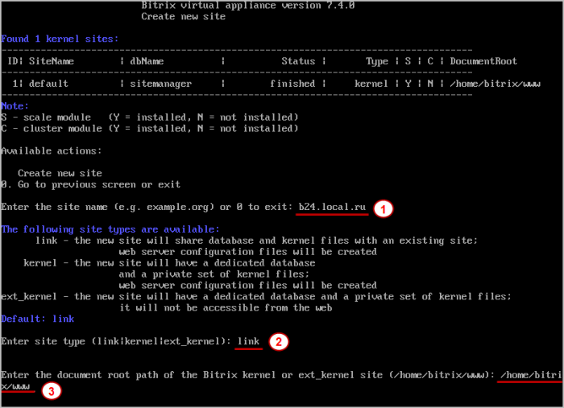
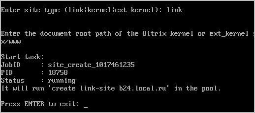
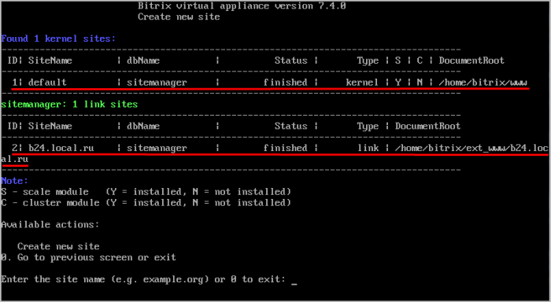
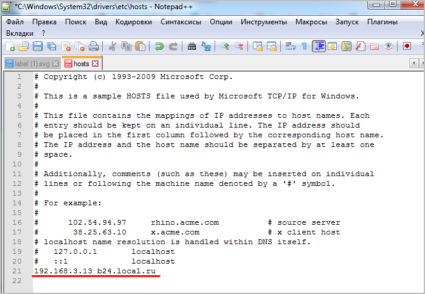
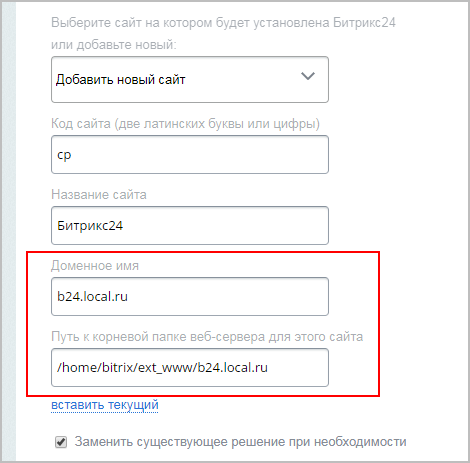

# Виртуальная машина: многосайтовость для перехода на «1С-Битрикс24»

**Навигация**
- [← Оглавление курса](index.md)
- [← Предыдущий: 12842 — Создание нового интернет-магазина в Битрикс24](lesson_12842.md)
- [Следующий: 12964 — Первый и второй шаги →](lesson_12964.md)

Официальная страница урока: https://dev.1c-bitrix.ru/learning/course/index.php?COURSE_ID=135&LESSON_ID=12878

|  | ### Пример создания дополнительного сайта в Виртуальной машине VMBitrix v7.x для перехода на «1С-Битрикс24: Интернет-магазин + CRM» |
| --- | --- |

Для перехода на

			«1С-Битрикс24: Интернет-магазин + CRM»

Единая платформа для продаж в интернете, объединяющая все возможности «1С-Битрикс: Управление сайтом» и Битрикс24.

[Подробнее о возможностях](https://www.1c-bitrix.ru/products/crm-store/")...

		 вам необходимо создать дополнительный сайт в рамках многосайтовости.

Создание дополнительных сайтов в **Виртуальной машине VMBitrix v7.x** подробно описано в курсе

			Виртуальная машина BitrixVM.

Мастер создания дополнительных сайтов, позволяет развернуть на одной виртуальной машине несколько сайтов, как на независимых установках «1С-Битрикс», так и в рамках многосайтовости.

[Подробнее](https://dev.1c-bitrix.ru/learning/course/index.php?COURSE_ID=37&LESSON_ID=6535) в курсе Виртуальная машина BitrixVM ...

		 В этом уроке разберемся на примере, как это сделать:

1. Запустим
  			в меню виртуальной машины
  Для перехода в меню виртуальной машины из командной строки введите в консоли команду: `/root/menu.sh`
  		 мастер создания сайтов:
  			6. Configure pool sites
  
  		 &gt;
  			1. Create a site
  
2. Укажем следующие параметры:
  
  На этом этапе нужный нам сайт создан.

  - 1 **Enter site name** – доменное имя дополнительного сайта без www;
    **Внимание!** Если у вас домен в национальной кодировке (например, кириллический домен), то в данное поле нужно вводить имя домена в Punycode-формате, воспользовавшись любым Unicode-Punycode конвертером.
  - 2 **Enter site type** – тип установки ядра. Прописываем тип **link** (создаваемый сайт будет использовать ядро ранее установленного сайта);
  - 3 **Enter full path to the Bitrix installation directory** – путь до ядра ранее установленного сайта, на которое будут автоматически сделаны
    			симлинки.
    **Символьная ссылка** (также симлинк от англ. Symbolic link, символическая ссылка) – cпециальный файл, для которого в файловой системе не хранится никакой информации, кроме одной текстовой строки. Эта строка трактуется как путь к файлу, который должен быть открыт при попытке обратиться к данной ссылке.
    Практически символьные ссылки используются для более удобной организации структуры файлов на компьютере, так как позволяют одному файлу или каталогу иметь несколько имён и свободны от некоторых ограничений, присущих жёстким ссылкам (последние действуют только в пределах одного раздела и не могут ссылаться на каталоги).
    		 После создания дополнительного сайта он будет располагаться в автоматически созданной
    			папке.
    К примеру, если первый сайт, содержащий ядро, находится в папке **/home/bitrix/www**,  то новый сайт будет располагаться в папке
    **/home/bitrix/ext_www/доменное_имя_нового_сайта**.
3. Нажмём
  			Enter
  
  		 для выхода из мастера создания сайтов. После этого можно просмотреть все созданные нами сайты, выбрав в меню виртуальной машины пункт
  			6. Configure pool sites
  
  		.
  Итак, теперь у нас есть два сайта:
  
  **Примечание**: Если запускаются несколько сайтов в одной BitrixVM на локальном компьютере или в пределах вашей локальной сети с одного IP, то необходимо указать для дополнительных сайтов вместо IP свои выдуманные домены (в нашем примере это **b24.local.ru**), предварительно прописав их в файле hosts операционной системы (откройте
  			файл
  
  		 на редактирование в режиме администратора, укажите существующий IP и новый выдуманный домен через пробел, сохраните изменения).
  Теперь можно обращаться к сайтам по доменным именам, но только в пределах одного компьютера или локальной сети.

  - **default** – это наш первый сайт, на котором изначально установлен один из продуктов («1С-Битрикс: Управление сайтом» или Битрикс24). Находится  в папке **/home/bitrix/www**;
  - **b24.local.ru** – созданный дополнительный сайт для размещения нового сайта при переходе на продукт «1С-Битрикс24: Интернет-магазин+ CRM». Находится в папке **/home/bitrix/ext_www/b24.local.ru**.

После настройки многосайтовости можно приступать к переходу на *«1С-Битрикс24: Интернет-магазин+ CRM»*, согласно инструкции соответствующих

			уроков.

                    Уроки по переходу на «1С-Битрикс24: Интернет-магазин + CRM»:

[Переход на «1С-Битрикс24: Интернет-магазин + CRM» с БУС](lesson_12834.md)

[Создание нового интернет-магазина в Битрикс24 (КП)](lesson_12842.md)

При работе Мастера перехода укажите доменное имя нового сайта и путь к корневой папке веб-сервера следующим образом:

