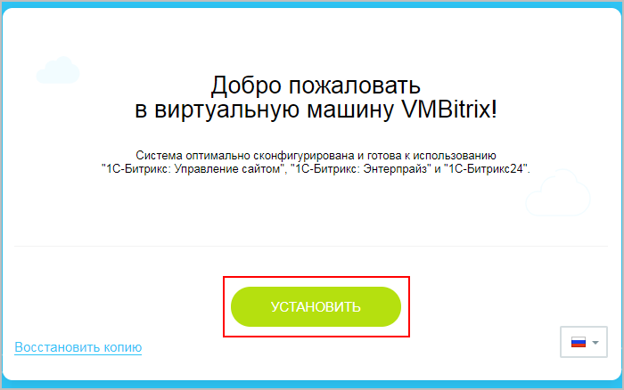
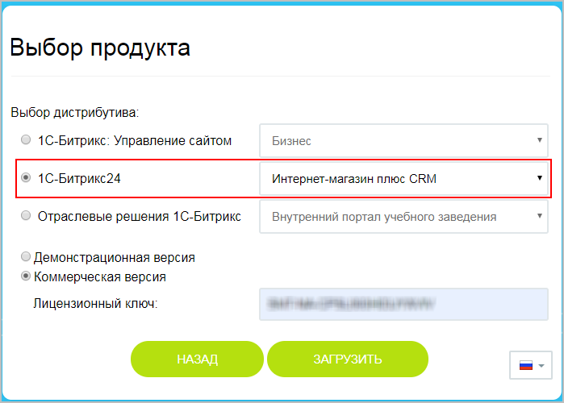

# Установка «1С-Битрикс24: Интернет-магазин + CRM» из дистрибутива

**Навигация**
- [← Оглавление курса](index.md)
- [← Предыдущий: 12972 — Схемы получения CRM и интернет-магазина в едином продукте](lesson_12972.md)
- [Следующий: 12834 — Переход на «1С-Битрикс24: Интернет-магазин + CRM» с БУС →](lesson_12834.md)

Официальная страница урока: https://dev.1c-bitrix.ru/learning/course/index.php?COURSE_ID=135&LESSON_ID=12960

### Установка "с нуля": подготовка

Еще раз уточним, что *«1С-Битрикс24: Интернет-магазин + CRM»* – это тот же самый *Битрикс24* (коробочная версия корпоративного портала), но с модулями, необходимыми для работы Интернет-магазина (как в продукте *«1С-Битрикс: Управление сайтом»* редакции **Бизнес**).

Поэтому в процессе установки этого продукта первым создается портал *Битрикс24*, а уже потом добавляется интернет-магазин на отдельном домене (или поддомене).

**Примечания**:

1) для корректной работы портала настоятельно рекомендуется использовать

			Виртуальную машину BitrixVM

**«1C-Битрикс: Виртуальная машина»** - бесплатный программный продукт, готовый к немедленному использованию виртуальный сервер, полностью настроенный, протестированный и адаптированный для оптимальной работы как с продуктами «1С-Битрикс», так и с любыми PHP-приложениями. Имеется в версии для Windows и для Unix систем.

[Подробнее о Виртуальной машине BitrixVM](https://dev.1c-bitrix.ru/learning/course/index.php?COURSE_ID=37&INDEX=Y)...

[Подробнее о настройке многосайтовости в BitrixVM для перехода на «1С-Битрикс24»](lesson_12878.md)...

		 или

			«1С-Битрикс: Веб-окружение»;

«1С-Битрикс: Веб-окружение» - Linux позволяет быстро и с минимальными затратами развернуть оптимальное окружение для работы продуктов и решений «1С-Битрикс» на Linux-платформе CentOS 6/7 (i386, x86_64).

[Подробнее](https://dev.1c-bitrix.ru/learning/course/index.php?COURSE_ID=37&LESSON_ID=8811)...

2) убедитесь, что тариф вашего хостинга соответствует

			требованиям коробочной версии

**Место на жестком диске**

Рекомендуется выделять как минимум 10Гб на начальном этапе без учета ОС. В зависимости от количества документов места может потребоваться и больше, но 10Гб - это минимум.

**Оперативная память**

Минимум – 2 Гб, лучше больше.

[Подробнее](https://helpdesk.bitrix24.ru/open/5825131/)...

		 *Битрикс24*.

|  |
| --- |

### Проведение работ

1. Перейдите по адресу **bitrix url**, указанному в
  			BitrixVM
  **Запуск виртуальной машины BitrixVM**:
  1) Загрузите подходящий вам дистрибутив настроенной виртуальной машины BitrixVM.
  2) Загруженный архив распакуйте в любую папку, например, `С:\BitrixVM\` и запустите виртуальную машину с помощью подходящего ПО.
  [Подробнее](https://dev.1c-bitrix.ru/learning/course/index.php?COURSE_ID=37&LESSON_ID=8813)...
  		 или
  			BitrixEnv
  Рассмотрим установку *«1С-Битрикс: Веб-окружение» - Linux* на оборудовании с уже установленной **CentOS 7 (Minimal)** (x86_64):
  1) Авторизуемся на сервер под административным аккаунтом **root**.
  2) Загружаем скрипт *«1С-Битрикс: Веб-окружение» - Linux* и запускаем его следующими командами..
  [Подробнее](https://dev.1c-bitrix.ru/learning/course/index.php?COURSE_ID=37&LESSON_ID=8811)...
  		 в браузере. В открывшейся странице кликните по кнопке
  			Установить.
  
2. Выберите дистрибутив *«1С-Битрикс24: Интернет-магазин + CRM»*, введите лицензионный ключ (или же можно установить пробную демонстрационную версию на 30 дней), и нажмите кнопку **Загрузить**:
  
3. Далее следуйте указаниям
  			Мастера Установки продукта *«1С-Битрикс24: Интернет-магазин + CRM»*.
  В главе подробно описывается по шагам процесс установки продукта *«1С-Битрикс24: Интернет-магазин + CRM»*.
  [Подробнее](https://dev.1c-bitrix.ru/learning/course/index.php?COURSE_ID=135&CHAPTER_ID=012962)...
  В результате будет создан портал *Битрикс24*.
4. Создайте дополнительный сайт по технологии
  			Многосайтовость на разных доменах
  Для работы многосайтовости на разных доменах нам потребуется произвести настройку программного продукта. Настройку веб-сервера Apache, как и в случае с многосайтовостью на одном домене, должна произвести хостинговая компания.
  [Подробнее в курсе "Многосайтовость"](https://dev.1c-bitrix.ru/learning/course/?COURSE_ID=103&LESSON_ID=287)...
  		 (на отдельном домене или поддомене).
  Если вы используете Виртуальную машину **VMBitrix**, то создайте новый сайт по аналогии с
  			уроком.
  Пример создания дополнительного сайта в Виртуальной машине VMBitrix v7.x для перехода на *«1С-Битрикс24: Интернет-магазин + CRM».*
  Количество шагов в **Мастере установки** продукта может отличаться в зависимости от вариантов установки. В частности, при установке на BitrixVM нет шага - приветствия . Этот шаг опущен и в описании установки.
  [Подробнее](lesson_12878.md)...
5. И на последнем этапе добавьте интернет-магазин согласно
  			уроку.
  В этом уроке рассмотрим, как установить новый интернет-магазин в Битрикс24 (коробочная версия).
  [Подробнее](lesson_12842.md)...

### «1С-Битрикс24: Интернет-магазин + CRM»: вопросы и ответы

- [Общие вопросы](https://helpdesk.bitrix24.ru/open/10434184/)
- [Вопросы по лицензированию](https://helpdesk.bitrix24.ru/open/10434194/)
- [Вопросы по переходу](https://helpdesk.bitrix24.ru/open/10434212/)
- [Вопросы по функционалу](https://helpdesk.bitrix24.ru/open/10434232/)
