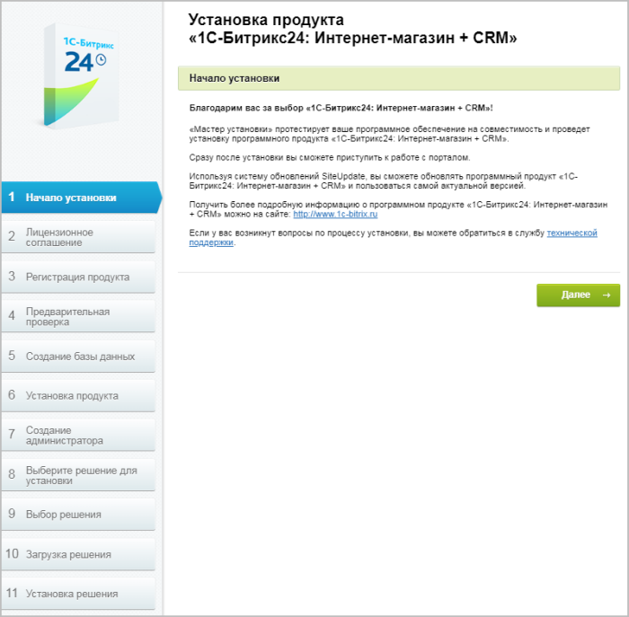
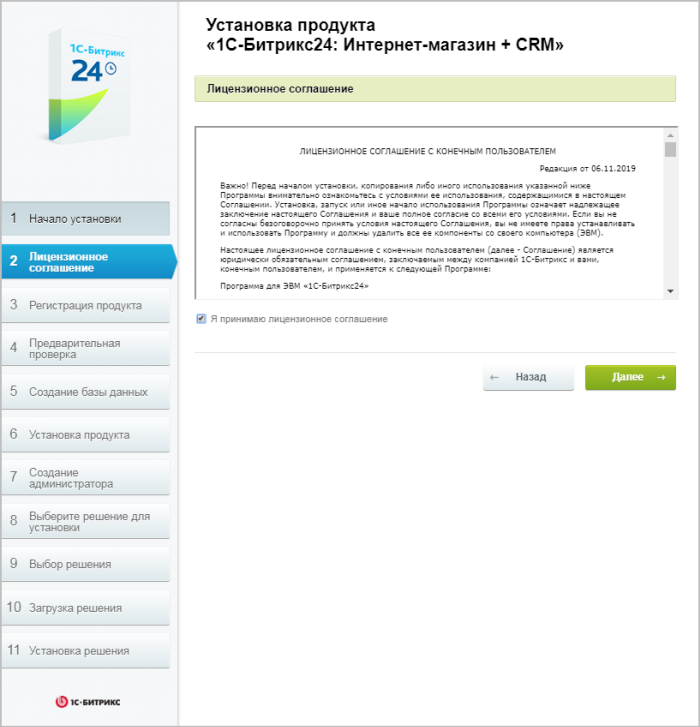

# Первый и второй шаги

**Навигация**
- [← Оглавление курса](index.md)
- [← Предыдущий: 12878 — Виртуальная машина: многосайтовость для перехода на «1С-Битрикс24»](lesson_12878.md)
- [Следующий: 12966 — Третий шаг →](lesson_12966.md)

Официальная страница урока: https://dev.1c-bitrix.ru/learning/course/index.php?COURSE_ID=135&LESSON_ID=12964

|  | ### Первый шаг установки (начало установки) |
| --- | --- |

**Примечание:**Если продукт устанавливается на *Виртуальной машине

			BitrixVM

**«1C-Битрикс: Виртуальная машина» (BitrixVM)** – бесплатный программный продукт, готовый к немедленному использованию виртуальный сервер, полностью настроенный, протестированный и адаптированный для оптимальной работы как с продуктами «1С-Битрикс», так и с любыми PHP-приложениями. Имеется в версии для Windows и для Unix систем.

[Подробнее](https://dev.1c-bitrix.ru/learning/course/index.php?COURSE_ID=37&INDEX=Y)...* (VMWare/VirtualBox), то этот шаг будет пропущен.

Приветственный шаг,

		 информирующий о начале процесса инсталляции и выводящий основную информацию о продукте.

Для продолжения установки нажмите кнопку **Далее**.

|  |
| --- |

|  | ### Второй шаг установки (лицензионное соглашение) |
| --- | --- |

Внимательно ознакомьтесь с текстом **Лицензионного соглашения**.

Если Вы согласны с его условиями, то установите флаг в поле **Я принимаю лицензионное соглашение** и кликните кнопку **Далее**.
