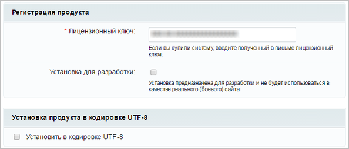
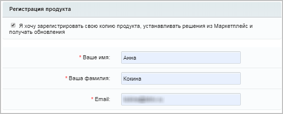

# Третий шаг

**Навигация**
- [← Оглавление курса](index.md)
- [← Предыдущий: 12964 — Первый и второй шаги](lesson_12964.md)
- [Следующий: 12968 — Четвёртый шаг →](lesson_12968.md)

Официальная страница урока: https://dev.1c-bitrix.ru/learning/course/index.php?COURSE_ID=135&LESSON_ID=12966

|  | ### Третий шаг установки (регистрация продукта) |
| --- | --- |

- **Лицензионный ключ** – введите полученный при покупке лицензионный ключ продукта.
  **Примечание:** При установке демонстрационной версии продукта будет доступна опция
  			Я хочу зарегистрировать свою копию продукта и получать обновления
  
  		. Заполните регистрационные поля и получите право на обновление продукта в течение демо-периода.
  В противном случае продукт будет установлен, но обновления будут недоступны. После установки демо-версии, всегда можно зарегистрировать демо-версию и получить демо-ключ для обновлений (подробнее читайте в разделе
  			Регистрация пробной (DEMO) версии продукта
  Для работы локальной демо-версии нет необходимости в получении пробного ключа. Он снимает только одно ограничение демо-версии: позволяет выполнять обновления системы. Регистрация пробной версии возможна двумя путями.
  [Подробнее](lesson_1946.md)...
  		).
- **Установка для разработки** – режим для тестирования продукта, позволяющий не устанавливать продукт локально. Этот функционал поможет решить проблему коллективного доступа к одной установке продукта. Ещё эта функция будет полезна, если разработчиков несколько и всем им нужна своя установка продукта для тестирования.
  **Примечание:** Подробнее о данном режиме установки можно прочитать в
  			соответствующем уроке.
  Начиная с версии 16.5.7 и старше, в продуктах *«1С-Битрикс»* можно пометить новую или существующую установку продукта специальным маркером **Установка для разработки**. Маркер позволяет проводить тестирование, не закрывая публичный доступ к сайту или не устанавливая продукт локально. Этот функционал поможет решить проблему коллективного доступа к одной установке продукта без возникновения ошибки `ERROR_WRONG_CODE`.
  [Подробнее](lesson_8471.md)...
- **Установка продукта в кодировке UTF-8** – установите флажок для использования кодировки
  			UTF-8
  **UTF-8** (от англ. Unicode Transformation Format — формат преобразования Юникода) — распространенная кодировка, реализующая представление Юникода, совместимое с 8-битным кодированием текста.
  		 (в этой кодировке хранится информация базы данных **MySQL**, с которой работает *«1С-Битрикс24: Интернет-магазин+CRM»*).
  **Примечание**:С 30 июня 2019 года минимальным техническим
  			требованием
  Для работы с СУБД MySQL требуется установленная поддержка MySQL для PHP.
  Кодировка MySQL utf8mb4 не поддерживается.
  [Подробнее](lesson_2593.md)...
  		 является использование **MySQL** версии 8.0 (рекомендуемая версия – 8.0 и выше).

Для продолжения установки нажмите кнопку **Далее**.

14

[Описание курса](/learning/course/index.php?COURSE_ID=135&INDEX=Y)

[назад Первый и второй шаги](lesson_12964.md)
		                                        [Четвёртый шаг вперед](lesson_12968.md)

Новинки документации в соцсетях:

[https://vk.com/1c_bitrix_doc](https://vk.com/1c_bitrix_doc)

[https://www.youtube.com/channel/UCtugDnALPdpOISTVfA8Hmjw](https://www.youtube.com/channel/UCtugDnALPdpOISTVfA8Hmjw)

[https://rutube.ru/channel/23487950/](https://rutube.ru/channel/23487950/)

[https://t.me/bitrixdoc](https://t.me/bitrixdoc)

Курсы разработаны в компании [«1С-Битрикс»](https://dev.1c-bitrix.ru)
