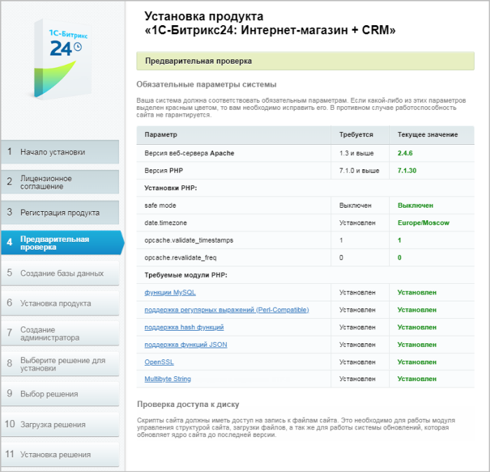
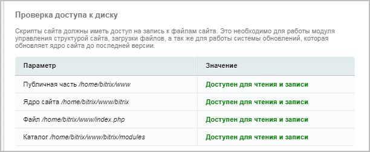
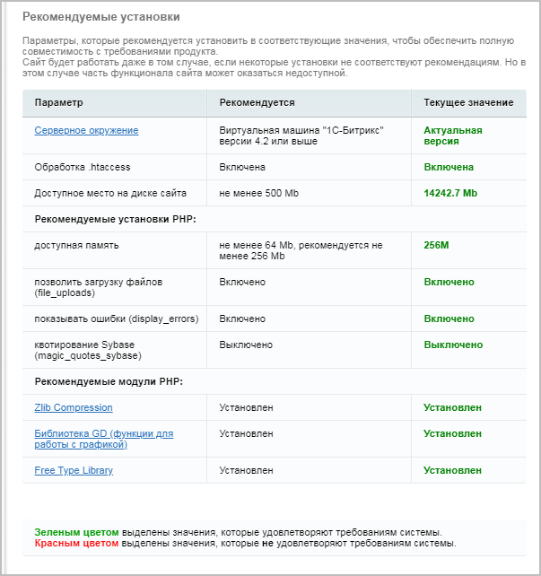

# Четвёртый шаг

**Навигация**
- [← Оглавление курса](index.md)
- [← Предыдущий: 12966 — Третий шаг](lesson_12966.md)
- [Следующий: 12970 — Пятый шаг →](lesson_12970.md)

Официальная страница урока: https://dev.1c-bitrix.ru/learning/course/index.php?COURSE_ID=135&LESSON_ID=12968

|  | ### Четвёртый шаг установки (предварительная проверка) |
| --- | --- |

**Примечание:**Если продукт устанавливается на *Виртуальной машине

			BitrixVM

**«1C-Битрикс: Виртуальная машина» (BitrixVM)** – бесплатный программный продукт, готовый к немедленному использованию виртуальный сервер, полностью настроенный, протестированный и адаптированный для оптимальной работы как с продуктами «1С-Битрикс», так и с любыми PHP-приложениями. Имеется в версии для Windows и для Unix систем.

[Подробнее](https://dev.1c-bitrix.ru/learning/course/index.php?COURSE_ID=37&INDEX=Y)...* (VMWare/VirtualBox), то этот шаг будет пропущен.

Производится проверка системы на:

- соответствие
  			минимальным техническим требованиям
  Для работы продукта требуется наличие PHP версии не ниже **7.2.0**. Выбор PHP-версии зависит от требований, предъявляемых вашим хостинг-провайдером, либо от установленной версии PHP на локальном компьютере. Рекомендуется использовать самую последнюю стабильную версию PHP, чтобы исключить возможность появления ошибок, связанных с PHP, а также для большей безопасности проекта на сервере.
  [Подробнее](lesson_2593.md)...
  		 продукта:
  С версии **20.100.0** Главного модуля (**main**) требуется удаление настройки PHP **mbstring.func_overload**. Эта опция более не требуется и не поддерживается платформой.
  

- права доступа к диску:
  
- наличие рекомендуемых установок:
  
  Технически установка продукта возможна и при отсутствии рекомендуемых установок, но после прохождения шагов **Мастера** приведите систему в соответствие с рекомендованными настройками. Иначе есть вероятность, что сайт работать не будет.
  В дальнейшем проверить настройки системы можно в административном разделе на странице
  			Проверка системы
  
  [Подробнее](https://dev.1c-bitrix.ru/learning/course/index.php?COURSE_ID=35&CHAPTER_ID=02024&LESSON_PATH=3906.4493.4506.2024)...
  		 (Настройки &gt; Инструменты &gt; Проверка системы).

Для продолжения установки нажмите кнопку **Далее**.
