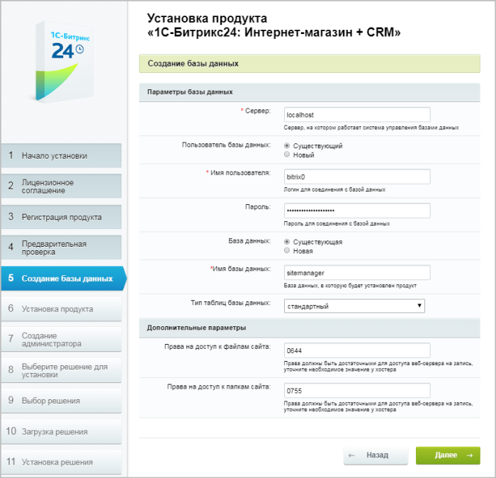

# Пятый шаг

**Навигация**
- [← Оглавление курса](index.md)
- [← Предыдущий: 12968 — Четвёртый шаг](lesson_12968.md)
- [Следующий: 13160 — Шестой шаг →](lesson_13160.md)

Официальная страница урока: https://dev.1c-bitrix.ru/learning/course/index.php?COURSE_ID=135&LESSON_ID=12970

|  | ### Пятый шаг установки (создание базы данных) |
| --- | --- |

**Примечание:**Если продукт устанавливается на *Виртуальной машине

			BitrixVM

**«1C-Битрикс: Виртуальная машина» (BitrixVM)** – бесплатный программный продукт, готовый к немедленному использованию виртуальный сервер, полностью настроенный, протестированный и адаптированный для оптимальной работы как с продуктами «1С-Битрикс», так и с любыми PHP-приложениями. Имеется в версии для Windows и для Unix систем.

[Подробнее](https://dev.1c-bitrix.ru/learning/course/index.php?COURSE_ID=37&INDEX=Y)...* (VMWare/VirtualBox), то этот шаг будет пропущен.

Продукт 1С-Битрикс: Управление сайтом поддерживает базы данных MySQL и PostgreSQL.

На пятом шаге мастер создает конфигурационный файл соединения с базой данных и производит загрузку данных в базу.

- **Параметры базы данных**
  ## Для локальной установки
  Рассмотрим установку на локальный компьютер на примере базы данных MySQL. Заполните поля:
  - **Сервер** – сервер, на котором работает система управления базами данных (СУБД) – *MySQL*. Для локального компьютера этот параметр обычно имеет значение **localhost** с портом, на котором работает *MySQL*, в формате **localhost:[номер_порта]**. Номер порта можно найти в конфигурационных файлах *MySQL*.
  - **Пользователь базы данных** –  создайте нового пользователя;
  - **Имя пользователя** – введите произвольное имя (логин) пользователя СУБД для доступа к базе данных;
  - **Пароль** – укажите пароль пользователя для доступа к базе данных;
  - **База данных** – создайте новую базу;
  - **Имя базы данных** – введите имя создаваемой базы данных (любое имя на латинице, возможно использование цифр и символа подчеркивания).
  - **Тип таблиц базы данных** – выберите подходящий тип таблиц для базы данных.
  **Примечание:** Для интернет-магазинов предпочтительнее тип
  			InnoDB
  Таблицы **InnoDB** в *MySQL* снабжены обработчиком таблиц, обеспечивающим
  безопасные транзакции с возможностями фиксации транзакции, отката и восстановления после сбоя.
  Для таблиц **InnoDB** осуществляется блокировка на уровне строки, а также используется
  метод чтения без блокировок в команде `SELECT`. На случай отмены транзакций
  ведется журнал транзакций. Он подвержен внутренней ротации, т.е. когда заполняются все записи,
  самые старые из них начинают удаляться. Перечисленные функции позволяют улучшить
  взаимную совместимость и повысить производительность в многопользовательском режиме.
  **InnoDB** предназначается для получения максимальной производительности при обработке
  больших объемов данных. По эффективности использования процессора этот тип намного
  превосходит другие модели реляционных баз данных с памятью на дисках.
  		, нежели
  			стандартный
  Стандартным типом таблиц в *MySQL* является тип **MyISAM**, который **не** является
  ориентированным на транзакции. Для таблиц типа **MylSAM** все данные сохраняются
  в одном файле, следовательно, максимальный размер файла одновременно является
  максимальным размером таблицы.
  Операционные системы налагают свои ограничения на максимальный размер файла. Обычно
  он составляет от 2 до 4 Гбайт. Таблицы **MylSAM** являются платформо-независимыми.
  Табличные файлы можно перемещать между компьютерами разных архитектур и разными
  операционными системами без всякого преобразования.
  		 тип, так как у таких сайтов повышенные требования к нагрузке.
- Далее выберите **Создать новую базу данных**. Появится дополнительная группа:
  			Пароль и логин администратора базы данных
                      
  		.

  - В поле **Логин** введите **root**.
  - Поле **Пароль** оставьте пустым.

## Для установки на удалённый сервер

При установке на удаленном сервере данные для полей параметров базы данных вам надо запросить у службы поддержки удаленного сервера и заполнить поля:

- **Сервер** – укажите сервер, на котором работает система управления базами данных (СУБД);
- **Пользователь базы данных** – укажите, нужно ли создавать нового пользователя базы данных в процессе установки, или же использовать данные существующего пользователя;
- **Имя пользователя** – укажите имя (логин) пользователя СУБД для доступа к базе данных;
- **Пароль** – пароль пользователя для доступа к базе данных;
- **База данных** – определите, создавать ли новую базу данных в процессе установки или использовать существующую;
- **Имя базы данных** – укажите имя базы данных, в которую будет установлен продукт;
- **Тип таблиц базы данных** – выберите подходящий тип таблиц для базы данных.

**Примечание:** Для интернет-магазинов предпочтительнее тип

			InnoDB

Таблицы **InnoDB** в *MySQL* снабжены обработчиком таблиц, обеспечивающим

безопасные транзакции с возможностями фиксации транзакции, отката и восстановления после сбоя.

Для таблиц **InnoDB** осуществляется блокировка на уровне строки, а также используется

метод чтения без блокировок в команде `SELECT`. На случай отмены транзакций

ведется журнал транзакций. Он подвержен внутренней ротации, т.е. когда заполняются все записи,

самые старые из них начинают удаляться. Перечисленные функции позволяют улучшить

взаимную совместимость и повысить производительность в многопользовательском режиме.

**InnoDB** предназначается для получения максимальной производительности при обработке

больших объемов данных. По эффективности использования процессора этот тип намного

превосходит другие модели реляционных баз данных с памятью на дисках.

		, нежели

			стандартный

Стандартным типом таблиц в *MySQL* является тип **MyISAM**, который **не** является

ориентированным на транзакции. Для таблиц типа **MylSAM** все данные сохраняются

в одном файле, следовательно, максимальный размер файла одновременно является

максимальным размером таблицы.

Операционные системы налагают свои ограничения на максимальный размер файла. Обычно

он составляет от 2 до 4 Гбайт. Таблицы **MylSAM** являются платформо-независимыми.

Табличные файлы можно перемещать между компьютерами разных архитектур и разными

операционными системами без всякого преобразования.

		 тип, так как у таких сайтов повышенные требования к нагрузке.

**Внимание!** Если в процессе установки необходимо создать нового пользователя или новую базу данных, то требуется ввести **Логин** и **Пароль** администратора базы данных. Если база данных ранее не была создана, то обязательно необходимо выбрать **новая** в поле **База Данных**. Как правило, база данных создается на сервере самой службой хостинга. Вам нужно только лишь получить имя и параметры доступа к ней.

**Дополнительные параметры**

Эти параметры определяют права доступа к файлам сайта (для всех типов баз данных).

Заполните поля:

- **Права на доступ к файлам сайта** – права, с которыми будут создаваться файлы. Права должны быть достаточными для доступа веб-сервера на запись. По умолчанию имеет значение
  			0644
  Право на чтение для всех, право на запись для владельца.
  		;
- **Права на доступ к папкам сайта** – права, с которыми будут создаваться каталоги. Права должны быть достаточными для доступа веб-сервера на запись. По умолчанию имеет значение
  			0755
  Право на чтение и исполнение для всех, право на запись для владельца.
  		.

**Примечание:** Ручную установку параметров соединения с базой данных (в том числе и максимальный объем памяти для выполнения скрипта) вы можете выполнить в файлах `/bitrix/php_interface/dbconn.php` до версии 20.900.0 и `/bitrix/.settings.php` с этой же версии. Файлы будут созданы после завершения установки.

Для продолжения установки нажмите кнопку **Далее**.
