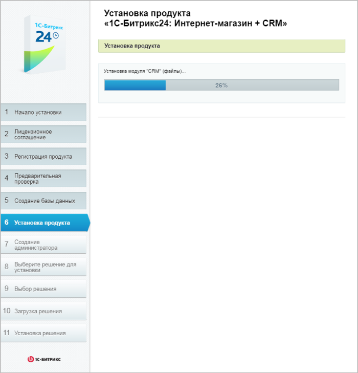

# Шестой шаг

**Навигация**
- [← Оглавление курса](index.md)
- [← Предыдущий: 12970 — Пятый шаг](lesson_12970.md)
- [Следующий: 13162 — Седьмой шаг →](lesson_13162.md)

Официальная страница урока: https://dev.1c-bitrix.ru/learning/course/index.php?COURSE_ID=135&LESSON_ID=13160

|  | ### Шестой шаг установки (установка продукта) |
| --- | --- |

Автоматический шаг, когда выполняется создание таблиц в базе данных и установка файлов системы. Отслеживание процесса можно вести по графическому индикатору. После завершения процесса создания базы данных система автоматически перейдет к следующему шагу.

