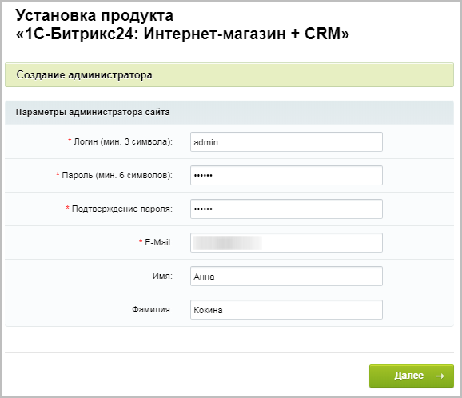

# Седьмой шаг

**Навигация**
- [← Оглавление курса](index.md)
- [← Предыдущий: 13160 — Шестой шаг](lesson_13160.md)
- [Следующий: 22634 — Настройка виджета онлайн-чата в многосайтовой конфигурации →](lesson_22634.md)

Официальная страница урока: https://dev.1c-bitrix.ru/learning/course/index.php?COURSE_ID=135&LESSON_ID=13162

|  | ### Седьмой шаг установки (создание администратора) |
| --- | --- |

На данном этапе производится настройка сайта и создается учетная запись (бюджет) администратора сайта, которому будут доступны все функции настройки и управления сайтом. После установки системы администратор при необходимости может создать дополнительные учетные записи пользователей с меньшим количеством прав.

Поля, отмеченные *, обязательны для заполнения.

- ***Логин** – логин (имя) администратора сайта для входа в административный раздел сайта. Логин должен быть не короче трех символов. Используйте в логине только латинские буквы и цифры.
- ***Пароль** – пароль администратора сайта для входа в административный раздел сайта. Используйте в пароле только латинские буквы и цифры.
  **Важно!** Для администратора сайта настоятельно рекомендуется использовать сложный пароль длиной более 6 символов.
- ***Подтверждение пароля** – пароль вводится еще раз для проверки правильности набора.
- ***E-Mail** – адрес электронной почты администратора сайта (e-mail).
- **Имя** – имя администратора сайта.
- **Фамилия** – фамилия администратора сайта.

**Примечание**: Введенные пароль и логин в дальнейшем будут использоваться администратором для авторизации при входе в систему.

Для продолжения установки нажмите кнопку **Далее**. Откроется

			Мастер настройки продукта «1С-Битрикс24».

Описание пошагового процесса настройки портала *Битрикс24*.

[Подробнее](lesson_3637.md)...
