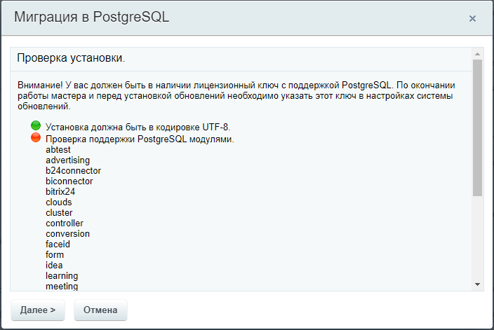
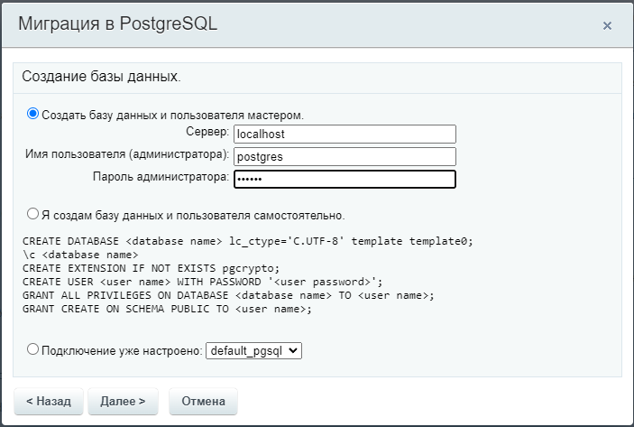
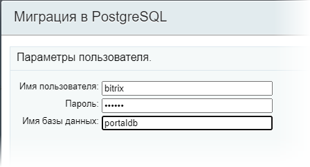
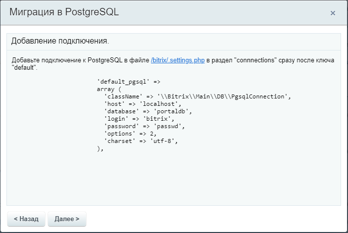
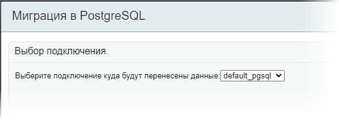
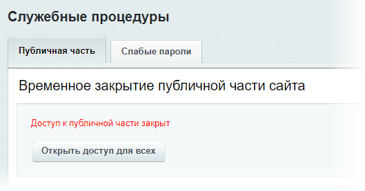
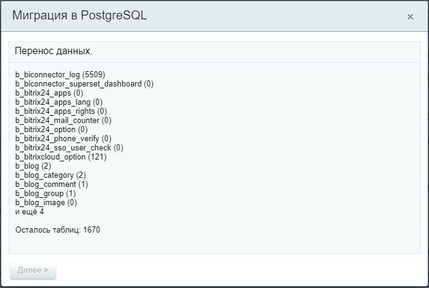
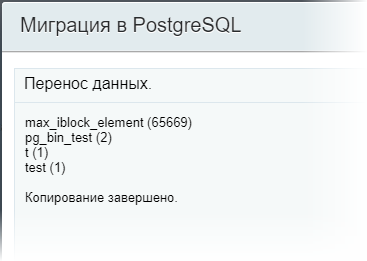
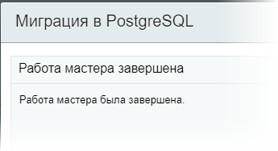

# Миграция через мастер

**Навигация**
- [← Оглавление курса](index.md)
- [← Предыдущий: 15284 — Порядок действий для миграции](lesson_15284.md)
- [Следующий: 15288 — Миграция через командную строку →](lesson_15288.md)

Официальная страница урока: https://dev.1c-bitrix.ru/learning/course/index.php?COURSE_ID=135&LESSON_ID=15286

Перейдите в административный раздел Рабочий стол &gt; Настройки &gt; Настройки продукта &gt; Список мастеров (`/bitrix/admin/wizard_list.php?lang=ru`) и запустите мастер **Миграция в PostgreSQL** (bitrix:perfon.pgsql). Начнётся пошаговый процесс миграции.

1. Сначала Мастер проверяет минимально достаточные требования:
  
  Модули, не поддерживающие PostgreSQL, необходимо деинсталлировать на странице **Управление модулями** (Рабочий стол &gt; Настройки &gt; Настройки продукта &gt; Модули).
2. На втором шаге или выберите уже созданную базу, или создайте новую базу (с помощью мастера или самостоятельно). Укажите логин и пароль администратора чтобы создать пользователя и базу данных:
  
3. Задайте
                      
  		 имя пользователя, пароль и базу данных для миграции.
  В случае возникновения ошибки система ее
  			отобразит
                       
  		. Исправьте ошибку нажмите «Далее».
4. Если создание и подключение к базе данных прошли успешно — добавьте это подключение в файл [/bitrix/.settings.php](https://dev.1c-bitrix.ru/learning/course/index.php?COURSE_ID=43&CHAPTER_ID=02795).
  
  Кликните по ссылке в окне и в новой вкладке откроется файл для редактирования. Должен получиться примерно такой код:
  ```
   'connections' =>
  	array (
  		'value' =>
  		array (
  			'default' =>
  			array (
  			'className' => '\\Bitrix\\Main\\DB\\MysqliConnection',
  			'host' => 'localhost',
  			'database' => 'cp',
  			'login' => 'cp',
  			'password' => 'cp',
  			'options' => 2,
  			'charset' => 'utf8',
  			'include_after_connected' => '',
  		),
  		'default_pgsql' =>
  		array (
  			'className' => '\\Bitrix\\Main\\DB\\PgsqlConnection',
  			'host' => 'localhost',
  			'database' => 'portal',
  			'login' => 'bitrix',
  			'password' => 'passwd',
  			'options' => 2,
  			'charset' => 'utf-8',
  			'include_after_connected' => '',
  		),
  	),
  	'readonly' => true,
  	),
  ```
5. На следующем шаге мастера выберите
  			добавленное подключение
                      
  		.
  На всё время копирования таблиц из MySQL сайт будет
  			закрыт от посетителей
                      
  		. Это поможет предотвратить любые изменения в базе данных. В противном случае целостность базы данных может быть нарушена.
  И начнётся процесс копирования данных:
  
6. Дождитесь
  			сообщения
                      
  		 об окончании копирования. Время выполнения процесса  зависит от объема данных, мощности сервера и настроек БД.
7. Отредактируйте **.settings.php**, переименовав подключения в разделе `connections`:

  - **default** в **default_mysql**
  - **default_pgsql** в **default**

			Всё готово!

                    

		, вы справились.

**Примечание** Сайт для доступа откроется автоматически после завершения миграции.
