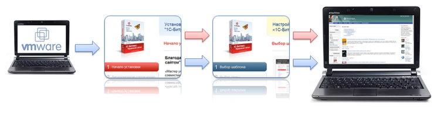
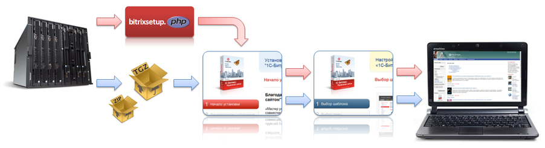
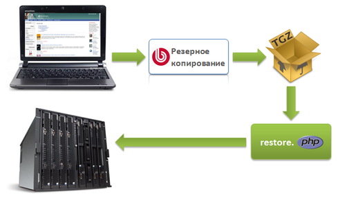

# Карта установки

**Навигация**
- [← Оглавление курса](index.md)
- [← Предыдущий: 2599 — Поддержка стандартов и технологий. Требования к клиентскому программному обеспечению](lesson_2599.md)
- [Следующий: 9369 — Установка дистрибутива сайта в BitrixVM/BitrixEnv →](lesson_9369.md)

Официальная страница урока: https://dev.1c-bitrix.ru/learning/course/index.php?COURSE_ID=135&LESSON_ID=1933

*"1C-Битрикс: Управление сайтом"* и *"Битрикс24 в коробке"*имеют несколько способов и вариантов установки. Конкретный способ зависит от целей установки, имеющегося на компьютере ПО, выбранного решения. Карта установки позволит вам выбрать для себя оптимальный вариант установки из множества возможных.

- **Ознакомление с продуктом на локальном компьютере**
  Для ознакомления с продуктом на локальном компьютере используйте установку ["1С-Битрикс: Управление сайтом"](/learning/course/index.php?COURSE_ID=135&CHAPTER_ID=04522) или ["Битрикс24 в коробке"](/learning/course/index.php?COURSE_ID=135&CHAPTER_ID=04702) на [Виртуальную машину](lesson_9369.md).
  
- **Установка на удаленный сервер**
  Для установки на удаленный сервер мы рекомендуем использовать скрипт [BitrixSetup](lesson_4523.md). Также в этой ситуации можно воспользоваться установкой продукта с помощью архива [**.tar.gz** или **.zip**](lesson_2040.md).
  Для установки на выделенный сервер рекомендуется ["1С-Битрикс: Веб-окружение" - Linux](https://dev.1c-bitrix.ru/learning/course/index.php?COURSE_ID=37&LESSON_ID=8811)

- **Перенос сайта между разными площадками**
  Для копирования сайта с локального компьютера на удаленный сервер или наоборот, а также для переезда с одного сервера на другой, воспользуйтесь главой [Перенос продукта](/learning/course/index.php?COURSE_ID=135&CHAPTER_ID=04496).
  
