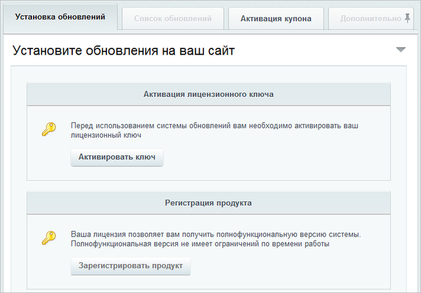
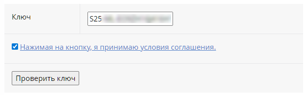

# Регистрация коммерческого продукта

**Навигация**
- [← Оглавление курса](index.md)
- [← Предыдущий: 6307 — Приложения Marketplace](lesson_6307.md)
- [Следующий: 1946 — Регистрация пробной (DEMO) версии продукта →](lesson_1946.md)

Официальная страница урока: https://dev.1c-bitrix.ru/learning/course/index.php?COURSE_ID=135&LESSON_ID=1945

### Зачем регистрировать?

Зарегистрировав продукт, вы получите доступ к бесплатным обновлениям системы, а также приоритетный доступ к службе Технической поддержки компании «1С-Битрикс» на период активности лицензии. Для неактивной лицензии техническая поддержка также осуществляется, но по менее строгому регламенту.

Кроме того, вы также получите доступ к закрытому форуму компании, где можно принять участие в обсуждении интересующей темы, а также вынести на обсуждение возникший вопрос.

Продукт «1C-Битрикс» может быть временно установлен на дополнительный компьютер для разработки, тестирования и/или наполнения сайта при условии отсутствия любого "внешнего" доступа к ней (в том числе из сети Интернет или извне локальной сети пользователя). Такая установка должна быть немедленно удалена после завершения этих работ. При получении ошибки о превышении допустимого количества установок продукта необходимо обратиться в [Техподдержку «1C-Битрикс»](https://www.1c-bitrix.ru/support/customers/ticket.php?show_wizard=Y).

С использованием одного и того же лицензионного ключа продукт «1C-Битрикс» можно установить **не более двух раз**. Публичный доступ к одной из этих двух копий должен быть ограничен и использоваться только

			для разработки и тестирования

                    Начиная с версии 16.5.7 и старше, в продуктах «1С-Битрикс» можно пометить новую или существующую установку продукта специальным маркером Установка для разработки. Маркер позволяет проводить тестирование, не устанавливая продукт локально.

[Подробнее ...](lesson_8471.md)

		.

### Регистрация продукта

В

			Административном разделе

                    **Административный раздел** - раздел системы, недоступный для просмотра обычным посетителям сайта. В нём производятся настройки сайта и системы для работы.

[Подробнее...](https://dev.1c-bitrix.ru/learning/course/index.php?COURSE_ID=34&CHAPTER_ID=04459&LESSON_PATH=3905.4455.4459)

		 откройте страницу *Обновление платформы*. Откроется форма, в которой можно активировать ключ, зарегистрировать продукт и установить обновления.

Ключ нужно активировать при первом использовании. Нажмите кнопку *Активировать ключ* — откроется официальный сайт с полем для ввода ключа. Введите ключ и нажмите *Проверить ключ*.

Заполните поля формы для активации ключа:

- Полное юридическое название компании-владельца продукта или ФИО частного лица — укажите название организации, которая является
  			владельцем ключа
                      Если по каким-то причинам указали не то ЮЛ, то сменить его можно будет через Партнерский отдел компании 1С-Битрикс.
  		. Если владельцем ключа является частное лицо, укажите его имя.
- Список адресов, включая тестовые, по которым будет доступна данная копия продукта «1С-Битрикс» — укажите через запятую адреса сайтов, которые будут работать с указанным лицензионным ключом.
- Телефон владельца данной копии продукта — укажите номер телефона владельца продукта с кодом города.
- E-mail владельца для связи по вопросам лицензирования и использования программного продукта — укажите адрес электронной почты, по которому сотрудники компании «1С-Битрикс» могут связаться с вами при необходимости.
- Контактное лицо, ответственное за использование данной копии программного продукта — укажите ФИО ответственного контактного лица.
- E-mail контактного лица — укажите адрес электронной почты контактного лица клиента.
- Телефон контактного лица — укажите телефон контактного лица.
- Прочая контактная информация — укажите любую дополнительную контактную информацию: адреса электронной почты, почтовый адрес, номера контактных телефонов и так далее.
- Я не зарегистрирован на сайте [www.1с-bitrix.ru](http://www.1c-bitrix.ru) и хочу зарегистрироваться — отметьте, если вы не регистрировались на сайте компании «1С-Битрикс». Откроется форма регистрации, в которой нужно указать имя, фамилию, логин, пароль и email.
  
  После активации лицензионного ключа вы будете зарегистрированы на сайте компании с указанными данными. Вы сможете обратиться в службу Технической поддержки компании «1С-Битрикс» и получить доступ к закрытому форуму на сайте компании.
- Я зарегистрирован на сайте… — отметьте эту опцию, если вы уже регистрировались на сайте [www.1с-bitrix.ru](http://www.1c-bitrix.ru) и хотите использовать свой аккаунт.
- Нажмите кнопку *Активировать ключ*. Лицензия активируется.

Вернитесь в административный раздел продукта на страницу *Обновление платформы*. Нажмите

			Зарегистрировать продукт

                    

		. Продукт будет зарегистрирован на указанные при активации данные.

Если вы активировали лицензионный ключ ранее, достаточно сразу зарегистрировать продукт в системе обновлений.

После регистрации отобразится информация о лицензии:

