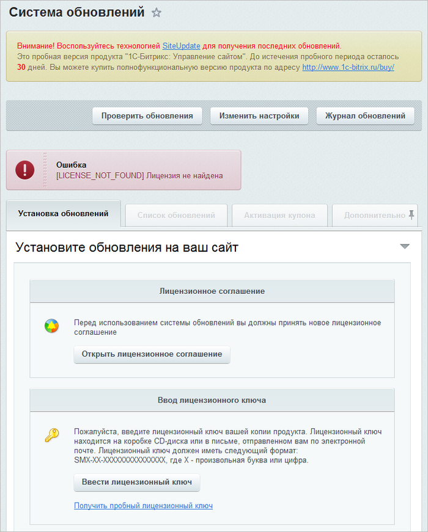
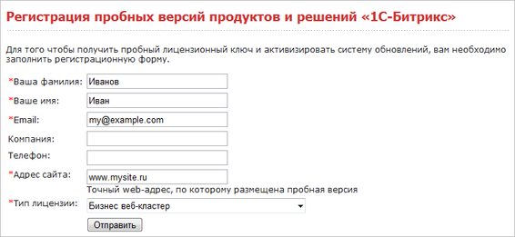
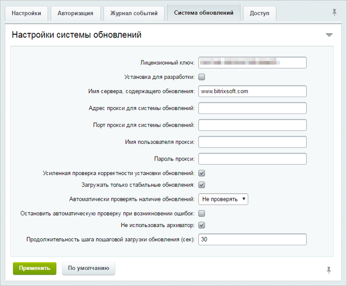
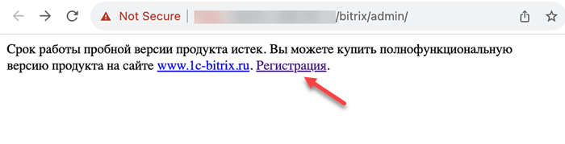

# Регистрация пробной (DEMO) версии продукта

**Навигация**
- [← Оглавление курса](index.md)
- [← Предыдущий: 1945 — Регистрация коммерческого продукта](lesson_1945.md)
- [Следующий: 1947 — Регистрация демо-версии коммерческим ключом →](lesson_1947.md)

Официальная страница урока: https://dev.1c-bitrix.ru/learning/course/index.php?COURSE_ID=135&LESSON_ID=1946

### Регистрация демо-версии

Для работы локальной демо-версии нет необходимости в получении пробного ключа. Он снимает только одно ограничение демо-версии: позволяет выполнять обновления системы. Регистрация пробной версии возможна двумя путями:

1. При установке пробной версии продукта на шаге [Регистрация продукта](lesson_2043.md) отметить опцию
  			Я хочу зарегистрировать свою копию продукта и получать обновления
                      
  		 и ввести данные, на которые будет зарегистрирована пробная версия. Таким образом, пробная версия будет уже активирована на 30 дней.
2. После установки пробной версии продукта перейдите в раздел **Система обновлений** (Marketplace &gt; Обновление платформы), прочитайте и  примите лицензионное соглашение.
  
  Затем воспользуйтесь ссылкой Получить пробный лицензионный ключ, которая приведёт на сайт компании в раздел регистрации пробных версий продуктов с формой регистрации:
  
  Заполните регистрационную форму, смысл полей понятен из их названий, поясним некоторые моменты:
  По введенному вами в форме адресу электронной почты будет выслано сообщение с указанием лицензионного ключа и срока его действия. Этот ключ вы можете ввести в окно формы, с которой производился запрос, или на странице изменения настроек **Главного модуля**. Для этого:
  Теперь демо-версия продукта может получать обновления в течение 30-дневного периода.

  - **E-mail**: укажите адрес вашей электронной почты (e-mail). Адрес должен быть валидным, по нему будет выслан пробный лицензионный ключ.
  - **Адрес сайта**: укажите точный web-адрес, по которому размещена пробная версия продукта. Если адреса ещё нет, оставьте значение по умолчанию.
  - **Тип лицензии**: выберите из списка редакцию устанавливаемого продукта.

  - В Административном разделе перейдите на закладку
    			Система обновлений
                        
    		 страницы настроек **Главного модуля** (Настройки &gt; Настройки продукта &gt; Настройки модулей &gt; Главный модуль).
  - В поле **Лицензионный ключ** введите номер полученного ключа.

### Переход на коммерческую версию

Вы можете перевести демо-версию в статус коммерческих, приобретя коммерческий лицензионный ключ.

Путь перехода зависит от того, закончился ли период действия демо-версии:

- **Если период действия демо-версии ещё не истёк:**
  Зарегистрируйте демо-версию коммерческим ключом, как это описано [в следующем уроке](lesson_1946.md).
- **Если период действия демо-версии истёк:**
  После окончания пробного периода ваша копия программного продукта будет заблокирована, но при этом все данные сохранятся.
  Чтобы разблокировать демо-версию, кликните по ссылке
  			Регистрация
  
  		 на странице блокировки вашей демо-версии – откроется страница [ваш_сайт]/bitrix/coupon_activation.php. Введите на ней логин и пароль администратора, а также приобретённый лицензионный ключ продукта.
  После того, как ваша копия продукта будет разблокирована, перейдите в административном разделе на страницу Marketplace &gt; Обновление платформы и активируйте ключ, как описано [в уроке](lesson_1945.md).

**Примечание**: При возникновении проблем с разблокировкой демо-версии обратитесь в [Техподдержку](https://dev.1c-bitrix.ru/support/).
