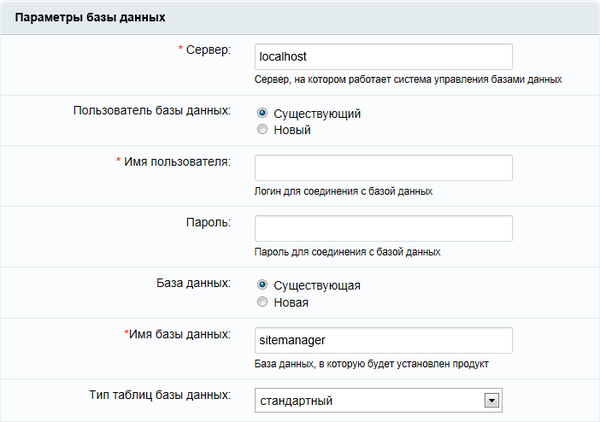
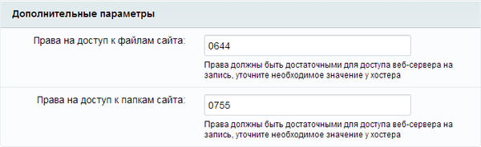

# Четвёртый шаг

**Навигация**
- [← Оглавление курса](index.md)
- [← Предыдущий: 2044 — Третий шаг](lesson_2044.md)
- [Следующий: 2058 — Пятый шаг →](lesson_2058.md)

Официальная страница урока: https://dev.1c-bitrix.ru/learning/course/index.php?COURSE_ID=135&LESSON_ID=2045

**Примечание:**Если продукт устанавливается на *Виртуальной машине BitrixVM*, то этот шаг будет пропущен.

### Создание базы данных

Продукт 1С-Битрикс: Управление сайтом поддерживает базы данных MySQL и PostgreSQL.

На четвертом шаге мастер создает конфигурационный файл соединения с базой данных и производит загрузку данных в базу.

### Локальная установка

Рассмотрим установку на локальный компьютер на примере базы данных MySQL. Заполните поля:

- **Сервер:** сервер, на котором работает система управления базами данных (СУБД), в данном случае *MySQL*. Для локального компьютера этот параметр обычно имеет значение **localhost** с портом, на котором работает *MySQL*, в формате **localhost:[номер_порта]**. Номер порта можно найти в конфигурационных файлах *MySQL*.

- **Пользователь базы данных:** выберите создать **нового** пользователя;
- **Имя пользователя:** введите произвольное имя (логин) пользователя СУБД для доступа к базе данных.
- **Пароль:** пароль пользователя для доступа к базе данных.
- **База данных:** создать новую базу.
- **Имя базы данных:** имя создаваемой базы данных. Любое имя на латинице, возможно использование цифр и символа подчеркивания.
- **Тип таблиц базы данных:** для большинства случаев подойдет тип стандартный.
  Возможен выбор из двух вариантов:

  - **Стандартный**. Стандартным типом таблиц в *MySQL* является тип **MyISAM**, который не является ориентированным на транзакции. Для таблиц типа **MylSAM** все данные сохраняются в одном файле, следовательно, максимальный размер файла одновременно является максимальным размером таблицы.
    Операционные системы налагают свои ограничения на максимальный размер файла. Обычно он составляет от 2 до 4 Гбайт. Таблицы **MylSAM** являются платформо-независимыми. Табличные файлы можно перемещать между компьютерами разных архитектур и разными операционными системами без всякого преобразования.
  - **Innodb**. Таблицы **InnoDB** в *MySQL* снабжены обработчиком таблиц, обеспечивающим безопасные транзакции с возможностями фиксации транзакции, отката и восстановления после сбоя.
    Для таблиц **InnoDB** осуществляется блокировка на уровне строки, а также используется метод чтения без блокировок в команде `SELECT`. На случай отмены транзакций ведется журнал транзакций. Он подвержен внутренней ротации, т.е. когда заполняются все записи, самые старые из них начинают удаляться. Перечисленные функции позволяют улучшить взаимную совместимость и повысить производительность в многопользовательском режиме.
    **InnoDB** предназначается для получения максимальной производительности при обработке больших объемов данных. По эффективности использования процессора этот тип намного превосходит другие модели реляционных баз данных с памятью на дисках.
- Далее выберите **Создать новую базу данных**. Появится дополнительная группа:
  			Пароль и логин администратора базы данных
                      
  		.

  - В поле **Логин** введите **root**.
  - Поле **Пароль** оставьте пустым.

Для PostgreSQL настройка базы данных похожа, но есть два отличия:

- не нужно указывать тип таблиц,
- для создания новой базы данных или пользователя нужны логин и пароль администратора базы данных — запросите их у вашего хостинга.

### Удалённый сервер

При установке на удаленном сервере данные для полей параметров базы данных вам надо запросить у службы поддержки удаленного сервера и заполнить поля:

- **Сервер:** укажите сервер, на котором работает система управления базами данных (СУБД).
- **Пользователь базы данных:** переключатель определяет, создавать ли нового пользователя базы данных в процессе установки или использовать данные существующего пользователя.
- **Имя пользователя:** имя (логин) пользователя СУБД для доступа к базе данных.
- **Пароль:** пароль пользователя для доступа к базе данных.
- **База данных:** переключатель определяет: создавать ли новую базу данных в процессе установки или использовать существующую.
- **Имя базы данных:** имя базы данных, в которую будет установлен продукт.
- **Тип таблиц базы данных:** выбор между различными типами таблиц для базы данных.

**Внимание!** В большинстве случаев подойдет стандартный тип таблиц. Для сайтов с повышенными требованиями к нагрузке, например, интернет-магазинов, для базы данных *MySQL* предпочтительнее тип **InnoDB**.

**Внимание!** Если в процессе установки необходимо создать нового пользователя или новую базу данных, то требуется ввести **Логин** и **Пароль** администратора базы данных. Если базы данных ранее не было создано, то обязательно необходимо выбрать **новая** в поле **База Данных**. Как правило, база данных создается на сервере самой службой хостинга. Вам нужно лишь только получить имя и параметры доступа к ней.

### Дополнительные параметры

Эти параметры определяют права доступа к файлам сайта (для всех типов баз данных).

Заполните поля:

- **Права на доступ к файлам сайта:** права, с которыми будут создаваться файлы. Права должны быть достаточными для доступа веб-сервера на запись. По умолчанию имеет значение **0644**;
- **Права на доступ к папкам сайта:** права, с которыми будут создаваться каталоги. Права должны быть достаточными для доступа веб-сервера на запись. По умолчанию имеет значение **0755**.

**Примечание**: Ручную установку параметров соединения с базой данных (в том числе и максимальный объем памяти для выполнения скрипта) вы можете выполнить в файлах `/bitrix/php_interface/dbconn.php` и `/bitrix/.settings.php`. Файлы будут созданы после завершения установки.

Для продолжения установки нажмите кнопку **Далее**.
