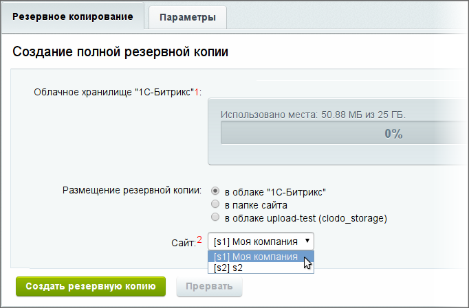
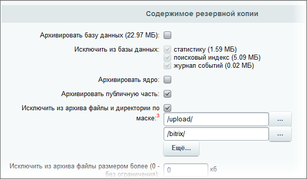
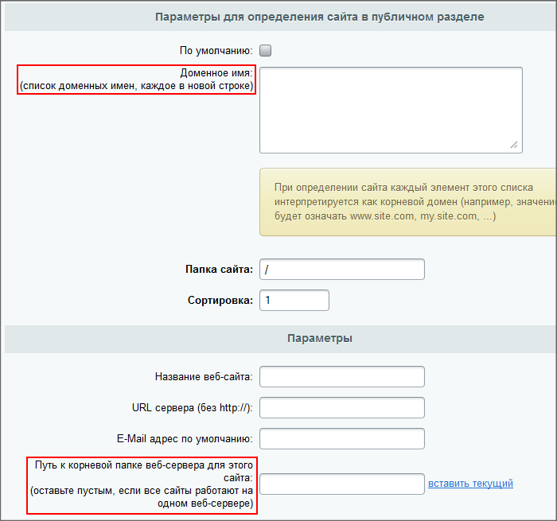

# Перенос сайтов в многосайтовой конфигурации

**Навигация**
- [← Оглавление курса](index.md)
- [← Предыдущий: 3554 — Битрикс и хостинг](lesson_3554.md)
- [Следующий: 29246 — Перенос продукта «1C-Битрикс» в виртуальную среду BitrixVM/BitrixEnv →](lesson_29246.md)

Официальная страница урока: https://dev.1c-bitrix.ru/learning/course/index.php?COURSE_ID=135&LESSON_ID=2559

### Порядок действий

Прежде всего, многосайтовость должна быть настроена на [разных доменах](https://dev.1c-bitrix.ru/learning/course/index.php?COURSE_ID=103&LESSON_ID=287).

Во-вторых, несколько меняется общий порядок действий:

1. Создайте [резервную копию](https://dev.1c-bitrix.ru/learning/course/index.php?COURSE_ID=35&LESSON_ID=5330) главного сайта с ядром, файлами и базой:
  
2. Перенесите главный сайт через [restore.php](https://dev.1c-bitrix.ru/learning/course/index.php?COURSE_ID=135&CHAPTER_ID=02014).
3. Создайте [резервную копию](https://dev.1c-bitrix.ru/learning/course/index.php?COURSE_ID=35&LESSON_ID=5330) второго и других сайтов без ядра и базы, только файлы. При создании копии исключите из архива папки `/bitrix` и `/upload`:
  
4. Перенесите второй и другие сайты через [restore.php](https://dev.1c-bitrix.ru/learning/course/index.php?COURSE_ID=135&CHAPTER_ID=02014).
5. С помощью файла [symlink.php](https://dev.1c-bitrix.ru/learning/course/index.php?COURSE_ID=103&LESSON_ID=287#simlink) сделайте связку с первым сайтом.
6. Настройте пути и доменные имена для каждого сайта:
  
