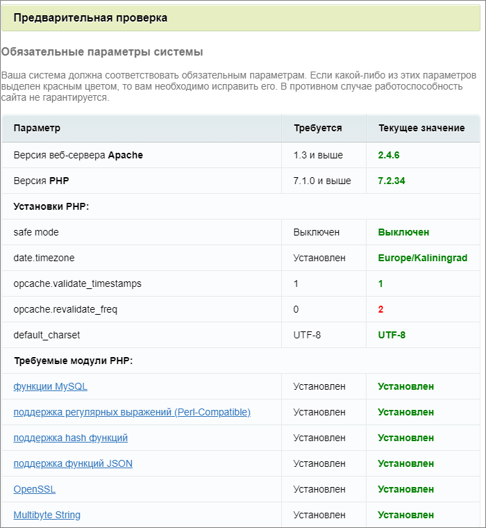
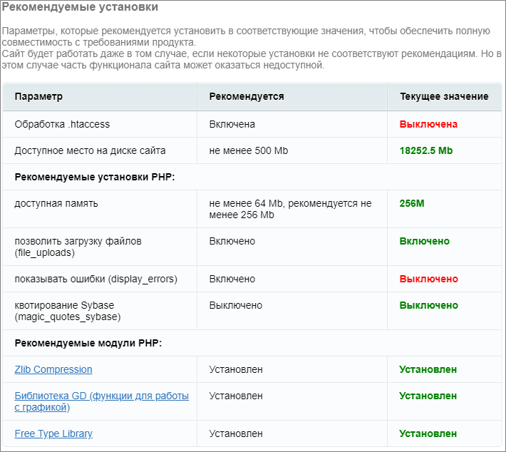
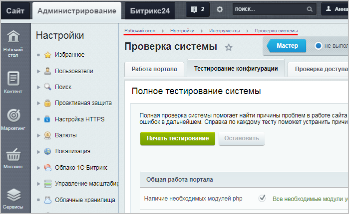

# Третий шаг

**Навигация**
- [← Оглавление курса](index.md)
- [← Предыдущий: 2616 — Второй шаг](lesson_2616.md)
- [Следующий: 2626 — Четвёртый шаг →](lesson_2626.md)

Официальная страница урока: https://dev.1c-bitrix.ru/learning/course/index.php?COURSE_ID=135&LESSON_ID=2618

**Примечание:**Если продукт устанавливается на *Виртуальной машине BitrixVM*, то этот шаг будет пропущен.

#### Третий шаг установки (предварительная проверка)

Проверка системы на:

- соответствие
  			минимальным техническим требованиям
                      Минимальным требованием продукта является наличие Apache версии 2.0 и выше, или MS IIS 5.0 и выше, PHP версии 8.1.0 и выше.
  [Подробнее...](lesson_2593.md)
  		 продукта;
- права доступа к диску;
- рекомендуемые установки.

Результаты проверки выводятся разными цветами:

С версии **20.100.0** Главного модуля (**main**) требуется удаление настройки PHP **mbstring.func_overload**. Эта опция более не требуется и не поддерживается платформой.

#### Обязательные параметры

#### Проверка доступа к диску

#### Рекомендуемые установки

Не рекомендуется продолжать установку продукта до устранения несовместимости.

Технически установка возможна, но после установки приведите систему в соответствие с рекомендованными настройками. Иначе есть вероятность, что сайт работать не будет.

В дальнейшем проверить настройки системы можно в административном разделе на странице

			Проверка системы

[Подробнее](https://dev.1c-bitrix.ru/learning/course/index.php?COURSE_ID=35&CHAPTER_ID=02024&LESSON_PATH=3906.4493.4506.2024)...

		 (Настройки &gt; Инструменты &gt; Проверка системы).

Для продолжения установки нажмите кнопку **Далее**.

25

[Описание курса](/learning/course/index.php?COURSE_ID=135&INDEX=Y)

[назад Второй шаг](lesson_2616.md)
		                                        [Четвёртый шаг вперед](lesson_2626.md)

Новинки документации в соцсетях:

[https://vk.com/1c_bitrix_doc](https://vk.com/1c_bitrix_doc)

[https://www.youtube.com/channel/UCtugDnALPdpOISTVfA8Hmjw](https://www.youtube.com/channel/UCtugDnALPdpOISTVfA8Hmjw)

[https://rutube.ru/channel/23487950/](https://rutube.ru/channel/23487950/)

[https://t.me/bitrixdoc](https://t.me/bitrixdoc)

Курсы разработаны в компании [«1С-Битрикс»](https://dev.1c-bitrix.ru)
