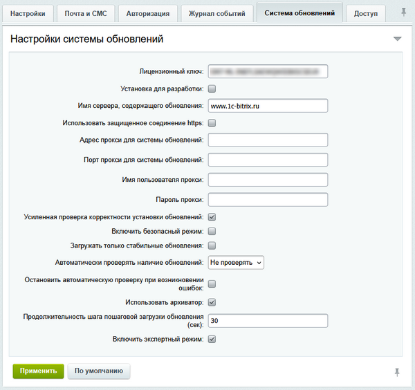

# Настройки системы обновлений

**Навигация**
- [← Оглавление курса](index.md)
- [← Предыдущий: 2688 — Общие сведения](lesson_2688.md)
- [Следующий: 2693 — Обновление ядра продукта →](lesson_2693.md)

Официальная страница урока: https://dev.1c-bitrix.ru/learning/course/index.php?COURSE_ID=135&LESSON_ID=2689

Настройки системы обновлений осуществляются на вкладке **Система обновлений** страницы настроек **Главного модуля** (Настройки &gt; Настройки продукта &gt; Настройки модулей &gt; Главный модуль)

- **Лицензионный ключ** – указывается лицензионный ключ продукта. Если коммерческая версия была уже зарегистрирована, то в этом поле будет уже указан лицензионный ключ.
- **Установка для разработки** – специальная [опция для разработчиков](lesson_8471.md), позволяющая устанавливать продукт без блокировки системы обновлений во время разработки.
- **Имя сервера, содержащего обновления** – указывается адрес сервера. По умолчанию поле уже заполнено.
  Если при установке обновлений вы увидите ошибку, проверьте адрес в поле *Имя сервера, содержащего обновления*. Правильный адрес — `www.1c-bitrix.ru`.
- **Использовать защищенное соединение https** – при включении этой опции соединение с сервером обновлений будет производиться по защищенному протоколу.
- Для настройки **обновления продукта через прокси-сервер** необходимо заполнить соответствующие поля:

  - Адрес прокси для системы обновлений;
  - Порт прокси для системы обновлений;
  - Имя пользователя прокси;
  - Пароль прокси.
- **Усиленная проверка корректности установки обновлений**. Использование этой функции системы несколько замедляет процесс установки, но позволяет получить информацию об успешности копирования тех или иных файлов. В случае некорректной установки будет выведено сообщение с описанием ошибки.
- **Загружать только стабильные обновления** – аналог опции **Включить установку только стабильных версий** на вкладке **Дополнительно** страницы **Системы обновлений** (Marketplace &gt; Обновление платформы). Если эта опция выключена, то будут загружаться бета-версии.
  Не рекомендуется выключать эту опцию для работающих проектов. Бета-версии иногда содержат ошибки в коде, которые могут повлиять на работу вашего проекта негативным образом. Выключать ее можно для локальных установок с целью ознакомления с новым функционалом системы.
- **Автоматически проверять наличие обновлений** – система будет автоматически проверять выход новых обновлений с выбранной периодичностью.
- **Остановить автоматическую проверку при возникновении ошибок** – при отмеченной опции при возникновении ошибок автоматическая проверка будет остановлена.
- **Использовать архиватор** – при отмеченной опции файлы с обновлениями будут архивироваться.
- **Продолжительность шага пошаговой загрузки обновления (сек)** – указывается продолжительность шага загрузки в секундах для пошаговой загрузки файлов.
- **Включить экспертный режим** – при отмеченной опции будет доступен экспертный режим для установки обновлений. Он позволяет ограничить версии обновлений. На странице Marketplace &gt; Обновление платформы будет доступна вкладка **Экспертный режим**.

**Примечание:** Для получения обновлений демо-версии продукта, установленной на локальный компьютер, необходимо иметь доступ в Интернет.

#### Дополнительная информация

- [Настройки главного модуля](http://dev.1c-bitrix.ru/user_help/settings/settings/settings.php#update)
- [Система обновлений (документация)](http://dev.1c-bitrix.ru/user_help/marketplace/sysupdate.php)
