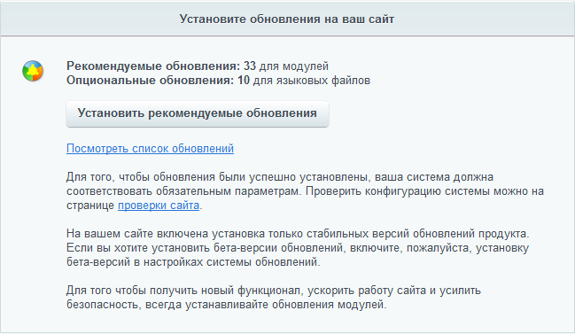
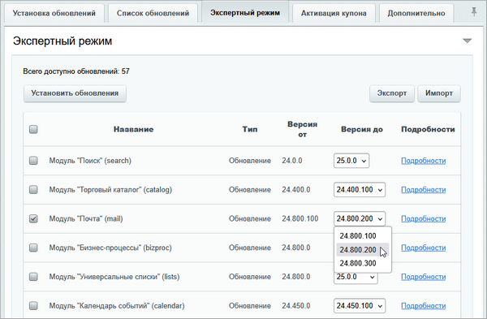

# Обновление ядра продукта

**Навигация**
- [← Оглавление курса](index.md)
- [← Предыдущий: 2689 — Настройки системы обновлений](lesson_2689.md)
- [Следующий: 32042 — Экспертный режим →](lesson_32042.md)

Официальная страница урока: https://dev.1c-bitrix.ru/learning/course/index.php?COURSE_ID=135&LESSON_ID=2693

**Внимание!** Внимательно прочитайте описания обновлений модулей. Они содержат важную информацию по установке. Кроме того, могут содержать предупреждения о возможных проблемах в работе.

Для загрузки обновлений модулей системы выполните следующие действия:

- Перейдите на страницу **Система обновлений** (Marketplace &gt; Обновление платформы).
- Для установки всех – нажмите кнопку
  			Установить рекомендуемые обновления
                      
  		.

Если вы не хотите устанавливать все обновления сразу, то на вкладке **Список обновлений** отметьте только те, что необходимо, и нажмите кнопку **Установить обновления**.

Если при установке обновлений вы увидите ошибку, проверьте адрес в поле *Имя сервера, содержащего обновления* на вкладке Система обновлений в настройках Главного модуля. Правильный адрес — `www.1c-bitrix.ru`.

Обновления некоторых модулей имеют зависимости на обновления других модулей. Например, новый функционал модуля Торговый каталог может быть увязан с новинками модулей Валюты или Интернет-магазин. В этом случае, для частичного обновления, выбирайте все связанные модули, либо ни один из них. Удаление из списка одного связанного модуля приводит к автоматическому удалению всех остальных.

Если в настройках Главного модуля включен экспертный режим, то в форме доступна вкладка **Экспертный режим**. На ней вы можете не только выбрать модули, которые нужно обновить, но и указать версию, до которой устанавливать обновления.

При необходимости процесс можно остановить, нажав кнопку **Остановить установку**. При этом система не прервет обновление сразу и полностью, а завершит загрузку модуля, который обновлялся в момент нажатия этой кнопки. Если в ходе установки произошел сбой, то система уведомит вас об этом и нужно будет просто повторить процесс.

**Примечание**: Если обновление на текущем сервере повлечет за собой нарушение лицензионного соглашения, то на странице **Система обновлений** (Marketplace &gt;  Обновление платформы) **до** начала процедуры появится сообщение

			ERROR_WRONG_CODE

		 (подробнее читайте

			в уроке

Чтобы **заранее** узнать о невозможности проведения обновления на текущем сервере, рекомендуем в настройках **Главного модуля** (Настройки &gt;  Настройки продукта &gt;  Настройки модулей &gt;  Главный модуль) включить опцию **Автоматически проверять наличие обновлений** и установить временной интервал

[Подробнее](lesson_2688.md)...

		).
