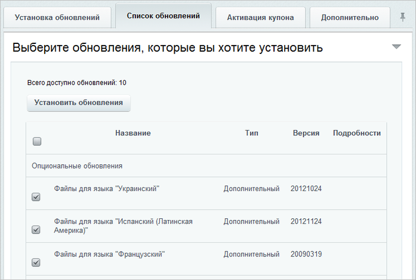

# Просмотр и загрузка языковых файлов

**Навигация**
- [← Оглавление курса](index.md)
- [← Предыдущий: 32042 — Экспертный режим](lesson_32042.md)
- [Следующий: 3533 — Обновления для закрытых порталов →](lesson_3533.md)

Официальная страница урока: https://dev.1c-bitrix.ru/learning/course/index.php?COURSE_ID=135&LESSON_ID=2694

С помощью системы обновлений вы можете установить дополнительные

			языковые файлы

                    Языковой файл - PHP скрипт, хранящий переводы языковых фраз на тот или иной язык.
[Подробнее...](/learning/course/index.php?COURSE_ID=43&LESSON_ID=3486)

		 интерфейса. Для этого выполните следующее:

- Перейдите на закладку
  			Список обновлений
                      
  		.
- В секции опциональных обновлений отметьте необходимые языковые файлы.
- Нажмите кнопку **Установить обновления**.

Контролировать процесс установки вы сможете по полосе прогресса. В результате будет выведено сообщение об успешной установке либо о возникших ошибках.

**Примечание:** Подробнее про установку и загрузку языков в систему смотрите в уроке **Управление языками** курсов [Администратор. Базовый](/learning/course/index.php?COURSE_ID=35&LESSON_ID=2073) или [Администратор сервиса Битрикс24 (коробочная версия)](/learning/course/index.php?COURSE_ID=48&LESSON_ID=2073).
