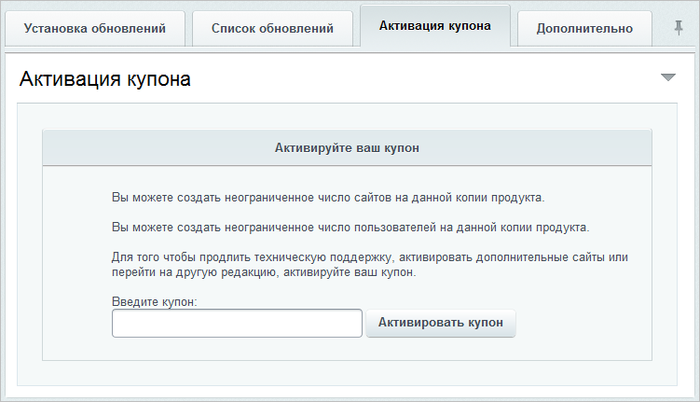

# Активация купона

**Навигация**
- [← Оглавление курса](index.md)
- [← Предыдущий: 3533 — Обновления для закрытых порталов](lesson_3533.md)
- [Следующий: 2697 — Типичные ошибки →](lesson_2697.md)

Официальная страница урока: https://dev.1c-bitrix.ru/learning/course/index.php?COURSE_ID=135&LESSON_ID=2696

### Дополнительные сайты

Система *«1C-Битрикс: Управление сайтом»* позволяет [создавать несколько сайтов](https://dev.1c-bitrix.ru/learning/course/index.php?COURSE_ID=103) с применением одной копии (лицензии) продукта, размещая ядро и базу данных системы в единственном экземпляре на сервере. Максимальное количество сайтов на одной копии продукта ограничено лицензией только для редакции "Старт". На данный момент - это 2 сайта. Если необходимо создать дополнительные сайты сверх этих двух, то приобретите лицензии на дополнительные сайты.

### Смена редакции

Если вы уже используете *«Старт»*, *«Стандарт»* или другую редакцию продукта *1C-Битрикс: Управление сайтом*, то вы можете расширить возможности вашего сайта, осуществив переход на более высокую редакцию продукта. Для этого вам необходимо приобрести купон для перехода на нужную вам редакцию.

При смене редакции *«Битрикс24» в коробке* добавляется не только функционал, но и число пользователей.

### Продление лицензии

Чтобы всегда иметь доступ к последним обновлениям продукта и технической поддержке в *1С-Битрикс: Управление сайтом*, необходимо по окончании периода активности обновлений приобрести купон на продление технической поддержки и получение обновлений.

*Коробочная версия Битрикс24* ограничена

			по сроку действия

                    C 14 марта 2022 года произошли изменения в лицензировании коробочной версии *Битрикс24*. Срок действия лицензии – 12 месяцев.

Подробнее на [helpdesk.bitrix24.ru](https://helpdesk.bitrix24.ru/open/15462996/).

		. Спустя 15 дней после окончания срока действия лицензии работа вашей коробочной версии *Битрикс24* **будет отключена полностью**, и работать с ней станет возможно только после

			продления лицензии

В уроке описываются способы продления лицензии и **до** истечения её срока действия, и **после** истечения срока.

[Подробнее](lesson_25720.md)...

		 на следующие 12 месяцев.

### Как активировать купон

Купон активируется на закладке **Активация купона** страницы **Система обновлений** (Marketplace &gt; Обновление платформы):

