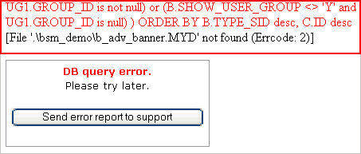
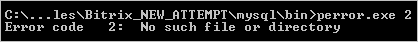
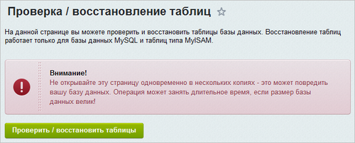

# Ошибки запросов к БД

**Навигация**
- [← Оглавление курса](index.md)
- [← Предыдущий: 2708 — Использование файлов .htaccess](lesson_2708.md)
- [Следующий: 2711 — Ошибки подключения к БД →](lesson_2711.md)

Официальная страница урока: https://dev.1c-bitrix.ru/learning/course/index.php?COURSE_ID=135&LESSON_ID=2712

При возникновении ошибок запросов к базе данных на экран выдается

			сообщение вида

                    Стандартный вид данного сообщения определяется в файле `/bitrix/php_interface/dbquery_error.php`.

		:


Иногда возникает ситуация, когда сайт перестает отвечать, и посетителям отображается пустая страница. В этом случае рекомендуется открыть файл `bitrix/php_interface/dbconn.php` и установить значение параметра `$DBDebug = true;`

```
<?
define("DBPersistent", true);
$DBType = "mysql";
$DBHost = "localhost:31006";
$DBLogin = "root";
$DBPassword = "";
$DBName = "bsm_demo";
$DBDebug = true;
$DBDebugToFile = false;

set_time_limit(60);

define("BX_FILE_PERMISSIONS", 0644);
define("BX_DIR_PERMISSIONS", 0755);
@ini_set("memory_limit", "64M");
?>
```

В результате будет получен код ошибки, содержащий, как правило, названия поврежденных таблиц базы данных.



Запуск утилиты

			perror.exe

                    Файл **perror.exe** хранится в каталоге `mysql/bin`.

		 с кодом ошибки позволяет получить описание ошибки по ее коду:



**Примечание**: Для ошибки с кодом **28** выводится следующее описание:


Данное сообщение означает, что на диске, где установлена база данных, недостаточно места для ее работы.

Если речь идет о повреждении базы данных, то рекомендуется воспользоваться встроенным инструментом системы для проверки и восстановления базы данных. Использование скрипта проверки и восстановления базы данных позволит оперативно восстановить работу сайта.

**Обратите внимание на следующее:**

- Скрипт проверки и восстановления базы данных может быть использован только для *MySQL* с типом таблиц **MyISAM**.
- Скрипт проверки запускается со
  			страницы
                      
  		 Настройки &gt; Инструменты &gt; Диагностика &gt; Проверка БД:
  В случае, если повреждены таблицы статистики и нет возможности перейти в административный раздел, сбор статистики может быть временно отключен с помощью параметра `?no_keep_statistic_LICENSE-KEY=Y`. В параметре указывается лицензионный ключ сайта.

|  |
| --- |

**Проблема:**

На экран выводится ошибка:

| \| MySQL Query Error: ….. [Out of memory restart server and try again (needed 65528 bytes)] \|<br>\| --- \| |
| --- |

**Решение:**

Необходимо увеличить объем памяти в настройках *MySQL*.

Рекомендуется использовать следующие параметры *MySQL*, задавая их в конфигурационном файле *MySQL* **my.cnf**:

```
key_buffer = 128K
max_allowed_packet = 16M
table_cache = 4
sort_buffer_size = 128K
read_buffer_size = 128K
read_rnd_buffer_size = 128K
net_buffer_length = 128K
thread_stack = 128K
```

После изменения параметров необходимо будет перезагрузить *MySQL*.

|  |
| --- |

**Проблема:**

При разворачивании бекапа на виртуальную машину на экран выводится ошибка:

| \| MySQL Query Error: SET LOCAL time_zone='Europe/Moscow'[Unknown or incorrect time zone: 'Europe/Moscow'] \|<br>\| --- \| |
| --- |

**Решение:**

Необходимо загрузить информацию по временным зонам в *MySQL*:

```
mysql_tzinfo_to_sql /usr/share/zoneinfo | mysql -u root mysql
```

После изменения параметров необходимо будет перезагрузить *MySQL*.
