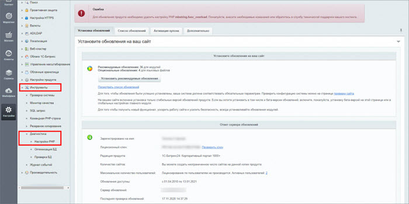
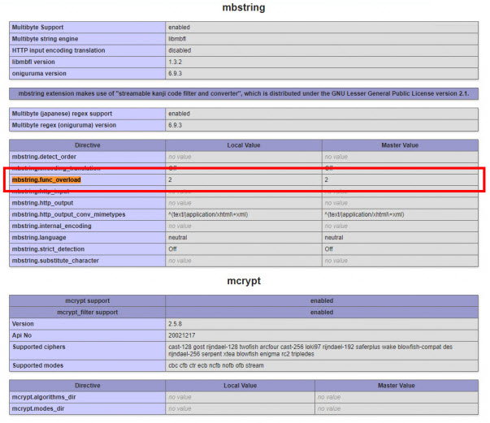

# Ошибка: Удалите настройку PHP mbstring.func_overload

**Навигация**
- [← Оглавление курса](index.md)
- [← Предыдущий: 2697 — Типичные ошибки](lesson_2697.md)
- [Следующий: 3554 — Битрикс и хостинг →](lesson_3554.md)

Официальная страница урока: https://dev.1c-bitrix.ru/learning/course/index.php?COURSE_ID=135&LESSON_ID=30130

При обновлении коробочной версии Битрикс24 вы можете получить уведомление: `Для обновления продукта необходимо удалить настройку PHP mbstring.func_overload. Пожалуйста, внесите необходимые изменения или обратитесь в службу технической поддержки вашего хостинга.`

#### Что это значит

Функционал `mbstring.func_overload` устарел начиная с PHP 7.2.0, и его использование не рекомендовано.

В продуктах «1С-Битрикс» прекращена поддержка данного параметра PHP. Вы не сможете установить обновления продукта, пока не удалите этот параметр в конфигурации PHP вашего сервера.

#### Что делать

Перейдите в раздел *Настройки &gt; Инструменты &gt; Диагностика &gt; Настройки PHP*.

В открывшемся окне найдите в настройках PHP параметр `mbstring.func_overload`.

Если его значение не равно 0, удалите этот параметр в конфигурации PHP сервера или выставите равным 0: `mbstring.func_overload=0`.

Чтобы выполнить эти рекомендации, обратитесь к вашему системному администратору или хостинг-провайдеру.

Если вы используете виртуальную машину [VMBitrix](https://www.1c-bitrix.ru/download/vmbitrix.php), [обновите](https://dev.1c-bitrix.ru/learning/course/index.php?COURSE_ID=37&LESSON_ID=29284&LESSON_PATH=3908.29228.29272.29284) ее до последней версии: выберите в меню виртмашины пункт *2. Manage localhost* — *6. Update server* и согласитесь на обновление. Перед обновлением выполните резервное копирование виртуальной машины.

То же самое можно сделать и вручную в VMBitrix:

- удалите в файле */etc/php.d/bitrixenv.ini* строку `mbstring.func_overload=2`
- сделайте рестарт Apache: `systemctl restart httpd.service`

**Важно!** Если в вашем Битрикс24 или сайте используются решения от сторонних разработчиков, может потребоваться доработка этих решений для соответствия новым требованиям.
