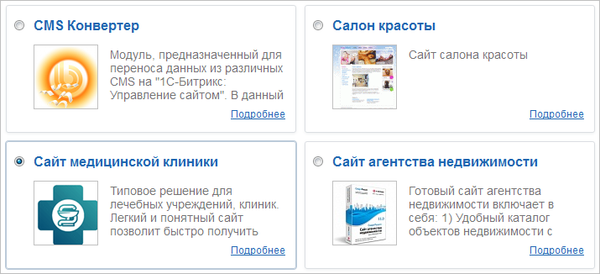
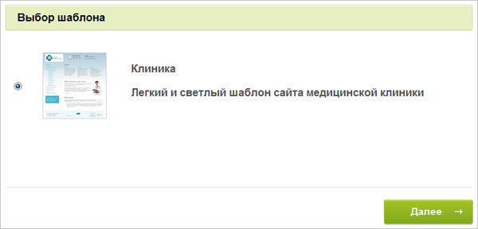
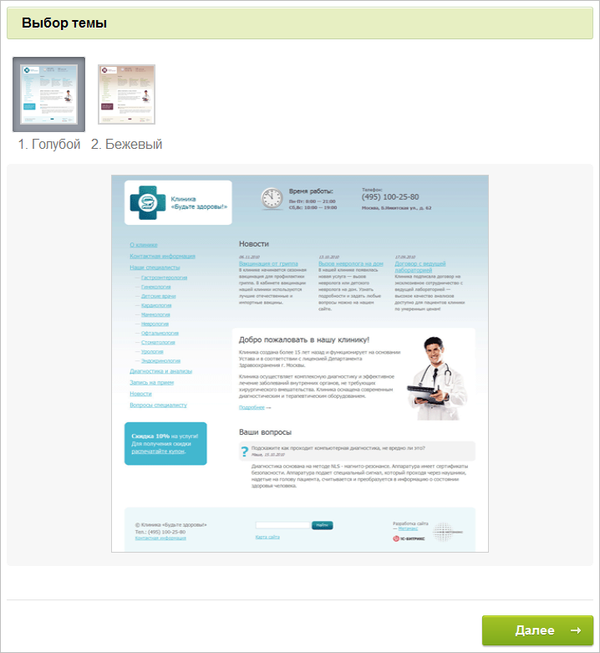
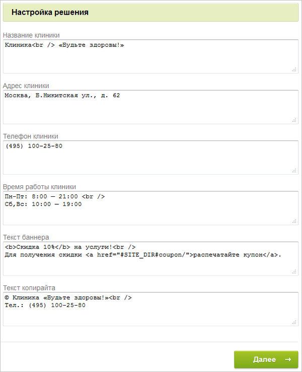
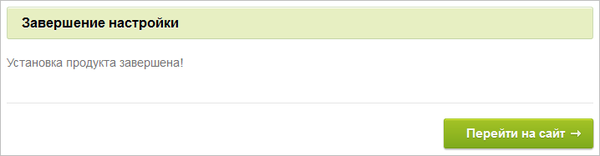

# До установки продукта

**Навигация**
- [← Оглавление курса](index.md)
- [← Предыдущий: 5325 — Установка решения «1C-Битрикс: Управление сайтом» версии 16.5.х и выше](lesson_5325.md)
- [Следующий: 3182 — После установки продукта →](lesson_3182.md)

Официальная страница урока: https://dev.1c-bitrix.ru/learning/course/index.php?COURSE_ID=135&LESSON_ID=3181

**Примечание:**Переход на этот шаг осуществляется, только если былo выбрано **Загрузить из Marketplace** на [седьмом шаге](lesson_2060.md) установки.

|  | #### Мастер установки решения |
| --- | --- |

В качестве примера установки любого стороннего решения из *Marketplace* рассмотрим создание типового сайта лечебных учреждений, клиник (решение *Сайт медицинской клиники*).

**Внимание!**Количество шагов в **Мастере создания сайта** может быть разным и зависит от конкретного решения.

#### Первый шаг мастера (выбор шаблона)

Первое окно информирует о начале работы мастера. Выберите

			шаблон дизайна

                    

		 для вашего сайта. Шаблоны отличаются внешним оформлением, а также базовыми настройками.

#### Второй шаг мастера (выбор темы)

Выберите цветовую тему для выбранного на первом шаге шаблона дизайна сайта. Для разных шаблонов предлагаются разные

			цветовые схемы

                    

		.

#### Третий шаг мастера (настройка решения)

Задайте данные о компании в

			полях формы

                    

		.

#### Четвертый шаг мастера (установка решения)

Автоматический шаг, на котором устанавливаются все настройки решения. Отслеживание процесса можно вести по

			графическому индикатору

                    

		. После завершения процесса установки система автоматически перейдет к следующему шагу.

#### Пятый шаг мастера (завершение установки)

Установка и настройка решения

			завершена

                    

		.

Нажмите кнопку **Перейти на сайт** для перехода на главную страницу сайта.
