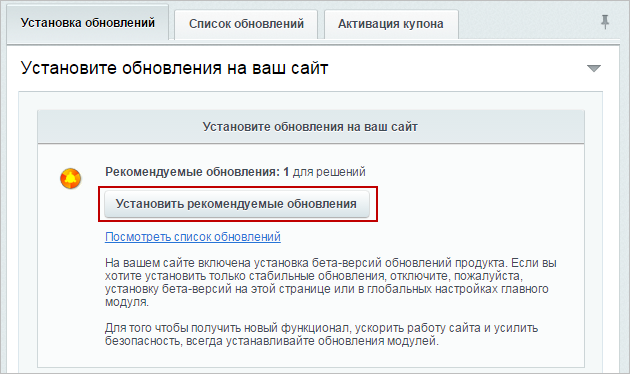
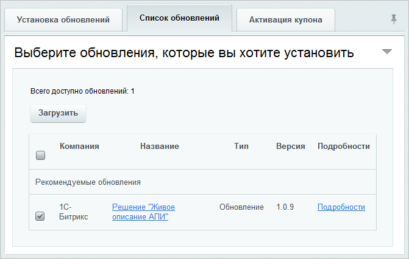
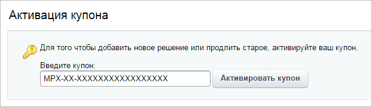

# После установки продукта

**Навигация**
- [← Оглавление курса](index.md)
- [← Предыдущий: 3181 — До установки продукта](lesson_3181.md)
- [Следующий: 2040 — Предварительные операции →](lesson_2040.md)

Официальная страница урока: https://dev.1c-bitrix.ru/learning/course/index.php?COURSE_ID=135&LESSON_ID=3182

### Установка стороннего решения

Установить стороннее решение из *Marketplace* после установки продукта *«1C-Битрикс: Управление сайтом»* можно двумя способами:

1. В
  			публичной части
                      **Публичный раздел** - это часть сайта, которая доступна всем пользователям ресурса. Иначе говоря, это сам сайт в том виде, в котором его видят посетители сайта. [Подробнее...](https://dev.1c-bitrix.ru/learning/course/index.php?COURSE_ID=34&CHAPTER_ID=04458&LESSON_PATH=3905.4455.4458)
  		, нажав на кнопку
  			Протестировать новое решение
                      
  		 на панели управления. Далее выполните действия аналогичные [установке стороннего решения до установки продукта](lesson_3181.md).
2. В
  			административной части
                      **Административный раздел** - раздел системы, недоступный для просмотра обычным посетителям сайта. В нём производятся настройки сайта и системы для работы.
  [Подробнее...](https://dev.1c-bitrix.ru/learning/course/index.php?COURSE_ID=34&CHAPTER_ID=04459&LESSON_PATH=3905.4455.4459)
  		, найдя нужное решение в **Каталоге решений** (Marketplace &gt; Каталог решений):
  

- Выбрав подходящее решение из списка в Marketplace, вы перейдете на страницу этого продукта:
  
  На странице решения выполните одно из действий:

  - **Купить** - товар добавится в **Корзину** на сайте Marketplace, и вы перейдете к выбору оплаты и покупки;
  - **Онлайн-Демо** - вы перейдете в демо-раздел на сайте разработчика, чтобы в реальном времени попробовать функционал в действии;
  - **Тестировать** - вы перейдете в раздел обновлений Marketplace для скачивания и установки демо-версии на ваш сайт.
  - **Установить** - вы перейдете в раздел обновлений Marketplace для скачивания и установки решения на ваш сайт (этот вариант доступен при бесплатном распространении решения).
- После выбора вариантов **Тестировать** или **Установить** вы перейдете в раздел **Обновление решений** (Marketplace &gt; Обновление решений). Нажав кнопку
  			Загрузить
                      
  		, необходимо принять лицензионное соглашение, далее начнется загрузка.
- После загрузки решения нажмите кнопку
  			Установить
                      
  		 для установки модуля.
- Установить решение можно и в разделе **Доступные решения** (Marketplace &gt; Установленные решения), выбрав в меню действий пункт
  			Установить
                      
  		нужного мастера установки решения.

### Обновление решения

Для обновления стороннего решения необходимо перейти в **Установка обновлений** (Marketplace &gt; Обновление решений):

По ссылке Посмотреть список обновлений осуществляется переход на закладку

			Список обновлений

                    

		, где указывается какое решение можно обновить.

### Активация купона

> **Купон** - это своего рода лицензионный ключ, позволяющий легально использовать стороннее коммерческое решение, но при этом не спрашивать у него код ключа самого продукта «1C-Битрикс».

На закладке **Активация купона** (Marketplace &gt; Обновление решений) осуществляется регистрация стороннего решения с помощью ввода кода купона:

**Обратите внимание**, купон нельзя активировать на демо-версии продукта.
