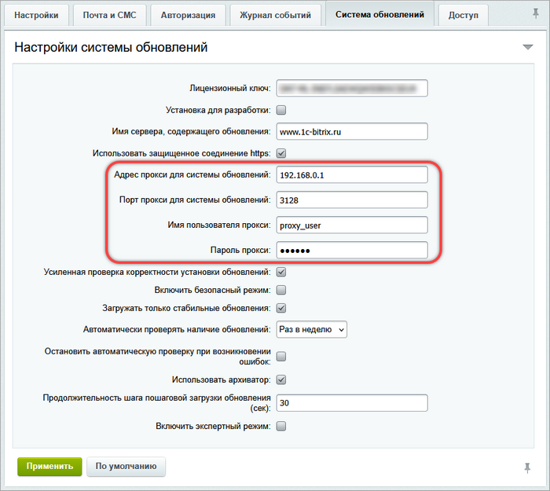

# Обновления для закрытых порталов

**Навигация**
- [← Оглавление курса](index.md)
- [← Предыдущий: 2694 — Просмотр и загрузка языковых файлов](lesson_2694.md)
- [Следующий: 2696 — Активация купона →](lesson_2696.md)

Официальная страница урока: https://dev.1c-bitrix.ru/learning/course/index.php?COURSE_ID=135&LESSON_ID=3533

### Сложности закрытых сетей

Часто в крупных организациях доступ к Интернету из внутренней сети ограничен, а доступ в сеть извне закрыт полностью. Тогда возникает вопрос: как обновлять продукты «1C-Битрикс», чтобы сохранялись корпоративные требования безопасности?

Типовые требования IT-отделов таких компаний: загрузка обновлений через отдельно загружаемые файлы на стороннем компьютере, не имеющем доступа к локальной сети организации, с дальнейшим переносом файлов на сервер с продуктом «Битрикс24 в коробке» и установка обновлений.

Есть несколько причин, по которым такое решение невозможно:

- Обновления не универсальны: каждый раз для каждой установки собирается индивидуальный пакет обновлений на основе набора установленных модулей и их версий.
- Для сборки обновлений также необходимо знать текущий язык клиента, кодировку его портала, а также версию PHP и базы данных (на случай если новые версии модулей требуют новые версии серверного ПО).
- При установке обновлений происходит контроль числа установок на данном ключе.
- Осуществляется проверка соответствия лицензии текущей установке по модулям и прочим лицензионным ограничениям.

При этом в продуктах **Bitrix Framework** существует техническая возможность обеспечить высокую безопасность при установке обновлений через прокси сервер. Можно полностью изолировать установку «Битрикс24 в коробке» из интернета и одновременно с этим строго ограничить (и контролировать) доступ в интернет с нее.

|  |
| --- |

### Безопасный способ установки обновлений

Безопасный способ установки обновлений для закрытых сетей заключается в использовании прокси сервера, который имеет выход в Интернет. Работа через прокси сервер штатно поддерживается продуктом, это делается в настройках главного модуля:

Система обновлений через прокси работает по следующим принципам:

- Весь обмен с сервером происходит по протоколу HTTP.
- Ответы сжимаются через gzip (если есть поддержка в вашем PHP).
- Лицензионный ключ передаются через сеть в зашифрованном виде (а точнее сказать, передаётся не ключ, а хеш ключа).
- Отправляются данные, связанные с лицензией: число сайтов, число пользователей, набор модулей и версии модулей.
- Передаётся информация о версиях PHP и базы данных, а также кодировка сайта.
- Система обновлений не собирает никакие пользовательские данные.

|  |
| --- |

### Дополнительные меры безопасности

В случае необходимости администратор сети может обеспечить дополнительные меры безопасности:

- Подключать прокси сервер к сети только на момент установки обновлений.
- Настроить прокси для подключения к сайту с обновлениями по SSL.
- Включить на сервере полное журналирование трафика.
- Блокировать с прокси доступ на все адреса, кроме www.1c-bitrix.ru.
