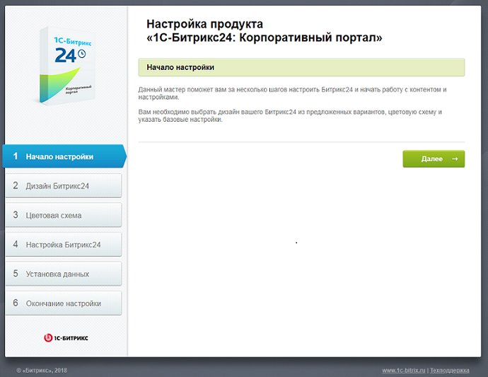
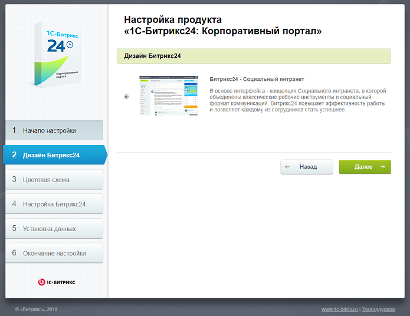
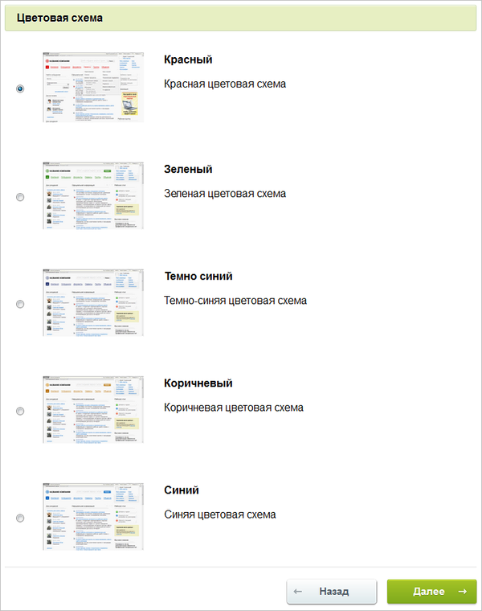
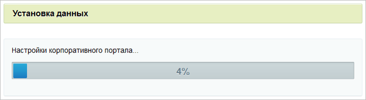
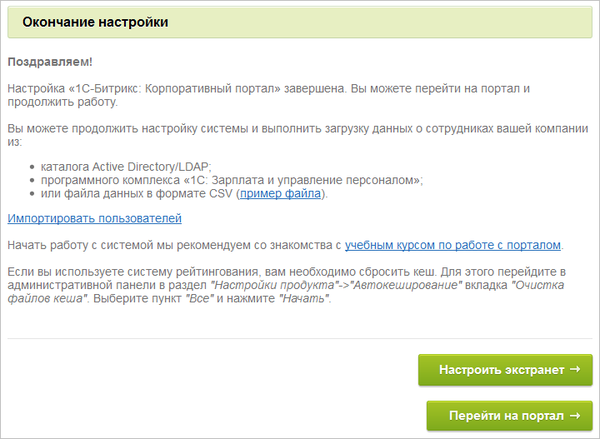
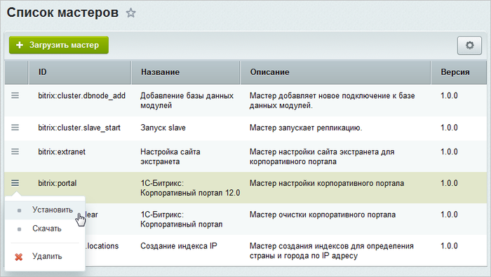

# Мастер настройки портала

**Навигация**
- [← Оглавление курса](index.md)
- [← Предыдущий: 2630 — Шестой шаг](lesson_2630.md)
- [Следующий: 3638 — Мастер настройки экстранета →](lesson_3638.md)

Официальная страница урока: https://dev.1c-bitrix.ru/learning/course/index.php?COURSE_ID=135&LESSON_ID=3637

#### Первый шаг мастера (начало настройки)

Первое окно

                    

		 информирует о начале работы мастера.

#### Второй шаг мастера (дизайн Битрикс24)

Выберите подходящий

			дизайн сайта

                    

		. (Рекомендуется дизайн Битрикс24.) Шаблоны отличаются внешним оформлением, а также базовыми настройками.

**Внимание!** Шаблоны портала являются системным шаблоном и их кастомизирование запрещено! Существует техническая возможность копирования шаблона, его кастомизации и применения, но при использовании этой возможности будет потеряна обратная совместимость.

#### Третий шаг мастера (цветовая схема)

Выберите подходящую

			цветовую тему

                    

		 для выбранного на втором шаге шаблона дизайна портала. Для разных шаблонов предлагаются разные цветовые схемы.

#### Четвертый шаг мастера (настройка портала)

Задайте служебные данные о компании.

- Заполните поле **Название компании**.
- Для установки демо-данных сотрудников, включения функционала социальных сетей и внешних коммуникаций и настройки прав доступа на портале включите соответствующие опции.
- Для перехода к следующему шагу нажмите кнопку **Далее**.

#### Пятый шаг мастера (установка данных)

Автоматический шаг, на котором устанавливаются все настройки портала. Отслеживание процесса можно вести по

			графическому индикатору

                    

		. После завершения процесса установки система автоматически перейдет к следующему шагу.

#### Шестой шаг мастера (завершение установки)

Установка и настройка решения завершена

- Нажмите кнопку **Перейти на портал** для перехода на главную страницу портала.
- Нажмите кнопку **Настроить экстранет** для перехода к [мастеру настройки экстранета](lesson_3638.md).

**Примечание:** Также **Мастер настройки портала** можно запустить повторно после установки продукта. Например, чтобы сменить шаблон или цветовую схему портала, включить дополнительные модули (в зависимости от лицензии) и т.п.

Для запуска Мастера нужно в **Административном интерфейсе** выбрать пункт меню действий

			Установить

                    

		 в **Мастере настройки корпоративного портала** (Настройки &gt; Настройки продукта &gt; Список мастеров).
