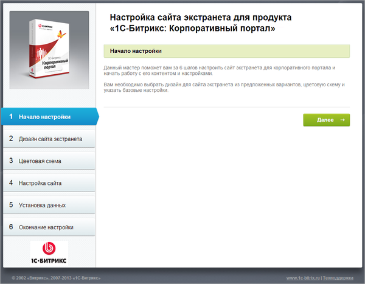
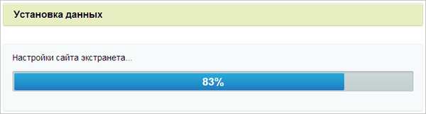
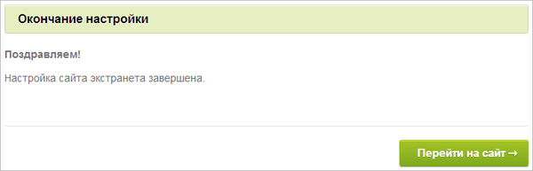
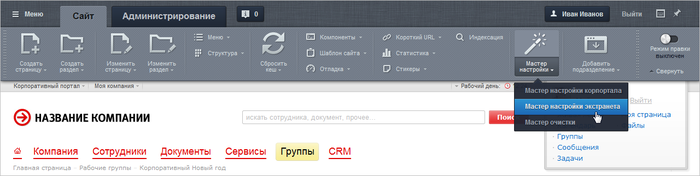
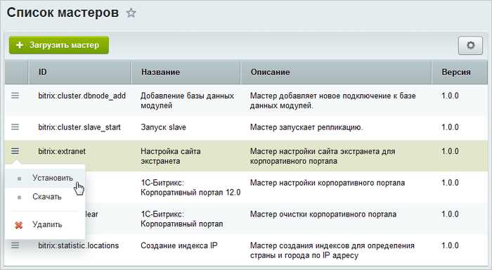

# Мастер настройки экстранета

**Навигация**
- [← Оглавление курса](index.md)
- [← Предыдущий: 3637 — Мастер настройки портала](lesson_3637.md)
- [Следующий: 9155 — Установка 1С-Битрикс24:CRM →](lesson_9155.md)

Официальная страница урока: https://dev.1c-bitrix.ru/learning/course/index.php?COURSE_ID=135&LESSON_ID=3638

#### Первый шаг мастера (начало настройки)

Первое окно

                    

		 информирует о начале работы мастера.

|  |
| --- |

#### Второй шаг мастера (дизайн сайта экстранета)

Автоматический шаг выбора шаблона.

|  |
| --- |

#### Третий шаг мастера (цветовая схема)

Автоматический шаг выбора цветовой схемы.

|  |
| --- |

#### Четвертый шаг мастера (настройка сайта)

На данном этапе задаются основные настройки экстранета: **Название компании**, **Логотип компании**,**Идентификатор сайта экстранета** и **Папка для сайта экстранета**.

- Для перехода к следующему шагу нажмите кнопку **Установить**.

|  |
| --- |

#### Пятый шаг мастера (установка данных)

Автоматический шаг, на котором устанавливаются все настройки экстранета. Отслеживание процесса можно вести по

			графическому индикатору

                    

		. После завершения процесса установки система автоматически перейдет к следующему шагу.

|  |
| --- |

#### Шестой шаг мастера (завершение установки)

Установка и настройка решения

			завершена

                    

		. Нажмите кнопку **Перейти на сайт** для перехода на главную страницу экстранета.

**Примечание:** Также **Мастер настройки экстранета** можно запустить повторно после установки продукта. Например, чтобы сменить шаблон экстранета или другие настройки. Запустить мастер можно двумя способами:

1. **Публичный интерфейс**: с помощью кнопки
  			Мастер настройки
                      
  		 на **Панели управления**:
2. **Административный интерфейс**: выбрать пункт меню действий
  			Установить
                      
  		 в **Мастере настройки сайта экстранета для корпоративного портала** (Настройки &gt; Настройки продукта &gt; Список мастеров):
