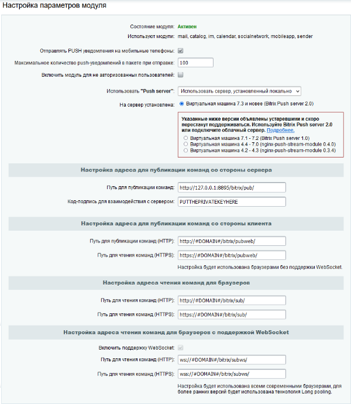

# Конфигурация сайта

**Навигация**
- [← Оглавление курса](index.md)
- [← Предыдущий: 20888 — Конфигурация Push-server](lesson_20888.md)
- [Следующий: 20918 — Установка и настройка ОС →](lesson_20918.md)

Официальная страница урока: https://dev.1c-bitrix.ru/learning/course/index.php?COURSE_ID=135&LESSON_ID=4564

### Сайт

Создайте рабочий каталог:

```
mkdir /var/www/html/bx-site
cd /var/www/html/bx-site
wget https://www.1c-bitrix.ru/download/scripts/bitrixsetup.php
chown www-data:www-data /var/www/html/bx-site -R
```

Аналогичным образом можно скачать нужный дистрибутив и установить его в каталог: `/var/www/html/bx-site`.

Создайте базу данных и пользователя:

```
create database portal;
CREATE USER 'bitrix'@'localhost' IDENTIFIED BY 'PASSWORD';
GRANT ALL PRIVILEGES ON portal.* to 'bitrix'@'localhost';
```

Необходимо заменить PASSWORD на пароль, который будет использоваться для доступа к БД.

### Push-server

Для работы портала необходимо настроить **push-server**. Настройки могут быть выполнены через

			административный раздел портала

                    Настройки производятся на странице http://_имя_сайта_/bitrix/admin/settings.php?lang=ru&mid=pull



[Подробнее](https://dev.1c-bitrix.ru/learning/course/index.php?COURSE_ID=48&LESSON_ID=2033)...

		, а можно добавить их в конфигурационный файл. Покажем как это делается вторым способом.

Исправьте конфигурационный файл `/var/www/html/bx-site/bitrix/.settings.php`, добавив следующую секцию:

```
return array (
'pull' => Array(
    'value' =>  array(
        'path_to_listener' => 'http://#DOMAIN#/bitrix/sub/',
        'path_to_listener_secure' => 'https://#DOMAIN#/bitrix/sub/',
        'path_to_modern_listener' => 'http://#DOMAIN#/bitrix/sub/',
        'path_to_modern_listener_secure' => 'https://#DOMAIN#/bitrix/sub/',
        'path_to_mobile_listener' => 'http://#DOMAIN#:8893/bitrix/sub/',
        'path_to_mobile_listener_secure' => 'https://#DOMAIN#:8894/bitrix/sub/',
        'path_to_websocket' => 'ws://#DOMAIN#/bitrix/subws/',
        'path_to_websocket_secure' => 'wss://#DOMAIN#/bitrix/subws/',
	'path_to_publish' => 'http://localhost:8895/bitrix/pub/',
        'path_to_publish_web' => 'http://#DOMAIN#/bitrix/rest/',
        'path_to_publish_web_secure' => 'https://#DOMAIN#/bitrix/rest/',
        'nginx_version' => '4',
        'nginx_command_per_hit' => '100',
        'nginx' => 'Y',
        'nginx_headers' => 'N',
        'push' => 'Y',
        'websocket' => 'Y',
        'signature_key' => 'PUTTHEPRIVATEKEYHERE',
        'signature_algo' => 'sha1',
        'guest' => 'N',
    ),
),
...
```

Обратите внимание, что **signature_key** должен содержать тот же ключ, который указан в `/etc/sysconfig/push-server-multi` в соответствующем ключе. Если все хорошо, то после перезапуска **apache2**:

```
systemctl restart apache2
```

Вы увидите запросы к push-server:

```
Request URL: ws://sitename/bitrix/subws/?CHANNEL_ID=....
Request Method: GET
Status Code: 101 Switching Protocols
```
