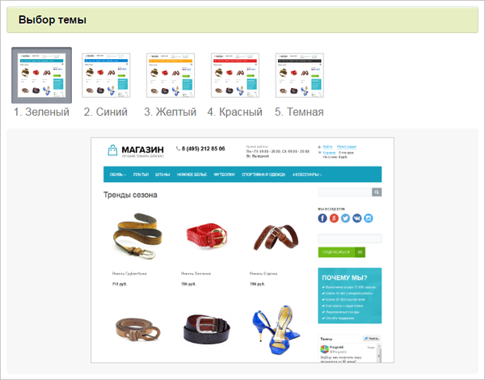
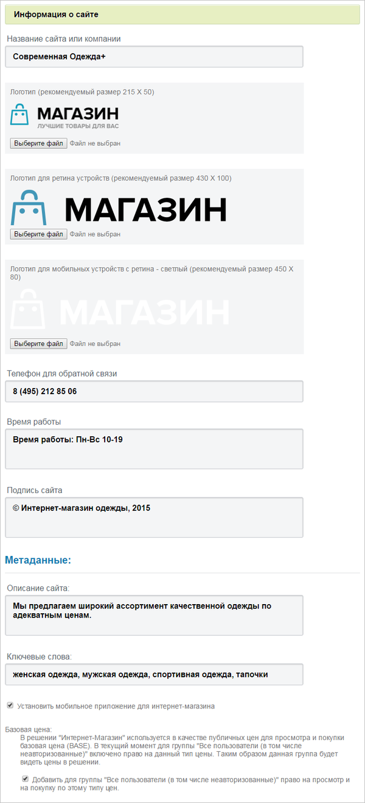
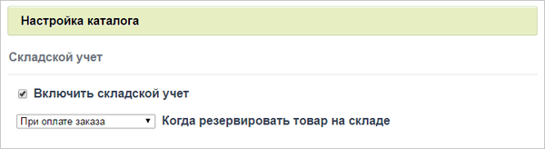
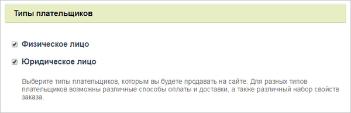
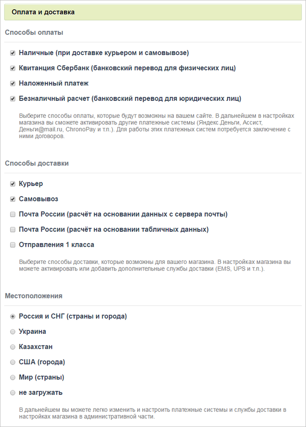
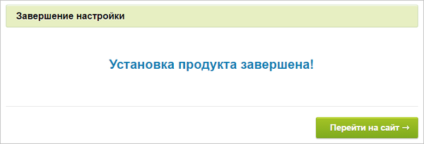

# Установка решения «1C-Битрикс: Управление сайтом» версии 16.5.х и выше

**Навигация**
- [← Оглавление курса](index.md)
- [← Предыдущий: 4582 — Установка демо-сайта для разработчиков](lesson_4582.md)
- [Следующий: 3181 — До установки продукта →](lesson_3181.md)

Официальная страница урока: https://dev.1c-bitrix.ru/learning/course/index.php?COURSE_ID=135&LESSON_ID=5325

**Внимание!**Количество шагов в **Мастере создания сайта** может быть разным и зависит от конкретного решения.

|  | #### Мастер установки решения |
| --- | --- |

В качестве примера установки решения рассмотрим создание сайта онлайн-магазина (решение *Интернет-магазин*).

**Примечание:**Переход к этому мастеру осуществляется, только если выбрано решение *Интернет-магазин* на [седьмом шаге](lesson_2060.md) установки.

#### Первый шаг мастера (выбор шаблона)

Первое окно информирует о начале работы мастера. Выберите

			шаблон дизайна

                    

		 для вашего сайта. Шаблоны отличаются внешним оформлением, а также базовыми настройками.

#### Второй шаг мастера (выбор темы)

На этом шаге работы мастера выбирается цветовая тема для выбранного на первом шаге шаблона дизайна сайта. Для разных шаблонов предлагаются разные

			цветовые схемы

                    

		.

#### Третий шаг мастера (информация о сайте)

Задайте

			данные о компании

                    

		.

#### Четвертый шаг мастера (настройка каталога)

Произведите

			настройки каталога

                    

		.

#### Пятый шаг мастера (информация о магазине)

Укажите

			служебные данные

                    

		 о компании: Локализацию магазина (физическое местоположение магазина), Информацию о магазине и Банковские реквизиты

#### Шестой шаг мастера (типы плательщиков)

Задайте

			типы плательщиков магазина

                    

		, которые будут использоваться на сайте.

#### Седьмой шаг мастера (оплата и доставка)

Определите

			способы оплаты, доставки

                    

		 товара и Местоположение магазина, которые будут использоваться на сайте.

#### Восьмой шаг мастера (установка решения)

Автоматический шаг, на котором устанавливаются все настройки решения. Отслеживание процесса можно вести по

			графическому индикатору

                    

		. После завершения процесса установки система автоматически перейдет к следующему шагу.

#### Девятый шаг мастера (завершение настройки)

Установка и настройка решения

			завершена

                    

		.

Нажмите кнопку **Перейти на сайт** для перехода на главную страницу сайта.
