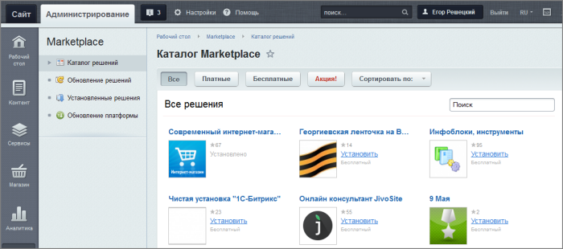
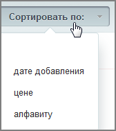

# Приложения Marketplace

**Навигация**
- [← Оглавление курса](index.md)
- [← Предыдущий: 5408 — Конфигурация сайта](lesson_5408.md)
- [Следующий: 1945 — Регистрация коммерческого продукта →](lesson_1945.md)

Официальная страница урока: https://dev.1c-bitrix.ru/learning/course/index.php?COURSE_ID=135&LESSON_ID=6307

### Как расширить функционал системы

Продукты компании могут многое, но не всё и не так, как, может быть, хочется кому-то из клиентов. Приложения из каталога **Marketplace** могут решить вашу задачу, если она не решается штатными методами.

Используя приложения Marketplace, вы можете легко добавить недостающий функционал для продуктов. В каталоге **Marketplace** административного раздела(Marketplace &gt; Каталог решений), с помощью одноименных кнопок, вы можете просмотреть платные\бесплатные решения, а также предлагаемые по акции (со скидкой). Возможно использование

			поиска и сортировки

                    

		.

Эти приложения создаются партнёрами компании "1С-Битрикс", а не самим вендором платформы.

**Внимание**! Компания "1С-Битрикс" не несет ответственности за разработки партнеров. По всем вопросам, связанным с работой сторонних решений, а также в случаях нарушения работы сайта, вызванного некорректной работой сторонних решений, обращайтесь к партнерам-разработчикам.

Установка новых приложений происходит очень быстро и не требует дополнительных знаний или навыков.

**Внимание!**Все решения из **каталога Marketplace** устанавливаются только на *коробочные продукты 1С-Битрикс* с активным сроком получения обновлений (с активной лицензией). Проверить статус вашего лицензионного ключа можно в разделе **Обновления** панели управления вашего сайта, или на [сайте](http://www.1c-bitrix.ru/support/key_info.php).
