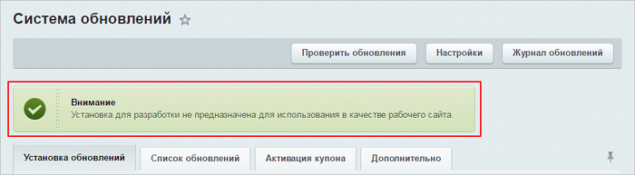
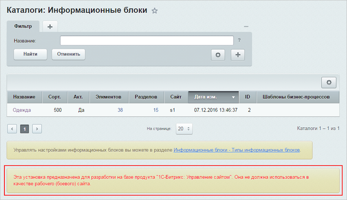
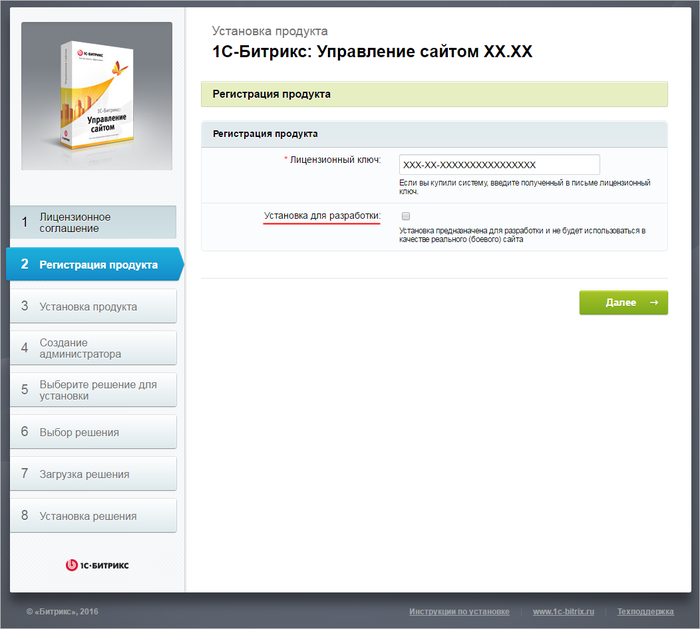
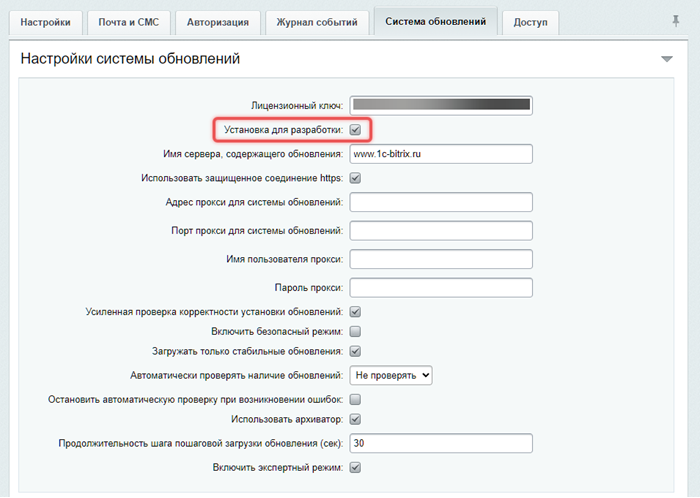

# Установка для разработки

**Навигация**
- [← Оглавление курса](index.md)
- [← Предыдущий: 22634 — Настройка виджета онлайн-чата в многосайтовой конфигурации](lesson_22634.md)
- [Следующий: 32914 — Установка и настройка ОС →](lesson_32914.md)

Официальная страница урока: https://dev.1c-bitrix.ru/learning/course/index.php?COURSE_ID=135&LESSON_ID=8471

### Введение. Видеоурок

Начиная с версии 16.5.7 и старше, в продуктах *«1С-Битрикс»* можно пометить новую или существующую установку продукта специальным маркером **Установка для разработки**.

### Установка для разработки

Маркер **Установка для разработки** позволяет проводить тестирование, не устанавливая продукт локально. Этот функционал поможет решить проблему коллективного доступа к одной установке разработчиков продукта без возникновения ошибки

			ERROR_WRONG_CODE

                    Система обновлений продукта привязывается к конкретной установке и "запоминает" состояние системы после очередного обновления. Ошибка ERROR_WRONG_CODE возникает в том случае, если текущее состояние не соответствует тому, которое было на момент последнего обновления.
[Подробнее](lesson_2697.md#error_wrong_code)...

		. Также эта функция будет полезна, если разработчиков несколько, и всем им нужна своя установка продукта для тестирования.

**Примечание**: Согласно

			лицензионному соглашению

[Лицензионное соглашение](https://www.1c-bitrix.ru/download/files/law/eula_bus.pdf) для «1С-Битрикс: Управление сайтом»

[Лицензионное соглашение](https://www.1c-bitrix.ru/download/files/law/eula_cp.pdf) для «1С-Битрикс24» (коробочная версия)

		, разрешен публичный доступ к сайтам, созданным на одной копии продукта. Соответственно, при использовании дополнительных копий продукта в режиме **Установка для разработки** рекомендуется

			закрыть сайт для публичного посещения.

Это делается на странице настроек Главного модуля

(Настройки &gt; Настройки продукта &gt; Настройки модулей &gt; Главный модуль)

во вкладке **Доступ**:

**Внимание!** Пытаться обмануть, постоянно включая и отключая этот режим, бессмысленно, т.к. все переключения в режим разработчика отслеживаются. Использование данного режима в качестве рабочего (боевого) сайта – запрещено. Компания «1С-Битрикс», при необходимости, может отключить данную возможность, а при грубых нарушениях может быть применена бессрочная блокировка коммерческого ключа, соответственно и обновлений продукта по этому ключу.

Наиболее оптимальный вариант - это на все время разработки и тестирования установить данный режим на нужную установку продукта и не отключать его. Если доработки по продукту закончены, то эту установку продукта можно удалить. Либо «законсервировать» до следующих доработок, а потом просто восстановить полный бекап с боевой версии сайта на эту тестовую установку.

Используйте, пожалуйста, данный функционал для работы с тестовыми установками продукта, и система обновлений на них не будет реагировать и блокироваться.

**Примечание**: У всех установок для разработки должна быть отключена

			автоматическая

                     Настройки **Главного модуля** (Настройки &gt;  Настройки продукта &gt;  Настройки модулей &gt;  Главный модуль),

опция **Автоматически проверять наличие обновлений**.

		 проверка наличия обновлений. Исключение может быть сделано (но не рекомендуется) только для установки, используемой для тестирования обновлений перед их установкой на "боевой" (основной) сайт. В противном случае во время обновления основного сайта может возникнуть ошибка

			ERROR_WRONG_CODE

[Подробнее](lesson_2688.md)...

		, а установка обновлений будет прервана.

При включенной опции **Установка для разработки** в административной части продукта будут напоминания:

- в разделе **Обновление платформы** (Маркетплейс &gt; Обновление платформы):
  
- на каждой странице административной части сайта:
  

**Примечание**: Установка для разработки имеет некоторые ограничения на

			использование телефонии

                    Телефония завязана на ключ. Поэтому если есть рабочий корпоративный портал и установка для разработки...

[Подробнее ...](https://dev.1c-bitrix.ru/learning/course/?COURSE_ID=48&LESSON_ID=5044)

		.

### Подключение функционала

|  |
| --- |

Подключить функционал можно:

При установке на шаге

			ввода лицензионного ключа

                    

		 продукта:

Или

В существующей установке в Административной части сайта на вкладке **Cистема обновлений** (Настройки &gt; Настройки продукта  &gt; Настройки модулей &gt; Главный модуль &gt; Cистема обновлений):

