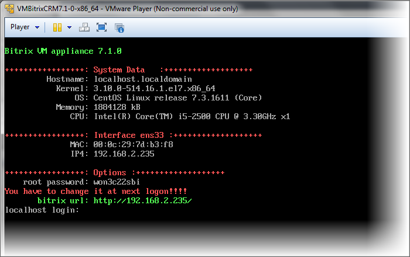
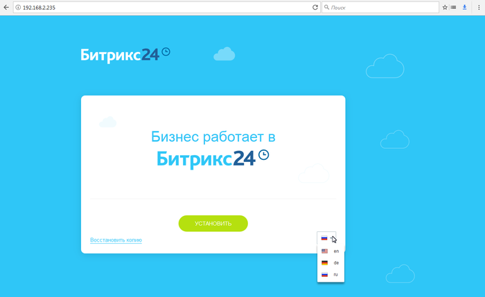
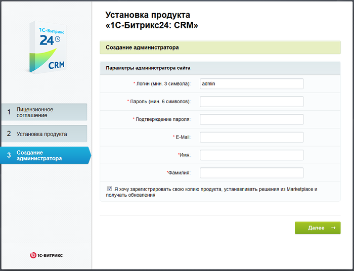

# Установка 1С-Битрикс24:CRM

**Навигация**
- [← Оглавление курса](index.md)
- [← Предыдущий: 3638 — Мастер настройки экстранета](lesson_3638.md)
- [Следующий: 12972 — Схемы получения CRM и интернет-магазина в едином продукте →](lesson_12972.md)

Официальная страница урока: https://dev.1c-bitrix.ru/learning/course/index.php?COURSE_ID=135&LESSON_ID=9155

**Внимание**!  В уроке описана устаревшая информация для тех, кто ещё пользуется BitrixVM.CRM. Сейчас BitrixVM.CRM уже не выпускается.

**1С-Битрикс24:CRM** устанавливается на виртуальную машину [BitrixVM.CRM](/learning/course/index.php?COURSE_ID=37&LESSON_ID=11681). Для установки необходимо [загрузить](https://www.1c-bitrix.ru/download/intranet.php#crm) образ виртуальной машины для выбранного вами плеера и распаковать его. Для машины с установленной CentOS 7 используется скрипт `bitrix-env-crm.sh`.

**Примечание**: Возможно использование VMware, Virtualbox и других аналогичных программ. Предпочтительнее базовая версия Virtualbox, так как она бесплатна для коммерческого применения.

Инструкцию по установке плеера виртуальных машин смотрите на сайте разработчика этого плеера.

|  |
| --- |

|  | #### Установка на примере VMPlayer. |
| --- | --- |

1. Запустите VMPlayer и с помощью меню **Player** - **File** - **Open** выберите в распакованной папке с дистрибутивом файл формата **.vmx**.
  **Внимание!** Не рекомендуется менять настройки образа по умолчанию в меньшую сторону!
2. Запустите виртуальную машину. После её запуска отобразится адрес виртуальной машины в вашей локальной сети (`bitrix url`):
  
  **Внимание!** При первом запуске виртуальной машины отображается пароль для root'а. Нужно зайти в виртуальную машину и
  			поменять
  - В строке **localhost login** введите логин: `root`, а в поле **Password** текущий пароль (в нашем примере **root password:** won3c22sbi).
  - В строке **(current) UNIX password** укажите текущий пароль и нажмите **Enter**.
  - Введите новый пароль в строке **Enter new UNIX password** и нажмите **Enter**.
  - Повторите ввод нового пароля в строке **Retype new UNIX password** и нажмите **Enter**.
  		этот пароль на свой.
3. Введите указанный адрес в браузер, откроется
  			окно установки
                      
  		. В окне можно выбрать либо восстановление ранее сделанного архива, либо выбрать язык дистрибутива для установки.
  Нажмите **Далее**, начнётся загрузка дистрибутива, а по завершению откроется окно Мастера установки.
4. Выполните шаги мастера, их всего три. Заполнение полей не должно вызвать затруднений, поля заполняются только на последнем шаге - при создании администратора:
  
  Заполните поля формы. Флажок в чекбоксе **Я хочу зарегистрировать ....** снимать нужно только в случае если у вас есть приобретённый ключ на "1С-Битрикс24:CRM". При неснятом флажке система автоматически подставит демонстрационный ключ на 30 дней работы.
5. После заполнение формы система произведёт донастройку портала, и можно приступать к работе.
