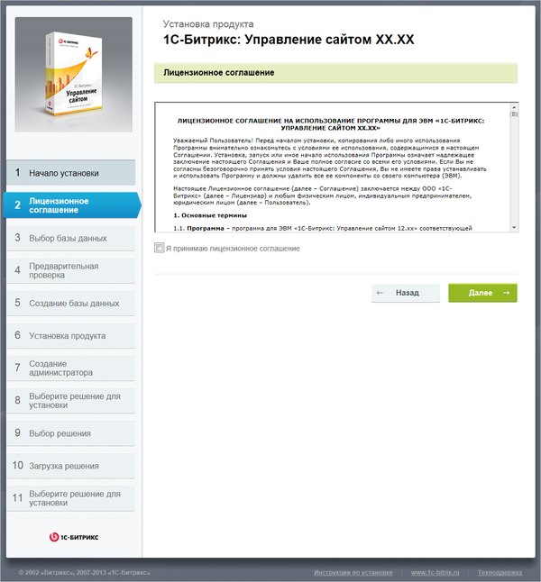

# Первый шаг

**Навигация**
- [← Оглавление курса](index.md)
- [← Предыдущий: 3186 — Поддержка стандартов и технологий. Требования к клиентскому программному обеспечению](lesson_3186.md)
- [Следующий: 2043 — Второй шаг →](lesson_2043.md)

Официальная страница урока: https://dev.1c-bitrix.ru/learning/course/index.php?COURSE_ID=32&LESSON_ID=2042

<!-- &lt;p&gt;&lt;div class="hint"&gt;&lt;b&gt;Примечание: &lt;/b&gt;Если продукт устанавливается вместе с пакетом  &lt;i&gt;&laquo;Битрикс: Веб-окружение&raquo;&lt;/i&gt;, то этот шаг будет пропущен.&lt;/div&gt;&lt;/p&gt; -->

#### Первый шаг установки (лицензионное соглашение)

- Внимательно ознакомьтесь с текстом **Лицензионного соглашения**. Если вы согласны с его условиями, то установите флаг в поле **Я принимаю лицензионное соглашение**.
- Для продолжения установки нажмите кнопку **Далее**.
