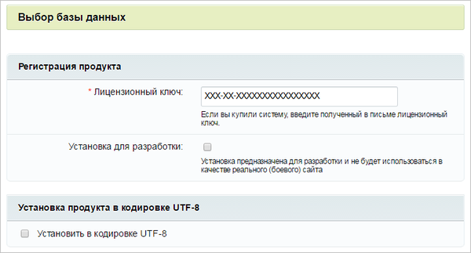
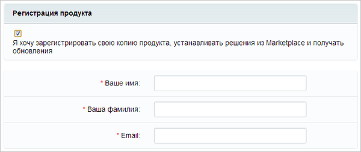

# Второй шаг

**Навигация**
- [← Оглавление курса](index.md)
- [← Предыдущий: 2042 — Первый шаг](lesson_2042.md)
- [Следующий: 2044 — Третий шаг →](lesson_2044.md)

Официальная страница урока: https://dev.1c-bitrix.ru/learning/course/index.php?COURSE_ID=32&LESSON_ID=2043

### Лицензионный ключ

- Регистрация лицензионного ключа
- Выбор типа установки
- Выбор кодировки сайта

|  |
| --- |

### Регистрация продукта

В поле **Лицензионный ключ** введите полученный при покупке лицензионный ключ продукта.

**Примечание:** При установке демонстрационной версии продукта будет доступна опция

			Я хочу зарегистрировать свою копию продукта и получать обновления

                    

		. Заполните регистрационные поля и получите право на обновление продукта в течение демо-периода.

В противном случае продукт будет установлен, но обновления будут недоступны. После установки демо-версии, всегда можно зарегистрировать демо-версию и получить демо-ключ для обновлений (подробнее см. в разделе [Регистрация пробной (DEMO) версии продукта](/learning/course/index.php?COURSE_ID=32&LESSON_ID=1946)).

### Установка для разработки

Начиная с версии 16.5.7 и старше, в продукте *«1С-Битрикс»* появилась возможность пометить новую или существующую установку программного продукта специальным маркером, который не будет влиять на блокировку системы обновлений, и как следствие - на возникновение ошибки

			ERROR_WRONG_CODE

                    Система обновлений продукта привязывается к конкретной установке и "запоминает" состояние системы после очередного обновления. Ошибка ERROR_WRONG_CODE возникает в том случае, если текущее состояние не соответствует тому, которое было на момент последнего обновления.
[Подробнее](lesson_2697.md#error_wrong_code)...

		.

На **Установке для разработки** можно проводить тестирование, не устанавливая продукт локально. Этот функционал поможет решить проблему коллективного доступа к одной установке продукта. Ещё эта функция будет полезна, если разработчиков несколько и всем им нужна своя установка продукта для тестирования.

**Примечание:** Подробнее о данном режиме установки можно прочитать [тут.](/learning/course/index.php?COURSE_ID=135&LESSON_ID=8471)

### Кодировка сайта

**Примечание**. С версии main 24.0.0 продукты 1С-Битрикс полностью перешли на кодировку UTF-8. Однобайтовые установки (cp1251) более не поддерживаются.

## Выбор кодировки до версии 24.0.0

Установкой флажка задаётся установка с использованием кодировки UTF-8.

> **UTF-8** (от англ. Unicode Transformation Format — формат преобразования Юникода) — распространенная кодировка, реализующая представление Юникода, совместимое с 8-битным кодированием текста.

На данный момент для кодировки HTML-документа [выбор стоит](https://dev.1c-bitrix.ru/learning/course/index.php?COURSE_ID=43&LESSON_ID=2919) между **WIN-1251** и **UTF-8**.

Использование кодировки **WIN-1251** целесообразно со старыми версиями *MySQL* (до версии 4.х), которые некорректно работали с UTF-8. Эти недостатки отсутствуют в современных версиях СУБД MySQL.

Для достижения наибольшей универсальности и полноты использования существующих символов рекомендуется использовать кодировку **UTF-8**.

Для продолжения установки нажмите кнопку **Далее**.
