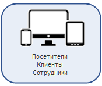
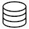

# Схема работы продукта

**Навигация**
- [← Оглавление курса](index.md)
- [← Предыдущий: 4631 — Модульная структура](lesson_4631.md)
- [Следующий: 2593 — Требования к серверному программному обеспечению →](lesson_2593.md)

Официальная страница урока: https://dev.1c-bitrix.ru/learning/course/index.php?COURSE_ID=32&LESSON_ID=2352

|  | ### Визуальное представление работы продукта |
| --- | --- |

Ознакомьтесь с общей схемой работы продукта.

| \|  Курсы по теме:
 1. [Виртуальная машина BitrixVM](https://dev.1c-bitrix.ru/learning/course/index.php?COURSE_ID=37&INDEX=Y) 2. [Курс для хостеров](https://dev.1c-bitrix.ru/learning/course/index.php?COURSE_ID=32&INDEX=Y) 3. [Администратор. Базовый](https://dev.1c-bitrix.ru/learning/course/index.php?COURSE_ID=35&INDEX=Y) 4. [Технология Композитный сайт](https://dev.1c-bitrix.ru/learning/course/index.php?COURSE_ID=39&INDEX=Y) 5. [Разработка и эксплуатация высоконагруженных проектов](https://dev.1c-bitrix.ru/learning/course/index.php?COURSE_ID=38&INDEX=Y) \|  \|  Курсы по теме:
 1. [Контент-менеджер](https://dev.1c-bitrix.ru/learning/course/index.php?COURSE_ID=34&INDEX=Y) 2. [Продвижение сайта и Маркетинг](https://dev.1c-bitrix.ru/learning/course/index.php?COURSE_ID=139&INDEX=Y) \| \| --- \| --- \| --- \| |
| --- |

| \|  \|  \|  \|  \|  \|  \|  \| \| --- \| --- \| --- \| --- \| --- \| --- \| --- \| \| <!-- рамка начало --> 
 \\| <!-- рамка начало --> 
 
 					<!-- начало внутренней таблицы --> 
 \\\|  \\\| \\\\|  \\\\|  \\\\|  \\\\| \\\\| --- \\\\| --- \\\\| --- \\\\| 
 
 \\\\| Сайт 1 **Публичный раздел** - это часть сайта, которая доступна всем пользователям ресурса. Иначе говоря, это сам сайт в том виде, в котором его видят посетители сайта. [Подробнее...](https://dev.1c-bitrix.ru/learning/course/index.php?COURSE_ID=34&CHAPTER_ID=04458&LESSON_PATH=3905.4455.4458) \\\\| ... \\\\| Сайт 3 \\\\| ... \\\\| Сайт N \\\\| \\\\| --- \\\\| --- \\\\| --- \\\\| --- \\\\| --- \\\\| 
 
 \\\\|  \\\\| \\\\| --- \\\\| 
 
 \\\\| Шаблон 1 **Шаблон дизайна** — это внешний вид сайта, в котором определяется расположение различных элементов на сайте, художественный стиль и способ отображения страниц. [Подробнее](https://dev.1c-bitrix.ru/learning/course/index.php?COURSE_ID=34&LESSON_ID=1994&LESSON_PATH=3905.4461.1851.1994)... \\\\| Шаблон 2 \\\\| Шаблон 3 \\\\| ... \\\\| Шаблон N \\\\| \\\\| --- \\\\| --- \\\\| --- \\\\| --- \\\\| --- \\\\| 
 
 \\\\|  \\\\|  \\\\|  \\\\|  \\\\|  \\\\| \\\\| --- \\\\| --- \\\\| --- \\\\| --- \\\\| --- \\\\| 
 
 \\\\| Многосайтовый диспетчер **Многосайтовость** - это возможность системы *"1С-Битрикс: Управление сайтом"* управлять разными сайтами из единой Панели управления. [Подробнее](https://dev.1c-bitrix.ru/learning/course/index.php?COURSE_ID=103&INDEX=Y)... \\\\| \\\\| --- \\\\| 
 
 \\\\|  \\\\|  \\\\|  \\\\|  \\\\|  \\\\| \\\\| --- \\\\| --- \\\\| --- \\\\| --- \\\\| --- \\\\| 
 
 \\\\| Журналирование На странице **Журнал событий** (Настройки &gt; Инструменты &gt; Журнал событий) вы можете просмотреть события сайта. [Подробнее](https://dev.1c-bitrix.ru/learning/course/index.php?COURSE_ID=35&LESSON_ID=2034&LESSON_PATH=3906.4493.4506.2034)... и  статистика Страница **Сводная статистика** (Аналитика &gt; Сводная статистика) позволяет увидеть и оценить суммарные данные по посещаемости и разным срезам статистики посещений. [Подробнее](https://dev.1c-bitrix.ru/learning/course/index.php?COURSE_ID=139&LESSON_ID=2102&LESSON_PATH=11427.4544.2102)... \\\\| \\\\| --- \\\\| 
 
 \\\\|  \\\\|  \\\\|  \\\\|  \\\\|  \\\\| \\\\| --- \\\\| --- \\\\| --- \\\\| --- \\\\| --- \\\\| 
 
 \\\\| Система авторизации и разграничения доступа За работу с пользователями (добавление и авторизация) отвечает **Главный модуль** системы. Пользователи добавляются с **Публичного раздела** самостоятельно, либо с **Административного раздела** вручную администратором или автоматически через разные виды импорта. Авторизация в системе также возможна через модуль **AD/LDAP**. [Подробнее](https://dev.1c-bitrix.ru/learning/course/index.php?COURSE_ID=35&CHAPTER_ID=04503&LESSON_PATH=3906.4503)... \\\\| \\\\| --- \\\\| \\\|  \\\| \\\\| **Битрикс Framework** **Bitrix Framework** - это созданная на основе PHP платформа для разработки веб-приложений. На этой платформе компанией «1C-Битрикс» созданы два популярных продукта: *«1C-Битрикс: Управление сайтом»* и *«1С-Битрикс: Корпоративный портал»*. Курс [Разработчик Bitrix Framework](https://dev.1c-bitrix.ru/learning/course/index.php?COURSE_ID=43). \\\\| \\\\| --- \\\\| 
 
 \\\\| **Компоненты, написанные на  API Документация по работе с API:
 1. [API документация](https://dev.1c-bitrix.ru/api_help/) 2. [API D7 документация](https://dev.1c-bitrix.ru/api_d7/) 3. [REST API документация](https://dev.1c-bitrix.ru/rest_help/)** \\\\|  \\\\|  \\\\| \\\\| --- \\\\| --- \\\\| --- \\\\| \\\\| Административный раздел **Административный раздел** - раздел системы, недоступный для просмотра обычным посетителям сайта. В нём производятся настройки сайта и системы для работы.  
 [Подробнее...](https://dev.1c-bitrix.ru/learning/course/index.php?COURSE_ID=34&CHAPTER_ID=04459&LESSON_PATH=3905.4455.4459) \\\\| Индивидуальная бизнес-логика \\\\| Компоненты пользователей Фактически, на сегодняшний момент свой компонент нужно писать лишь тогда, когда нужен абсолютно новый функционал для сайта. Тем не менее, приходит время, когда разработчик должен научиться создавать свои компоненты. [Подробнее](https://dev.1c-bitrix.ru/learning/course/index.php?COURSE_ID=43&CHAPTER_ID=04777&LESSON_PATH=3913.4565.4790.4777)... \\\\| 
 
 \\\\|  \\\\| **API** \\\\| \\\\| --- \\\\| --- \\\\| 
 
 
 \\\\| **Модули** Курсы по теме:
 1. [Администратор. Модули](https://dev.1c-bitrix.ru/learning/course/index.php?COURSE_ID=41) - администрирование модулей не относящихся к коммерческой деятельности; 2. [Администратор. Бизнес](https://dev.1c-bitrix.ru/learning/course/index.php?COURSE_ID=42) - администрирование модулей при организации торговых операций через Интернет. \\\\|  \\\\|  \\\\| \\\\| --- \\\\| --- \\\\| --- \\\\| \\\\| Главный модуль **Главный модуль** задаёт параметры работы системы в целом. Форма настройки находится на странице Настройки &gt; Настройки продукта &gt; Настройки модулей &gt; Главный модуль. [Подробнее](https://dev.1c-bitrix.ru/learning/course/index.php?COURSE_ID=35&LESSON_ID=5010&LESSON_PATH=3906.4493.5010)... \\\\| Управл. структурой Сайт в системе *"1С-Битрикс: Управление сайтом"* обладает логической и физической структурой. [Подробнее](https://dev.1c-bitrix.ru/learning/course/index.php?COURSE_ID=34&CHAPTER_ID=04460&LESSON_PATH=3905.4460)... \\\\| Интернет-магазин Для создания интернет-магазина предназначен модуль **Интернет-магазин**, позволяющий осуществлять продажу товаров и услуг с сайта. [Подробнее](https://dev.1c-bitrix.ru/learning/course/index.php?COURSE_ID=42&CHAPTER_ID=04580&LESSON_PATH=3912.4580)... \\\\| \\\\| Рекламные баннеры Система *«1С-Битрикс: Управление сайтом»* позволяет организовать показ баннеров на сайте, подключив код внешней баннерной системы, либо за счет внутренней ротации баннеров в пределах сайта. [Подробнее](https://dev.1c-bitrix.ru/learning/course/index.php?COURSE_ID=41&CHAPTER_ID=04556&LESSON_PATH=3911.7257.4556)... \\\\| Информ.блоки Модуль **Информационные блоки** предназначен для управления различными блоками однородной информации. (на базе информационных блоков можно реализовать каталоги товаров, блоки новостей, справочники и т.д.). Познакомьтесь с описанием элементов модуля, а также примерами создания и настройки различных информационных блоков. [Подробнее](https://dev.1c-bitrix.ru/learning/course/index.php?COURSE_ID=34&CHAPTER_ID=04477&LESSON_PATH=3905.4477)... \\\\| Веб-формы Модуль организует работу с произвольными веб-формами, позволяет хранить и фильтровать данные заполненных форм. [Подробнее](https://dev.1c-bitrix.ru/learning/course/index.php?COURSE_ID=34&CHAPTER_ID=05749&LESSON_PATH=3905.4753.5749)... \\\\| \\\\| Документооборот Модуль **Документооборот** используется для организации цепочки движения документа от момента создания до момента публикации. Этот механизм используется если документ (новость, товар, страница сайта) должен быть проверен перед выпуском редактором или кем-то ещё. [Подробнее](https://dev.1c-bitrix.ru/learning/course/index.php?COURSE_ID=34&CHAPTER_ID=05305&LESSON_PATH=3905.4753.5305)... \\\\| Торговый каталог Главная составляющая интернет-магазина на CMS *«1С-Битрикс: Управление сайтом»* - каталог товаров.  Его легко организовать, если использовать инструменты модуля **Торговый каталог**. [Подробнее](https://dev.1c-bitrix.ru/learning/course/index.php?COURSE_ID=42&CHAPTER_ID=04771&LESSON_PATH=3912.4771)... \\\\| Почта Модуль **Почта** предназначен для получения и обработки почтовых сообщений. [Подробнее](https://dev.1c-bitrix.ru/learning/course/index.php?COURSE_ID=41&CHAPTER_ID=04558&LESSON_PATH=3911.4558)... и т.д. \\\\| \\\\| Валюты Вся работа по управлению валютами ведется в модуле**Валюты**. Этот модуль необходим для работы модулей **Торговый каталог**, **Интернет-магазин**, используется для отчетов в CRM, необходим при работе с финансовыми параметрами в рекламных кампаниях и событиях в **Веб-аналитике**. [Подробнее](https://dev.1c-bitrix.ru/learning/course/index.php?COURSE_ID=42&CHAPTER_ID=04770&LESSON_PATH=3912.4770)... \\\\| Статистика Модуль **Веб-аналитика** используется для сбора и анализа информации о посетителях веб-сайтов. На основании этих данных определяется веб-аудитория и изучается её поведение для принятия решений по развитию веб-ресурса. [Подробнее](https://dev.1c-bitrix.ru/learning/course/index.php?COURSE_ID=41&CHAPTER_ID=06459&LESSON_PATH=3911.6459)... \\\\| Свои модули Основа работ по созданию собственных продуктов для **Маркетплейс** - создание собственных модулей. В курсе **Маркетплейс Bitrix Framework** рассказано, как расширять функционал проектов на основе *Bitrix Framework* с помощью сторонних модулей и решений. [Подробнее](https://dev.1c-bitrix.ru/learning/course/index.php?COURSE_ID=101&INDEX=Y)... \\\\| 
 
 \\\\|  \\\\|  \\\\| \\\\| --- \\\\| --- \\\\| 
 
 \\\\| Интерфейс к БД \\\\| Интерфейс работы c внешними источниками \\\\| \\\\| --- \\\\| --- \\\\| 
 
 \\\\|  \\\\|  \\\\|  \\\\| \\\\| --- \\\\| --- \\\\| --- \\\\| \\\|  \\\| \\\| --- \\\| --- \\\| --- \\\| --- \\\| --- \\\| 
 				<!-- конец внутренней таблицы --> 
 
 				<!-- рамка конец --> \\| \\| --- \\| 
 				<!-- рамка конец --> \|  \|  \|  \|  \|  \|  \| \|  \| \\| 
 						
 						 \\| \\| --- \\| \|  \|  \|  \|  \|  \| \|  \| \\| Базы данных Минимальным техническим требованием является использование версии MySQL 5.6. Рекомендуемая версия MySql - 5.7 и выше. [Подробнее](lesson_2593.md#database)...  MySQL \\| XML, Excel,  1C Курс **Интеграция с 1С**предназначен для базовой подготовки пользователей, осуществляющих интегрирование продуктов «1С-Битрикс» с торговыми конфигурациями компании «1С». [Подробнее](https://dev.1c-bitrix.ru/learning/course/index.php?COURSE_ID=131&INDEX=Y)... , Платежные системы Под **платежными системами** понимаются любые способы оплаты заказа: как платежные системы, принимающие платежи online, так и банковские переводы. В системе может быть создано любое их количество. [Подробнее](https://dev.1c-bitrix.ru/learning/course/index.php?COURSE_ID=42&CHAPTER_ID=03076&LESSON_PATH=3912.4580.4828.3076)... , Складские системы, ERP и другие \\| Дисковая подсистема Забота о свободном дисковом пространстве - одна из задач администратора сайта. Для решения этих задач в в Bitrix Framework есть несколько инструментов. Подробнее в курсе [Администратор. Базовый](https://dev.1c-bitrix.ru/learning/course/index.php?COURSE_ID=35&CHAPTER_ID=06416).  \\| \\| --- \\| --- \\| --- \\| \|  \|  \|  \|  \|  \| \|  \|  \|  \|  \|  \|  \|  \| |
| --- |
