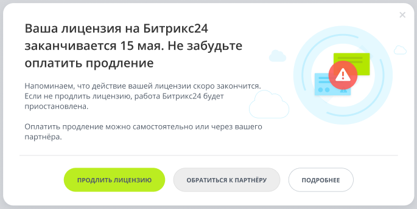
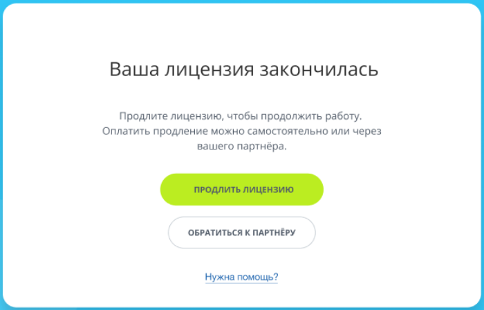

# Продление лицензии коробочной версии Битрикс24

**Навигация**
- [← Оглавление курса](index.md)
- [← Предыдущий: 12856 — Ограниченная лицензия](lesson_12856.md)
- [Следующий: 2688 — Общие сведения →](lesson_2688.md)

Официальная страница урока: https://dev.1c-bitrix.ru/learning/course/index.php?COURSE_ID=32&LESSON_ID=25720

**Внимание!** C 14 марта 2022 года произошли изменения в лицензировании коробочной версии *Битрикс24*. Срок действия лицензии – 12 месяцев. С подробностями можно ознакомиться [в статье](https://helpdesk.bitrix24.ru/open/15462996/).

Если же лицензия была куплена до 14 марта 2022 года и вы не продлили её согласно новым условиям лицензирования, то после окончания действия лицензионного ключа коробочная версия *Битрикс24* продолжит работать в режиме

			ограниченной лицензии

В уроке перечислены функции, недоступные в ограниченном режиме. Ограниченный режим актуален для продукта *Битрикс24 Коробочная версия*, если этот продукт приобретен до 14 марта 2022 года и вы не продлили её согласно новым условиям лицензирования.

[Подробнее](lesson_12856.md)...

		.

Чтобы продолжить использование коробочной версии *Битрикс24*, необходимо

			заранее

Продлить лицензию можно за 60 дней до истечения срока действия текущей лицензии.

		 приобрести продление действия лицензии на следующие 12 месяцев. Стоимость продления составляет 30% от стоимости лицензионного ключа.

После окончания срока действия лицензии через 15 дней коробочная версия *Битрикс24* будет отключена.

- При своевременном продлении срока действия лицензии вы увидите
  			всплывающее окно
                      Если вы **не успели заранее** приобрести продление, то в течение 15 дней после окончания срока
  действия лицензии всплывающее окно будет выглядеть так:
  
  		 с выбором способа продления:
  

  - **Продлить лицензию** – при клике на кнопку вы попадёте на страницу корзины сайта 1с-bitrix.ru.
    После оплаты ваша лицензия будет автоматически продлена. На email, указанный при оформлении заказа, придёт соответствующее письмо об успешной активации.
    Всё, что вам останется сделать – это
    			обновить систему SiteUpdate
    
    		 на странице **Система обновлений** (Marketplace &gt; Обновление платформы).
  - **Обратиться к партнёру** (если лицензия приобреталась через компанию-партнёра *1С-Битрикс*) – при выборе этого варианта вы попадёте в административный раздел портала и сможете заполнить и отправить
    			заявку
    
    		 партнёру.
- Если вы **не** продлили лицензию, то спустя 15 дней после окончания срока действия лицензии работа вашей коробочной версии *Битрикс24* **будет отключена полностью**, и вы увидите следующее окно блокировки:
  
  Для возобновления работы нужно продлить лицензию, выбрав один из вариантов:

  - **Продлить лицензию** – при клике на кнопку вы попадёте на страницу корзины сайта 1с-bitrix.ru.
    После оплаты ваша лицензия будет автоматически продлена. На email, указанный при оформлении заказа, придёт соответствующее письмо об успешной активации.
  - **Обратиться к партнёру** (если лицензия приобреталась через компанию-партнёра *1С-Битрикс*) – при выборе этого варианта откроется
    			форма заявки
    
    		 партнёру.

**Важно!** Если ваш *Битрикс24* используется только в локальной сети и недоступен извне, то продление не произойдёт автоматически – вам нужно будет ввести

			код активации

		.

<!-- &lt;p&gt;Приобрести продление можно на странице &lt;a href="https://www.1c-bitrix.ru/buy/products/b24.php#tab-section-2" target="_blank"&gt;Продление 1С-Битрикс24&lt;/a&gt;, нажав кнопку &lt;b&gt;Продлить ключ&lt;/b&gt;.&lt;/p&gt; -->
