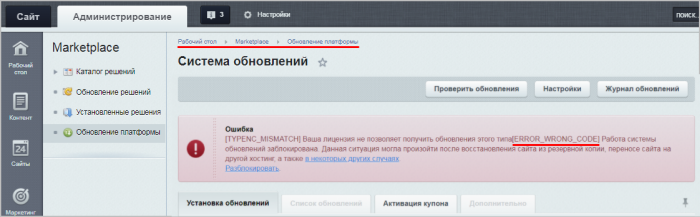

# Общие сведения

**Навигация**
- [← Оглавление курса](index.md)
- [← Предыдущий: 25720 — Продление лицензии коробочной версии Битрикс24](lesson_25720.md)
- [Следующий: 2689 — Настройки системы обновлений →](lesson_2689.md)

Официальная страница урока: https://dev.1c-bitrix.ru/learning/course/index.php?COURSE_ID=32&LESSON_ID=2688

### Термины

**Ядро продукта** - каталог `/bitrix/modules/`, а также файлы системных компонентов: `/bitrix/components/bitrix/` (пути везде задаются относительно корневой папки). Часто в понятие ядра продукта включается также структура базы данных продукта.

**Служебная область** - все подкаталоги каталога `/bitrix/`, за исключением ядра продукта и каталога `/bitrix/updates/`. Часто в понятие служебной области включаются также данные служебных таблиц базы данных.

**Каталог системы обновлений** - каталог `/bitrix/updates/`. Этот каталог предназначен исключительно для работы системы обновлений и не может использоваться в других целях.

**Публичная часть** - все каталоги, относящиеся к данной копии продукта, за исключением ядра продукта, служебной области и каталога системы обновлений. Часто в понятие публичной части включаются все данные базы данных, за исключением данных служебных таблиц.

**Регистрация копии продукта** - снятие с данной копии продукта ограничений, которые имеет демонстрационная версия (например, ограничение по времени работы).

**Лицензионный ключ** - последовательность символов, которая подтверждает право на использование копии продукта.

**Купон на дополнительный сайт** - последовательность символов, которая подтверждает право на создание одного дополнительного сайта в рамках данной копии продукта.

**Сервер обновлений** - сервер, который отдает обновления продукта системе обновлений. Адрес сервера обновлений задается на странице глобальных настроек главного модуля. Должен иметь значение `www.1c-bitrix.ru`.

### Как работает система

Система обновлений не собирает и не передает никаких конфиденциальных данных копии продукта, на которой она работает. Она обменивается с сервером обновлений только техническими данными, необходимыми для корректной работы системы обновлений (например, текущие версии модулей или дата последнего обновления системы помощи).

Система обновлений не изменяет публичную часть. Служебная область изменяется только в рамках необходимости, при этом существующие файлы и записи не изменяются (т.к. они уже могли быть изменены владельцем копии продукта под свои нужды). Ядро продукта может быть изменено системой обновлений сколь угодно сильно (при этом обеспечивается обратная совместимость).

**Важно!**Если вы самостоятельно изменили хотя бы один файл ядра продукта или структуру базы данных, то автоматическая установка обновления может иметь непредсказуемый результат.

Система обновлений производит технически сложную серьезную модификацию ядра продукта. Если эта модификация будет произведена с ошибками, то сайты, работающие на этом ядре, могут оказаться неработоспособными. Перед установкой обновлений рекомендуется убедиться в наличии резервной копии как базы данных, так и скриптов ядра продукта и служебной области. Рекомендуется для проведения процедуры обновления выбирать время, когда нагрузка на сервер минимальна. При возникновении проблем с установкой обновления вам необходимо незамедлительно обратиться в службу технической поддержки компании «1С-Битрикс».

### Страница системы обновлений

Установка обновлений выполняется со страницы **Система обновлений** (Marketplace &gt;  Обновление платформы).

Если на странице вывелось сообщение о том, что лицензионный ключ не верен (или лицензия не найдена), то установка не лицензирована и её  надо [зарегистрировать](/learning/course/index.php?COURSE_ID=32&CHAPTER_ID=04518).

Если выводится сообщение о том, что лицензионный ключ не активирован, то вам необходимо нажать кнопку **Активировать ключ** и заполнить все поля открывшейся формы. После этого лицензионный ключ будет активирован.

Если выводится сообщение о том, что доступно обновление самой системы обновлений, то необходимо установить это обновление. До установки этого обновления остальной функционал системы будет недоступен.

Если в систему введен валидный активный лицензионный ключ и установлено последнее обновление самой системы обновлений, то на странице системы обновлений доступны следующие действия:

- Просмотреть и загрузить обновления модулей системы.
- Просмотреть и загрузить языковые файлы.
- Выполнить загрузку исходных текстов продукта, если позволяет лицензия. Перед загрузкой исходных текстов ядро продукта должно быть обновлено до последней версии (т.е. никакие обновления ядра продукта не должны быть доступны). Обратите внимание, что в случае медленного канала или большой загрузки сервера загрузка исходных текстов может занять некоторое время.
- Выполнить активацию купона на продление технической поддержки, на добавление дополнительных сайтов или на переход на другую редакцию.
- Включить или отключить установку бета-версий обновлений модулей.
- Просмотреть журнал установки обновлений. Журнал содержит информацию о последних установленных обновлениях, включая информацию по статусам и ошибкам установки.

### Предупреждение об ошибке ERROR_WRONG_CODE

#### Ошибка ERROR_WRONG_CODE

Если обновление на текущем сервере повлечет за собой нарушение лицензионного соглашения, то на странице **Система обновлений** (Marketplace &gt;  Обновление платформы) **до** начала процедуры обновления появится сообщение

			ERROR_WRONG_CODE

                    Система обновлений продукта привязывается к конкретной установке и "запоминает" состояние системы после очередного обновления. Ошибка ERROR_WRONG_CODE возникает в том случае, если текущее состояние не соответствует тому, которое было на момент последнего обновления.
[Подробнее](lesson_2697.md#error_wrong_code)...

		:

Для устранения ошибки необходимо обратиться [в Техподдержку](https://www.1c-bitrix.ru/support/index.php). Техническая поддержка по данному вопросу осуществляется в рабочие дни **с 9 до 20 часов** московского времени, кроме выходных и праздничных дней (по календарю праздничных дней РФ).

|  |
| --- |

#### Как заранее узнать, возникнет ли при обновлении ошибка ERROR_WRONG_CODE?

Чтобы **заранее** узнать о невозможности проведения обновления на текущем сервере, рекомендуем в настройках **Главного модуля** (Настройки &gt;  Настройки продукта &gt;  Настройки модулей &gt;  Главный модуль) включить опцию **Автоматически проверять наличие обновлений** и установить временной интервал:

В случае невозможности установки обновлений появится соответствующее

			уведомление системы.

**Важно!** Опция **Автоматически проверять наличие обновлений** на

			всех тестовых установках

Начиная с версии 16.5.7 и старше, в продуктах «1С-Битрикс» можно пометить новую или существующую установку продукта специальным маркером Установка для разработки. Маркер позволяет проводить тестирование, не устанавливая продукт локально. Этот функционал поможет решить проблему коллективного доступа к одной установке разработчиков продукта без возникновения ошибки **ERROR_WRONG_CODE**. Также эта функция будет полезна, если разработчиков несколько, и всем им нужна своя установка продукта для тестирования.

[Подробнее](https://dev.1c-bitrix.ru/learning/course/index.php?COURSE_ID=135&LESSON_ID=8471)...

		 должна быть **отключена**. Исключение может быть сделано (но не рекомендуется) только для установки, используемой для тестирования обновлений перед их установкой на "боевой" (основной) сайт. В противном случае во время обновления основного сайта может возникнуть ошибка `ERROR_WRONG_CODE`, а установка обновлений будет прервана.

### Дополнительная информация

- [Marketplace (документация)](http://dev.1c-bitrix.ru/user_help/marketplace/index.php)
