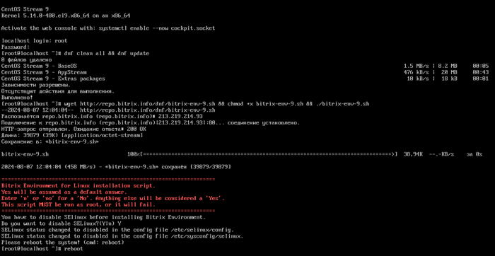
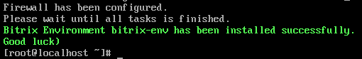
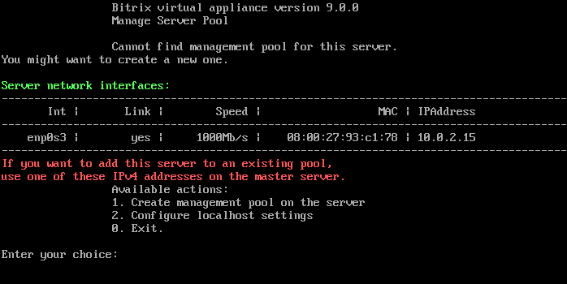
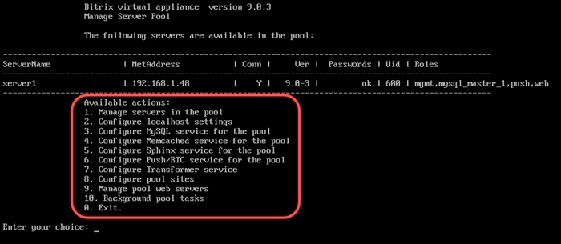

# Установка «1С-Битрикс: Веб-окружение» — Linux (BitrixEnv)

**Навигация**
- [← Оглавление курса](index.md)
- [← Предыдущий: 30746 — Что нового](lesson_30746.md)
- [Следующий: 29238 — Запуск виртуальной машины BitrixVM →](lesson_29238.md)

Официальная страница урока: https://dev.1c-bitrix.ru/learning/course/index.php?COURSE_ID=32&LESSON_ID=29234

### Для кого?


*«1С-Битрикс: Веб-окружение» — Linux* (BitrixEnv)  позволяет быстро и с минимальными затратами развернуть оптимальное окружение для работы продуктов и решений «1С-Битрикс» на Linux установке CentOS Stream 9.  С версии BitrixEnv 9.0.4 добавлена поддержка операционных систем Rocky Linux 9, Alma Linux 9, Oracle Linux 9.


Для успешной установки BitrixEnv используйте чистую CentOS с официального сайта. Кастомные сборки, например, от хостинг-провайдеров, могут привести к ошибкам. Если возникнут проблемы на модифицированных системах, свяжитесь с администратором сервера или вашим хостинг-провайдером.


*«1С-Битрикс: Веб-окружение» — Linux* будет полезно:


- Для пользователей и разработчиков, которые использовали продукт *«1С-Битрикс: Виртуальная машина»* в процессе подготовки сайта и столкнулись с проблемой переноса конфигурации на хостинг или на невиртуальное оборудование и потерей производительности.
- Для специалистов хостинг-партнеров, планирующих создать шаблоны различных VPS для продуктов «1С-Битрикс».
- Для системных администраторов, которым требуется быстро подготовить производительную платформу для установки или миграции сайтов на основе «1С-Битрикс».
- Для программистов и системных администраторов, которым требуется быстро развернуть кластер для проектов на основе «1С-Битрикс».


В окружение входит:


- percona server 8.0 (MySQL)
- web-server (Apache 2.4.x)
- php 8.x
- nginx 1.26.x
- redis
- memcached
- catdoc
- xpdf


### Установка на CentOS Stream 9


Рассмотрим установку *«1С-Битрикс: Веб-окружение» — Linux* на оборудовании с установленной CentOS Stream 9.


Если вы используете виртуальную машину BitrixVM, устанавливать окружение BitrixEnv не нужно. Подробнее в статье [Запуск виртуальной машины BitrixVM](lesson_29238.md)


1. Авторизуйтесь на сервере под административным аккаунтом **root** и обновите все пакеты системы:
  ```
  dnf clean all && dnf update
  ```
  Если на сервере нет утилиты для загрузки файлов **wget** — установите ее командой `dnf install wget`.
2. Загрузите скрипт *«1С-Битрикс: Веб-окружение» — Linux* и запустите его командами:
  ```
  wget http://repo.bitrix24.tech/dnf/bitrix-env-9.sh && chmod +x bitrix-env-9.sh && ./bitrix-env-9.sh
  ```
  Далее необходимо согласиться на отключение **SELinux** (если SELinux включен в системе) и перезагрузить машину командой `reboot`:
  
  После перезагрузки сервера снова продолжите установку *BitrixEnv*:
  ```
  ./bitrix-env-9.sh
  ```
  Когда установка
  			закончится
                      
  		, запустите меню BitrixEnv:
  ```
  /root/menu.sh
  ```
  В *VMBitrix* **версии 9x+** нужно обязательно создать пул ([1. Create Management pool of server](https://dev.1c-bitrix.ru/learning/course/index.php?COURSE_ID=32&CHAPTER_ID=029250)). Мастер создания пула откроет все необходимые порты в CentOS для корректной работы сервисов продуктов «1С-Битрикс»:
  - 22 — ssh доступ
  - 80 / 443 — http / https web-сервер
  - 8890 / 8891 — http/https ntlm
  - 8893 / 8894 — http/https сервер мгновенных сообщений
  Если пул не создан, то открыты только 22, 80 и 443 порты.
  Внутри машины могут использоваться дополнительные порты для служб и сервисов, но они не открываются наружу.
  
  После создания, обязательно подключите Push ([6. Configure Push/RTC service for the pool](https://dev.1c-bitrix.ru/learning/course/index.php?COURSE_ID=32&CHAPTER_ID=029374)). В версии виртуальной машины 9x+ сервис автоматически не подключается.
  Установите пароль для пользователя **bitrix** через меню 1. Manage servers in the pool &gt; 3. Change 'bitrix' user password on host.
  Cервер готов для дальнейшего использования.


### Тихая установка и ключи запуска


Установить окружение можно в «тихом» режиме с указанием ключей. Такой способ позволит после установки окружения *VMBitrix* сразу создать пул с нужным именем хоста, запустить Push сервер и установить пароль для root MySQL.


Синтаксис команды запуска скрипта со всеми ключами:


```

./bitrix-env-9.sh [-h] [-s] [-p [-H hostname]] [-P] [-t] [-M mysql_root_password] [-m 8.0|8.4]
```


где:

- `-s` — Использовать тихий режим установки. Не запрашивать информацию (Use silent mode. don't query for information)
- `-p` — Создать пул после установки окружения (Create management pool after installing bitrix-env package)
- `-H` — Установить имя хоста для создания пула (Set server name for management pool creation procedure)
- `-P` — Запустить Push сервис после установки окружения и создания пула (Run push server after installing bitrix-env package and create management pool)
- `-t` — Использовать тестовую версию окружения Bitrix (Use alpha/test version of Bitrix Environment)
- `-M` — Установить пароль root для MySQL (Set root password for MySQL service)
- `-m` — Установить Percona Server версии 8.0 или 8.4 (Set Percona Server version: 8.0 or 8.4). Если не указать ключ, по умолчанию установится Percona Server 8.0.x. Ключ доступен с версии BitrixVM 9.0.6
- `-h` — Вывести список всех ключей запуска скрипта (print help messager)


**Пример использования**:


Задача:


- запустить установку окружения в «тихом» режиме
- создать пул с именем хоста server1
- запустить Push сервер
- установить Percona Server версии 8.4.x
- задать пароль root пользователя MySQL — 'BX123bx@#MYSQL'


```

./bitrix-env-9.sh -s -p -H server1 -P -m 8.4 -M 'BX123bx@#MYSQL'
```


**Важно**! Запуск push сервера (`-P`) при установке окружения сработает только в связке с созданием пула (`-p`).


### Как управлять BitrixEnv


Управление осуществляется с помощью меню:





Для перехода к выполнению любого действия в меню виртуальной машины введите число и нажмите **Enter**. Например, для просмотра фоновых задач в главном меню наберите **10** (**Background pool tasks**) и нажмите **Enter**.


Из меню можно полностью выйти в обычную консоль операционной системы. Для этого необходимо выполнить команду **0. Exit** или нажать **Ctrl+C**.


Чтобы вновь запустить меню *VMBitrix*, введите в консоли команду:


```
/root/menu.sh
```


### Работа с файлами в BitrixEnv


Работа с файлами в *VMBitrix* осуществляется по протоколам **SSH / SFTP**. Протоколы FTP и SCP по умолчанию не поддерживаются.
