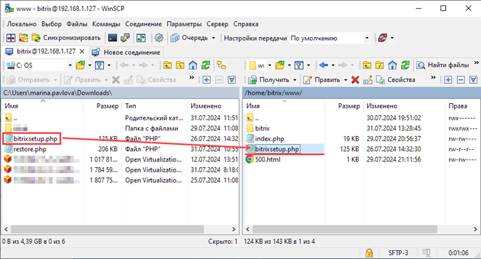

# Установка дистрибутива сайта в BitrixVM/BitrixEnv

**Навигация**
- [← Оглавление курса](index.md)
- [← Предыдущий: 29238 — Запуск виртуальной машины BitrixVM](lesson_29238.md)
- [Следующий: 29246 — Перенос продукта «1C-Битрикс» в виртуальную среду BitrixVM/BitrixEnv →](lesson_29246.md)

Официальная страница урока: https://dev.1c-bitrix.ru/learning/course/index.php?COURSE_ID=32&LESSON_ID=29244

Для установки продукта «1С-Битрикс»:


1. Откройте браузер и в адресную строку вбейте адрес
  			**bitrix url**
                      
  		. Откроется страница с описанием и ссылками на скачивание скриптов установки и восстановления:
  
2. Чтобы установить продукт, скачайте скрипт BitrixSetup и положите в корневую папку сайта одним из способов:
  > **Корневая папка** дефолтного сайта находится по пути /home/bitrix/www/.
  >
  > Если сайтов несколько — у каждого будет своя корневая папка. Например: /home/bitrix/www/s1 и /home/bitrix/www/s2.
  >
  > Далее будем рассматривать установку на примере дефолтного сайта.

  - Скачайте скрипт [BitrixSetup.php](https://www.1c-bitrix.ru/download/scripts/bitrixsetup.php). Подключитесь по SSH / SFTP к виртуальной машине под пользователем **bitrix** и разместите скачанный файл bitrixsetup.php
    ## Пример: как разместить скрипт с помощью программы WinSCP
    Подключиться по SFTP протоколу можно с помощью программы WinSCP.
    Заполните данные для подключения:
    
      - Протокол передачи — SFTP
      - Имя хоста — IP-адрес из **bitrix url**, который вы вбивали в адресную строку браузера
      - Порт — 22
      - Имя пользователя — **bitrix**
      - Пароль — пароль пользователя bitrix
    Нажмите «Войти» для подключения. Теперь вы увидите окно программы, разделенное на 2 части. Слева — файлы вашего ПК, а справа — файлы виртуальной машины.
    
    В левой части откройте папку, в которую вы скачали скрипт установки (обычно, это «Загрузки»). А в правой части откройте папку /home/bitrix/www/. Cкопируйте bitrixsetup.php c ПК в корневую папку сайта.
  - Используйте команду wget в консоли. Набор команд будет отличаться в зависимости от пользователя, под которым вы работаете на сервере:

    - Под пользователем **root** выполните набор команд:
      ```
      cd /home/bitrix/www/ // переходим в корневую папку сайта
      wget https://www.1c-bitrix.ru/download/scripts/bitrixsetup.php // скачиваем скрипт
      chown bitrix:bitrix bitrixsetup.php // меняем владельца файла на пользователя bitrix
      ```
    - Под пользователем **bitrix** перейдите в директорию /home/bitrix/www/ и выполните команду wget:
      ```
      cd /home/bitrix/www/ // переходим в корневую папку сайта
      wget https://www.1c-bitrix.ru/download/scripts/bitrixsetup.php // скачиваем скрипт
      ```
3. В адресной строке браузере допишите /bitrixsetup.php. Получится, например, так: http://192.168.1.127/bitrixsetup.php. Откроется окно выбора продукта:


Выбирайте интересующий вас продукт. После загрузки запустится мастер установки продукта.


Подробную информацию о всех шагах мастера вы найдете в учебном курсе [Установка и настройка](https://dev.1c-bitrix.ru/learning/course/index.php?COURSE_ID=135):


- [Установка продукта «1С-Битрикс: Управление сайтом»](https://dev.1c-bitrix.ru/learning/course/index.php?COURSE_ID=135&CHAPTER_ID=04522)
- [Установка продукта «Битрикс24 в коробке»](https://dev.1c-bitrix.ru/learning/course/index.php?COURSE_ID=135&CHAPTER_ID=04702)
