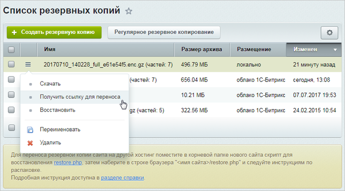
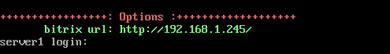
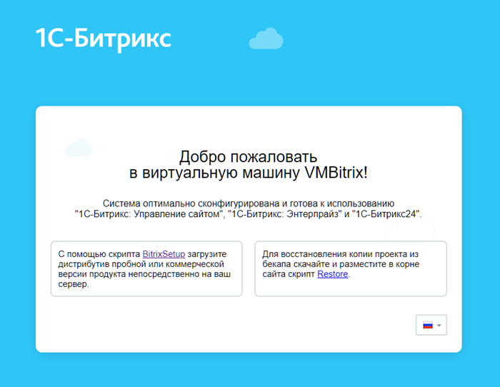
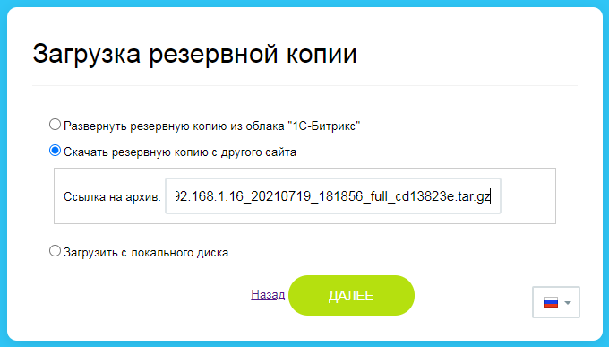
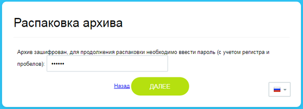
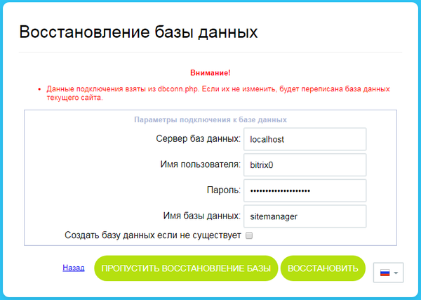

# Перенос продукта «1C-Битрикс» в виртуальную среду BitrixVM/BitrixEnv

**Навигация**
- [← Оглавление курса](index.md)
- [← Предыдущий: 29244 — Установка дистрибутива сайта в BitrixVM/BitrixEnv](lesson_29244.md)
- [Следующий: 29248 — Типовые ошибки при установке →](lesson_29248.md)

Официальная страница урока: https://dev.1c-bitrix.ru/learning/course/index.php?COURSE_ID=32&LESSON_ID=29246

### Подготовка


Что должно быть готово перед переносом?


Для переноса сайта с хостинга (облака) или локального сервера на виртуальную среду *BitrixVM* или *BitrixEnv* необходимы:

- [резервная копия сайта](https://dev.1c-bitrix.ru/learning/course/index.php?COURSE_ID=35&CHAPTER_ID=04833&LESSON_PATH=3906.4833)
- настроенная виртуальная среда [BitrixVM](lesson_29238.md) или [BitrixEnv](lesson_29234.md)


После успешного создания, бекап сайта будет доступен на странице

			Список резервных копий

                    

		 (Настройки &gt; Инструменты &gt; Список резервных копий) .


Воспользуйтесь командой

			Получить ссылку для переноса

                    

		 в меню действий (ссылка доступна только для локально размещенной копии) и в появившемся окне скопируйте её в буфер обмена:


Также можно скачать архив сайта на локальный компьютер с помощью пункта меню  **Скачать**.


### Перенос сайта


1. В адресной строке браузера введите http://адрес_виртуальной_машины/ (домен или ip-адрес из
  			**bitrix url**
                      
  		).
2. Откроется страница с описанием и ссылками на скачивание скриптов установки и восстановления:
  
3. Чтобы перенести продукт нужно скачать скрипт Restore и положить в корневую папку сайта одним из способов:
  > **Корневая папка** дефолтного сайта находится по пути /home/bitrix/www/.
  >
  > Если сайтов несколько — у каждого будет своя корневая папка. Например: /home/bitrix/www/s1 и /home/bitrix/www/s2.
  >
  > Далее будем рассматривать установку на примере дефолтного сайта.

  - Скачайте скрипт [restore.php](https://www.1c-bitrix.ru/download/scripts/restore.php). Подключитесь по SSH / SFTP к виртуальной машине под пользователем **bitrix** и разместите скачанный файл restore.php
  - Используйте команду wget в консоли. Набор команд будет отличаться в зависимости от пользователя, под которым вы работаете на сервере:

    - Под пользователем **root** выполните набор команд:
      ```
      cd /home/bitrix/www/ // переходим в корневую папку сайта
      wget https://www.1c-bitrix.ru/download/scripts/restore.php // скачиваем скрипт
      chown bitrix:bitrix restore.php // меняем владельца файла на пользователя bitrix
      ```
    - Под пользователем **bitrix** перейдите в директорию /home/bitrix/www/ и выполните команду wget:
      ```
      cd /home/bitrix/www/ // переходим в корневую папку сайта
      wget https://www.1c-bitrix.ru/download/scripts/restore.php // скачиваем скрипт
      ```
4. Вернитесь в браузер и допишите к адресу сайта restore.php. Например, адрес может выглядеть так: http://192.168.1.127/restore.php.
  Откроется страница с инструкцией как подготовить архив и ссылкой на [документацию](https://dev.1c-bitrix.ru/learning/course/index.php?COURSE_ID=35&CHAPTER_ID=04833):
  
5. На этапе загрузки резервной копии укажите место хранения архива сайта (в нашем примере — введите ссылку из буфера обмена, полученную на странице со списком резервных копий сайта):
  
  **Примечание**. Вы можете загрузить архив из облака «1С-Битрикс» (понадобится лицензионный ключ с действующей лицензией), с локального компьютера или из корневой папки сервера. Это зависит от того, где хранится ваша резервная копия.
6. Если архив был зашифрован —
  			введите пароль
                      
  		 после скачивания.
7. Далее настройте подключение к базе данных:
  
  Настройки подключения к MySQL по умолчанию в *BitrixVM/BitrixEnv* берутся из `/home/bitrix/www/bitrix/php_interface/dbconn.php`.
  Можно указать собственные параметры подключения к MySQL. В этом случае необходимо выбрать опцию **Создать базу данных, если не существует**.
8. После успешного восстановления базы данных в целях безопасности, необходимо **Удалить локальную резервную копию и служебные скрипты**, нажав на
  			одноименную кнопку
                      
  		.
9. Перенос продукта «1C-Битрикс» на виртуальную среду **BitrixVM/BitrixEnv** закончен.
  


### Что проверить после переноса


После переноса продукта «1C-Битрикс» с помощью скрипта **restore.php**:


- Проверьте административные настройки продукта. Скорее всего у вас изменился домен сайта, а значит нужно исправить все настройки связанные с этим. Подробнее о настройках модулей вы найдете информацию в [Пользовательской документации](https://dev.1c-bitrix.ru/user_help/) и учебных курсах [Администратор. Базовый](https://dev.1c-bitrix.ru/learning/course/index.php?COURSE_ID=35), [Администратор. Модули](https://dev.1c-bitrix.ru/learning/course/index.php?COURSE_ID=41)
- Запустите проверку соответствия параметров системы, на которой осуществляется функционирование проекта, минимальным и рекомендуемым техническим требованиям продукта с помощью инструмента [Проверка системы](https://dev.1c-bitrix.ru/learning/course/index.php?COURSE_ID=35&CHAPTER_ID=02024&LESSON_PATH=3906.4493.4506.2024)
