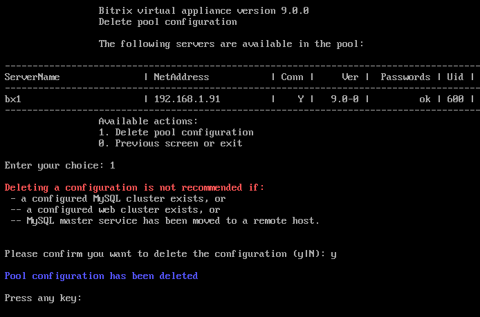
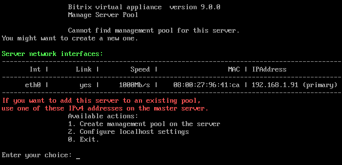

# 5. Удаление конфигурации пула (5. Remove pool configuration)

**Навигация**
- [← Оглавление курса](index.md)
- [← Предыдущий: 29262 — 4. Настройка таймзоны в пуле (4. Configure pool timezone)](lesson_29262.md)
- [Следующий: 29266 — 6. Обновление PHP и MySQL (6. Update PHP and MySQL) →](lesson_29266.md)

Официальная страница урока: https://dev.1c-bitrix.ru/learning/course/index.php?COURSE_ID=32&LESSON_ID=29264

Удаление конфигурации пула осуществляется с помощью меню 1. Manage servers in the pool &gt; 5. Remove pool configuration. После подтверждения конфигурация пула будет удалена:

Меню же вернется к своему первоначальному состоянию:

**Примечание.** Задачи могут выполняться длительное время. Время зависит от сложности задачи, объема данных, используемых в этих задачах, мощности и загруженности сервера.
Проверить текущие выполняемые задачи можно с помощью меню 10. Background pool tasks &gt; 1. View running tasks. Лог-файлы выполнения задач находятся в директории `/opt/webdir/temp`.
