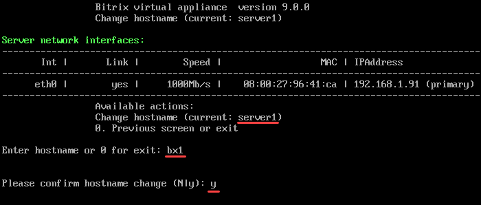
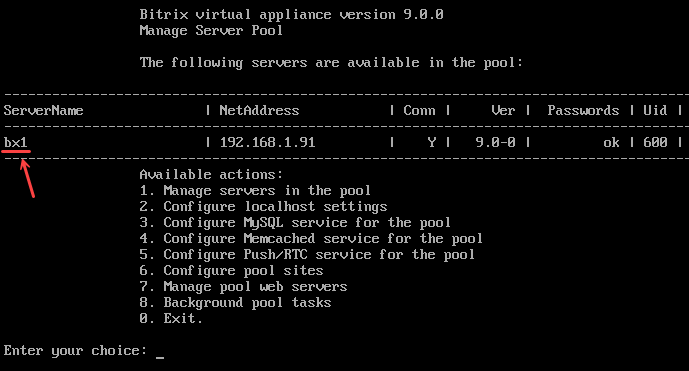

# 1. Изменение имени хоста (1. Configure hostname)

**Навигация**
- [← Оглавление курса](index.md)
- [← Предыдущий: 29266 — 6. Обновление PHP и MySQL (6. Update PHP and MySQL)](lesson_29266.md)
- [Следующий: 29276 — 2. Настройка IP-адреса сервера через DHCP (2. Configure network interface via DHCP) →](lesson_29276.md)

Официальная страница урока: https://dev.1c-bitrix.ru/learning/course/index.php?COURSE_ID=32&LESSON_ID=29274

Чтобы задать имя хоста локального сервера, нужно перейти в главном меню 2. Configure localhost settings - 1. Configure hostname.

Здесь будет указано текущее имя сервера. Например, `current: server1`, где server1 — имя сервера.

Введите новое название сервера (Enter hostname), например, **bx1** и подтвердите изменения:

Будет запущена задача на изменение. После чего системе будет присвоено новое имя:

**Примечание**. Название для хоста можно выбрать любое, какое вам нравится: bx1, server10, mysite.ru (можно и имя домена, если он один) и так далее.
