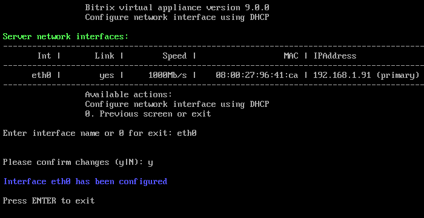

# 2. Настройка IP-адреса сервера через DHCP (2. Configure network interface via DHCP)

**Навигация**
- [← Оглавление курса](index.md)
- [← Предыдущий: 29274 — 1. Изменение имени хоста (1. Configure hostname)](lesson_29274.md)
- [Следующий: 29278 — 3. Настройка IP-адреса сервера вручную (3. Configure network inteface manually) →](lesson_29278.md)

Официальная страница урока: https://dev.1c-bitrix.ru/learning/course/index.php?COURSE_ID=32&LESSON_ID=29276

При первом старте BitrixVM получение IP-адреса сервером происходит автоматически, если в сети есть настроенный DHCP-сервер.

Чтобы с помощью него сменить или обновить IP-адрес локального сервера, нужно:

- Перейти в главном меню 2. Configure localhost settings - 2. Configure network interface via DHCP.
- Выбрать сетевой интерфейс (в данном примере это **eth0**) и он будет автоматически сконфигурирован:
  
